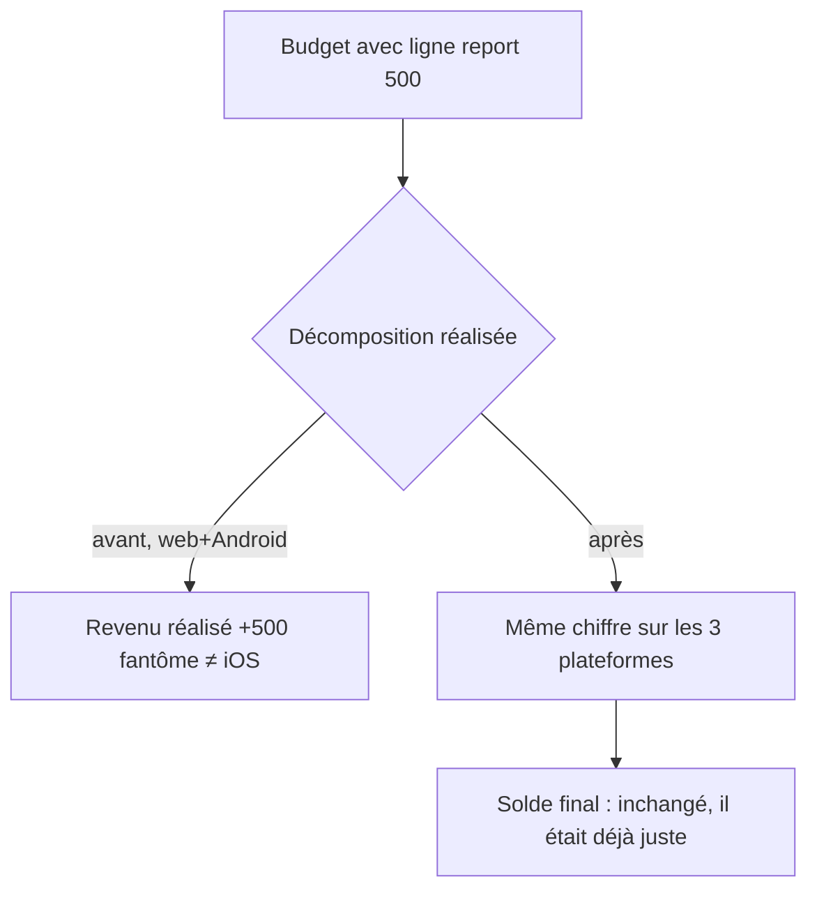

# Instruction: Formules partagées — gardes rollover & rapatriement

Cinq fonctions de `shared/src/calculators/budget-formulas.ts` n'ont pas la garde `isRollover` que leur jumeau Swift possède → la décomposition « réalisé » web/Android est gonflée du report vs iOS (le solde final, lui, est juste). Le commentaire d'`current-month-view-model.ts:195-198` accuse iOS d'un double comptage **vérifié inexistant** (gardes présentes dans `BudgetFormulas.swift:190-240` et `+Metrics.swift`). On corrige la source unique ; les contournements client Android meurent. Au passage, trois calculs restés locaux à Android rentrent dans `shared` où la règle du miroir les couvre.

## Architecture projection

```txt
shared/src/calculators/
├── budget-formulas.ts                  ✏️ garde isRollover sur les 5 fonctions (aligné Swift) :
│                                          #calculateEnvelopeTotal (:89-105), calculateRealizedIncome (:171-173),
│                                          calculateRealizedExpenses (:201-213), calculateTotalIncome/Expenses
├── budget-formulas.spec.ts             ✏️ cas rollover : mêmes fixtures que BudgetFormulasTests Swift
├── line-consumption.ts                 ✅ rapatrié depuis android/src/features/budgets/line-consumption.ts
├── template-totals.ts                  ✅ rapatrié depuis android/src/features/templates/template-vm.ts (partie calcul)
└── spread-progress.ts                  ✅ rapatrié depuis android/src/features/budget-details/spread/ (avec sa spec)

android/src/
├── features/current-month/current-month-view-model.ts  ✏️ commentaire faux supprimé ; filtres client
│                                                          `isRollover !== true` (:242,:260,:293,:318) retirés
│                                                          (la garde vit désormais dans shared)
├── features/budgets/line-consumption.ts                ✏️ ré-exporte depuis pulpe-shared puis disparaît
├── features/templates/template-vm.ts                   ✏️ consomme shared/template-totals
└── features/budget-details/spread/                     ✏️ consomme shared/spread-progress

ios/Pulpe/Domain/Formulas/              (inchangé — c'est la référence ; miroir restauré, pas déplacé)
```

## User Journey



## Tasks to do

### `1)` Gardes dans shared

1. Ajouter la garde rollover (`line.isRollover !== true`, sémantique exacte du Swift `!(line.isRollover ?? false)`) aux 5 fonctions listées ; relire le Swift fonction par fonction pendant l'édition — pas de par-cœur
2. Specs : fixture avec ligne rollover checked, assertions alignées sur les tests Swift existants (mêmes montants attendus)
3. Grep frontend + e2e : toute spec qui assertait les anciens chiffres gonflés est mise à jour dans le même commit (cf. mémoire `shared-schema-field-removal` : `frontend/e2e/` casse aussi)

### `2)` Nettoyage Android

1. Supprimer le commentaire accusant iOS + les 4 filtres client devenus redondants dans `current-month-view-model.ts` ; ses specs continuent de passer sans modification des attendus (preuve que shared fait maintenant le travail)

### `3)` Rapatriement des 3 calculs locaux

1. `line-consumption`, la partie calcul de `template-vm`, `spread-progress` → `shared/src/calculators/`, specs déplacées/adaptées, imports Android mis à jour
2. `pnpm build:shared` puis suites Android + frontend vertes ; noter dans le commit que le miroir Swift de ces 3 calculs reste à ouvrir si iOS les recode un jour (aujourd'hui iOS a ses propres équivalents là où il en a besoin)

## Test acceptance criteria

| Task | Acceptance criteria                                                                                                                     |
| ---- | --------------------------------------------------------------------------------------------------------------------------------------- |
| 1    | Specs shared rollover vertes avec les montants des tests Swift ; `pnpm quality` racine vert                                             |
| 2    | Grep `isRollover` dans `android/src/features/current-month/` → uniquement des usages légitimes (affichage), plus aucun filtre de calcul |
| 3    | Les 3 modules importés depuis `pulpe-shared` ; zéro copie locale restante (grep) ; suites Android 404+ et shared 711+ vertes            |
