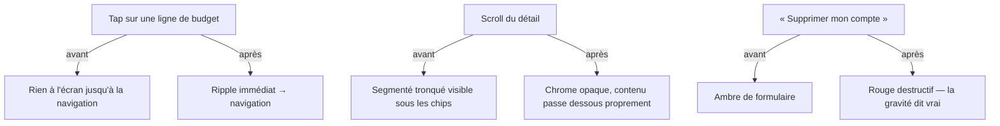

# Instruction: Sensoriel Android — ripple, tab bar M3, 48dp, contrastes

Findings **C2 → C8** de `DESIGN_AUDIT_20260814.md`. Le verdict de l'audit : « l'app se comporte en Android et ne se sent pas Android ». Cette phase est le lot critique : retour tactile, chrome Material, planchers d'accessibilité, contrastes AA, chevauchements vus en live. Design uniquement — zéro changement de logique. **Approbation explicite avant implémentation.**

## Architecture projection

```txt
android/src/
├── core/ui/theme.ts                          ✏️ + TOUCH_TARGET=48, TINT_ALPHA, ICON_BUTTON_INSET (section 5 de l'audit)
├── app/(main)/(tabs)/_layout.tsx             ✏️ tabBarVariant: "material" (C3)
├── features/budget-details/components/
│   ├── point-circle.tsx                      ✏️ TAP_TARGET→TOUCH_TARGET, hitSlop{0} retiré, commentaire corrigé (C4)
│   ├── budget-line-row.tsx                   ✏️ ripple (C2) ; POINTED_OPACITY retirée ; outline→onSurfaceVariant (C6)
│   ├── transaction-row.tsx                   ✏️ idem C2+C6
│   └── budget-detail-hero.tsx                ✏️ pastille dépenses assombrie façon overBudget (C6)
├── app/(main)/budget/[id].tsx                ✏️ rangée sticky : fond opaque + élévation (C7, capture 13)
├── app/(main)/(tabs)/home.tsx                ✏️ FAB_CLEARANCE réel (C7, capture 17) ; FlatList (C8)
├── app/(main)/(tabs)/budgets.tsx             ✏️ FlatList (C8)
├── app/(main)/settings/security.tsx          ✏️ error↔destructive échangés (C5)
├── features/savings-goals/components/goal-generation-stop-sheet.tsx ✏️ destructive→error (C5)
└── (11 Pressable au total)                   ✏️ android_ripple systématique (C2, liste dans l'audit)
```

## User Journey



## Tasks to do

### `1)` Retour tactile & chrome (C2, C3)

1. `android_ripple` (couleur `onSurface` + `TINT_ALPHA.surface`) sur les 11 `Pressable` ; `TouchableRipple` Paper là où c'est plus simple
2. `tabBarVariant: "material"` ; vérifier les 4 onglets + safe area après bascule (captures avant/après)

### `2)` Planchers tactiles (C4)

1. Token `TOUCH_TARGET = 48` ; `point-circle.tsx` (44→48, `hitSlop{0}` retiré, commentaire « Android floor » corrigé), `home-hero-card.tsx:204` (44→48), les 6 `IconButton` de ligne à 36dp effectifs → cible 48 (`hitSlop` ou conteneur)

### `3)` Gravité & contrastes (C5, C6)

1. Swap destructif : `security.tsx:159,164,176,267` → `FINANCIAL_COLORS.destructive` ; `goal-generation-stop-sheet.tsx:121` → `theme.colors.error`
2. `POINTED_OPACITY` retirée des deux rows (le `line-through` reste) ; textes en retrait sur `onSurfaceVariant`
3. `theme.colors.outline` comme couleur de texte → `onSurfaceVariant` (liste des sites dans C6) ; pastille dépenses du hero re-mesurée ≥ 4.5:1
4. Re-mesurer les 3 ratios corrigés (méthode de l'audit) et coller les valeurs dans le commit

### `4)` Chevauchements & virtualisation (C7, C8)

1. Détail : fond opaque + élévation sur la rangée sticky de mois (ou segmenté inclus dans le sticky) — plus aucun texte tronqué visible au scroll
2. Home : clearance réelle sous le dernier élément (FAB étendu + marge) ; re-vérifier le ✕ du tooltip Pointage ; passer les écrans à FAB en revue
3. `FlatList` sur `budgets.tsx` et la liste de transactions de `budget/[id].tsx` (RefreshControl conservé via la prop)

## Test acceptance criteria

| Task | Acceptance criteria                                                                                                                  |
| ---- | ------------------------------------------------------------------------------------------------------------------------------------ |
| 1    | Chaque surface tapable montre un ripple (vérif manuelle des 11) ; tab bar M3 avec pilule active sur capture                          |
| 2    | Zéro cible < 48dp (grep 44 + `hitSlop={0}` → 0 résultat hors tests) ; le commentaire faux a disparu                                  |
| 3    | Les 3 ratios corrigés mesurés ≥ 4.5:1, valeurs citées ; suppression de compte en rouge, stop-sheet en ambre                          |
| 4    | Captures scroll détail + bas de home sans chevauchement ; listes converties scrollent sans régression de RefreshControl ni de sticky |
