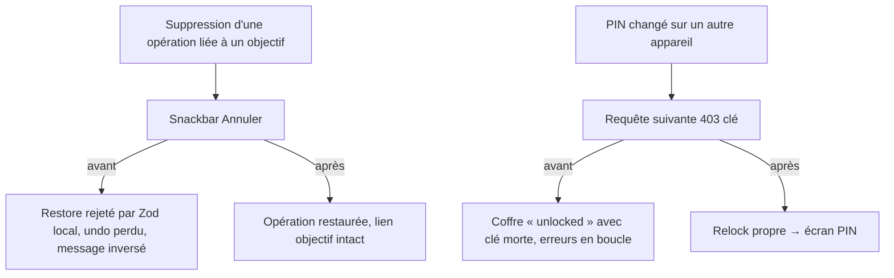

# Instruction: Bugs de flux — undo, report, pointage, retrait, clé client

Cinq défauts fonctionnels confirmés par l'audit 6 axes, tous côté Android, tous avec leur référence iOS/webapp comme modèle. Aucun ne demande de changement backend.

## Architecture projection

```txt
android/src/
├── features/transactions/
│   ├── transaction-draft.ts                  ✏️ restore : retire budgetLineId+sourceSavingsGoalId interdits ensemble
│   │                                            (shared/schemas.ts:1574-1581, superRefine) selon le cas
│   └── use-transaction-removal.ts            ✏️ pop du LIFO APRÈS confirmation serveur ; message d'échec remis à l'endroit
├── app/(main)/budget/[id]/line/[lineId].tsx  ✏️ entrée « Reporter au mois suivant » gardée (miroir PostponeMenuButton.swift:9-42)
├── features/current-month/components/
│   └── unchecked-operations-card.tsx         ✏️ snackbar Annuler après pointage (parité iOS home)
├── features/transactions/components/
│   └── transaction-sheet.tsx                 ✏️ sélecteur IncomeOrigin (revenu ↔ retrait d'objectif) — aujourd'hui
│                                                un retrait planifié d'objectif est incréable depuis Android
└── core/
    ├── api/api-error.ts (ou interceptor)     ✏️ 403 ERR_AUTH_CLIENT_KEY → lockVault() + route déverrouillage
    └── vault/vault-store.ts                  ✏️ (si besoin) chemin relock sans sign-out — miroir auth-interceptor webapp
```

## User Journey



## Tasks to do

### `1)` Undo d'une opération liée à un objectif

1. `transaction-draft.ts:144-177` : le payload de restauration respecte le superRefine (l'un OU l'autre des deux ids, jamais les deux) ; cas testés : op pointée sur prévision, op de retrait d'objectif
2. `use-transaction-removal.ts:48-55` : dépiler seulement à la confirmation ; en échec, l'entrée reste dans la pile et le message dit que l'**annulation** a échoué (aujourd'hui inversé)

### `2)` Gardes du report

1. Miroir des 5 cas de refus (`postpone-budget-line.use-case.ts:60-116`) : entrée cachée/désactivée avec message dédié par cas (déjà pointée, dernier mois, spread, retrait, rollover) — plus jamais « Réessaie » sur un refus déterministe

### `3)` Undo du pointage sur l'accueil

1. Après « C'est passé », snackbar avec action Annuler (délai standard) qui repasse `checkedAt` à null — parité iOS

### `4)` Origine d'un revenu

1. `transaction-sheet.tsx` : pour kind=income, choix « Revenu » / « Depuis un objectif » (sélecteur d'objectif) → `sourceSavingsGoalId` posé ; vocabulaire exact de l'équivalent iOS

### `5)` Clé client invalidée à distance

1. Sur `403 ERR_AUTH_CLIENT_KEY` (nom d'erreur exact à confirmer dans le backend) : `lockVault()` + navigation écran de déverrouillage, sans sign-out ; miroir du comportement auth-interceptor webapp ; test unitaire du chemin

## Test acceptance criteria

| Task | Acceptance criteria                                                                                                              |
| ---- | -------------------------------------------------------------------------------------------------------------------------------- |
| 1    | Undo d'une op liée à un objectif restaure la ligne ET le lien ; échec réseau simulé → message parlant d'annulation, pile intacte |
| 2    | Les 5 cas montrent l'état/le message du miroir iOS ; aucun appel réseau parti d'un cas interdit                                  |
| 3    | Pointer puis Annuler → l'op revient dans « à pointer », compteur hero décrémenté/réincrémenté                                    |
| 4    | Créer un retrait planifié d'objectif depuis Android → visible avec badge objectif sur le détail, identique à iOS                 |
| 5    | Clé invalidée simulée (PIN changé via webapp locale) → écran PIN au lieu d'erreurs en boucle ; session Supabase intacte          |
