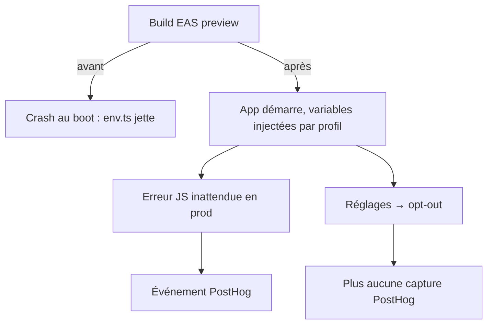

# Instruction: Télémétrie & variables de build EAS

PostHog est installé mais **jamais importé** : zéro erreur JS remontée, zéro analytics — trompeur pour qui lit `package.json`. Et un build EAS planterait au boot : `env.ts:22-30` jette sans `EXPO_PUBLIC_*`, qu'aucun `eas.json`/workflow ne fournit. Cette phase rend un build EAS viable et observable. (La création du projet EAS lui-même = humain, phase 9.)

## Architecture projection

```txt
android/
├── eas.json                              ✏️ env EXPO_PUBLIC_* par profil (dev/preview/production)
└── src/
    ├── core/observability/
    │   └── analytics.ts                  ✅ PostHog init + capture d'écrans et erreurs JS, opt-out lu depuis le store
    ├── app/_layout.tsx                   ✏️ init analytics au boot
    └── app/(main)/settings/index.tsx     ✏️ toggle « Partager les données d'usage » (opt-out, défaut aligné iOS/web)
```

## User Journey



## Tasks to do

### `1)` Env par profil

1. `eas.json` : bloc `env` par profil pour chaque `EXPO_PUBLIC_*` requis par `env.ts` (URLs backend/Supabase, clés publiques) ; secrets sensibles via `eas env` (documenté, pose humaine en phase 9)
2. Garde-fou : `env.ts` garde son throw (fail-fast voulu) mais le message liste la variable manquante et le profil

### `2)` Erreurs JavaScript PostHog

1. Autocapture des exceptions non interceptées et promesses rejetées via `core/observability/analytics.ts`, en production uniquement ; capture console et crash natif désactivées
2. Test ciblé : options de construction, profil désactivé et propagation du consentement

### `3)` PostHog + opt-out

1. Init + capture minimale (écrans, pas de propriétés financières) ; clé par env
2. Toggle réglages persistant (MMKV) branché sur `optOut()` ; respected dès le boot suivant
3. Aligner le défaut et le wording sur iOS/webapp (vérifier les deux avant d'écrire)

## Test acceptance criteria

| Task | Acceptance criteria                                                                                                                                      |
| ---- | -------------------------------------------------------------------------------------------------------------------------------------------------------- |
| 1    | `eas build --profile preview` (une fois le projet EAS créé, phase 9) démarre sans throw ; en attendant : `npx expo start` avec env de prod simulée boote |
| 2    | Exceptions non interceptées et promesses rejetées activées en production ; console, crash natif et profils non production restent silencieux             |
| 3    | Opt-out ON → zéro requête PostHog (vérifié au proxy/logs) ; OFF → captures visibles ; le choix survit au relaunch                                        |
