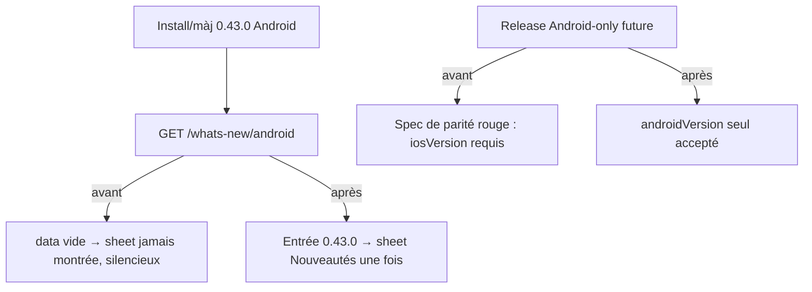

# Instruction: Nouveautés Android — feed vivant & parité release élargie

Le feed whats-new Android est mort en silence : **aucune** entrée de `releases-data.ts` ne porte `platforms: ['android']` (filtre `whats-new-payload.ts:45` exécuté pour preuve → `[]`), et la spec de parité (`releases-data.parity.spec.ts:153-160, 295-308`) exige `iosVersion` sur chaque entrée + le miroir `landing/data/releases.json` — une release Android-only est aujourd'hui **impossible**. On élargit le contrat au lieu de le contourner. (Cf. mémoire projet : tag `platforms` manquant = sheet jamais affichée, en silence.)

## Architecture projection

```txt
backend-nest/src/modules/whats-new/domain/
├── releases-data.ts                      ✏️ tag `android` sur les entrées applicables + entrée 0.43.0
│                                            (première release Android) avec copy FR produit
├── releases-data.parity.spec.ts          ✏️ contrat élargi : androidVersion accepté, règle « au moins une
│                                            plateforme versionnée », parité landing conservée
└── (schéma zod de l'entrée)              ✏️ androidVersion optionnel — vérifier le schéma exact avant d'étendre

landing/data/releases.json                ✏️ MÊME COMMIT : miroir des entrées touchées (la spec de parité le force)

android/ (aucun changement)               la sheet existe déjà (phase 12 du portage) et lira le feed dès qu'il est non-vide
```

## User Journey



## Tasks to do

### `1)` Contrat de release élargi

1. Lire le schéma d'entrée + la spec de parité en entier ; étendre : `androidVersion` optionnel, contrainte « au moins une version de plateforme présente », le filtre par plateforme inchangé
2. La spec de parité couvre le nouveau champ dans les deux sens (backend ↔ landing)

### `2)` Données

1. Taguer `android` les entrées existantes réellement applicables (juger entrée par entrée — pas de tag en masse)
2. Entrée 0.43.0 « Pulpe arrive sur Android » (copy FR, voix « je », vocabulaire produit) avec `androidVersion: "0.43.0"`
3. `landing/data/releases.json` mis à jour dans le **même commit** (mémoire : un merge qui les sépare casse la parité)

### `3)` Preuve d'exécution

1. Rejouer le filtre en local : `GET /whats-new/android?currentVersion=0.43.0` rend l'entrée ; `/ios` et `/web` inchangés (diff des payloads avant/après joint à la PR)

## Test acceptance criteria

| Task | Acceptance criteria                                                                                          |
| ---- | ------------------------------------------------------------------------------------------------------------ |
| 1    | Spec de parité verte avec une entrée fictive Android-only (test du nouveau contrat)                          |
| 2    | Payload `/whats-new/android` non vide en local ; payloads iOS/web strictement identiques à avant (diff vide) |
| 3    | Sheet Nouveautés visible sur l'émulateur après bump de version locale, une seule fois                        |
