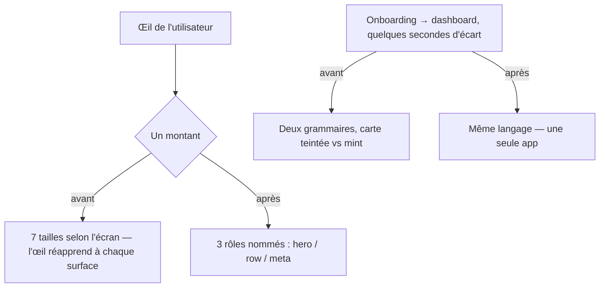

# Instruction: Design system consolidé — tokens, Amount, Card, chips, heros

Findings **R4 → R9 + section 5** de `DESIGN_AUDIT_20260814.md`. La base est saine (0 valeur en dur) mais trois angles morts du système (icônes, opacités, alphas) et quatre doctrines non tranchées (7 tailles de montant, 3 chips, 2 rayons de carte, 3 grammaires de hero) font la sensation « deux applications collées ». Design uniquement. **Approbation explicite avant implémentation.**

## Architecture projection

```txt
android/src/core/ui/
├── theme.ts                    ✏️ + ICON_SIZE, EMPHASIS, TINT_ALPHA, UPPERCASE_TRACKING (section 5 de l'audit) ;
│                                  HOME_HERO_COLORS.surfaceTop/.overlay morts → supprimés (ou dégradé posé, à trancher)
├── amount.tsx                  ✅ <Amount size="hero"|"row"|"meta"> : taille, graisse, TABULAR_DIGITS, accent financier
├── card.tsx                    ✅ carte unique imposant RADIUS.card=18 (remplace Card Paper nu, rayon 24, sur 10+ écrans)
├── pill.tsx                    ✅ la capsule de stat du hero devient un composant nommé (DESIGN.md:153)
└── use-financial-colors.ts     ✅ hook remplaçant 22 répétitions de useColorScheme()==="dark"?…

android/src/ (consommateurs)
├── features/current-month/components/home-hero-card.tsx     ✏️ grammaire hero unifiée (eyebrow, place du symbole)
├── features/budget-details/components/budget-detail-hero.tsx ✏️ idem + Pill importé
├── features/onboarding/steps/budget-preview-step.tsx          ✏️ mint constant (doctrine dashboard) ; FlowBars pressables,
│                                                                 3 boutons « Modifier… » supprimés (R6, §11)
├── features/onboarding/components/step-scaffold.tsx           ✏️ gutter 24→SCREEN_PADDING ; header aligné (R7)
├── app/(auth)/…                                               ✏️ gutter 24→SCREEN_PADDING (R7)
├── app/(main)/(tabs)/goals.tsx                                ✏️ progression visible sur la carte (barre + X / Y CHF) (R9)
├── core/ui/placeholder-screen.tsx                             ✏️ slot icon : vide ≠ erreur (R8)
├── app/(main)/settings/index.tsx                              ✏️ RefreshControl ; en-têtes capitales → tracking ou titleSmall
├── currency-picker.tsx, suggestion-grid.tsx                   ✏️ Chip Paper brut → FilterChip (R5)
└── (montants inventoriés dans l'audit)                        ✏️ migrés vers <Amount>
```

## User Journey



## Tasks to do

### `1)` Tokens & primitives

1. Poser les tokens de la section 5 de l'audit ; supprimer les valeurs sauvages qu'ils remplacent (inventaire question 1 de l'audit : 10 constantes réparties sur 7 fichiers)
2. `<Amount>`, `<Card>`, `<Pill>`, `useFinancialColors()` créés dans `core/ui/` avec leurs specs

### `2)` Migration des consommateurs

1. Montants → `<Amount>` (l'inventaire des 7 variantes/fichiers est dans le §6 du rapport design system) ; `titleMedium` = `row`
2. `<Card>` remplace les `Card mode="contained"` Paper des 10+ écrans listés ; les 2 `Chip` Paper bruts → `FilterChip`
3. Vérification visuelle écran par écran (captures) — zéro changement de layout non voulu

### `3)` Doctrines tranchées

1. Heros : une grammaire (eyebrow unique, symbole devise à un seul emplacement, `displaySmall` partagé)
2. Onboarding au mint constant ; gutters tous sur `SCREEN_PADDING` ; header onboarding aligné (`SCREEN_PADDING - ICON_BUTTON_INSET`)
3. Goals avec progression ; placeholder à icône ; réglages complétés (RefreshControl, capitales)

## Test acceptance criteria

| Task | Acceptance criteria                                                                                                            |
| ---- | ------------------------------------------------------------------------------------------------------------------------------ |
| 1    | grep des anciennes constantes sauvages → 0 ; specs des 4 nouvelles primitives vertes                                           |
| 2    | grep `mode="contained"` sur Card Paper → 0 hors `core/ui/card.tsx` ; un seul rayon de carte à l'écran (captures)               |
| 3    | Captures avant/après des 3 heros : même grammaire ; carte objectif montre barre + montants ; état vide ≠ état d'erreur à l'œil |
