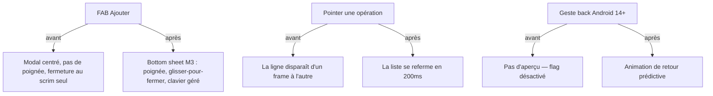

# Instruction: Motion & surfaces natives — bottom sheet, back prédictif, gestes

> **État au 2026-08-14.** Livrées : les tokens `DURATION`, `layout={LinearTransition}`
> sur les listes qui gagnent ou perdent une ligne (2.1), le menu contextuel au long-press
> sur les lignes de transaction (3.2), et la taxonomie haptique ramenée à quatre intentions
> nommées dans `core/ui/haptics.ts` (3.3, 25 fichiers).
> Restent ouvertes : 1 (sheet gorhom — l'inconnue nommée est un `TextInput` Paper dans une
> sheet gorhom sur Android, qui se vérifie au doigt), 2.2 (`animated: true` du pager de
> mois — le cas « mois courant loin dans le rail » demande l'appareil), 3.1 (back prédictif,
> bloqué en amont).

Findings **R1, R2, R3, R10, R11** de `DESIGN_AUDIT_20260814.md`. L'app est entièrement statique : `@gorhom/bottom-sheet` et Reanimated installés mais jamais importés, la « sheet » est un Modal centré (17 fichiers), aucun token de durée, back prédictif désactivé pour deux `BackHandler` legacy, ni swipe ni long-press. Design/interaction uniquement. **Approbation explicite avant implémentation.**

## Architecture projection

```txt
android/src/
├── core/ui/
│   ├── sheet.tsx                 ✏️ ré-implémentée sur @gorhom/bottom-sheet (poignée, glisser-pour-fermer,
│   │                                snap points, clavier) — l'API publique (props) reste la même pour
│   │                                que les 17 *-sheet.tsx ne changent pas, sinon migration par lots
│   └── theme.ts                  ✏️ + DURATION = { short: 200, medium: 300 }
├── features/current-month/components/unchecked-operations-card.tsx  ✏️ layout={LinearTransition} (lignes qui partent)
├── features/budget-details/…                                        ✏️ idem sur les listes à ajout/retrait
├── app/(onboarding)/index.tsx:53 + app/(main)/budget/[id].tsx:131   ✏️ BackHandler → onBackInvokedCallback
├── app.json                                                          ✏️ predictiveBackGestureEnabled: true
├── features/budget-details/components/transaction-row.tsx            ✏️ onLongPress → Menu Paper ancré (supprimer/modifier)
└── (haptics, 41 appels)                                              ✏️ ramenés à 3 usages (selection/impact/notification)
```

## User Journey



## Tasks to do

### `1)` Bottom sheet réelle

1. `sheet.tsx` portée sur gorhom (dep déjà installée, `GestureHandlerRootView` déjà monté dans `_layout.tsx:81`) ; comportement clavier re-validé (le choix documenté `adjustResize` + pas de KeyboardAvoidingView doit survivre)
2. Passe visuelle des 17 `*-sheet.tsx` (captures) ; attention au precedent Reanimated (mémoire : `entering` + position absolue) — gorhom gère son propre layout, ne pas ajouter d'`entering` aux contenus

### `2)` Motion de base

1. Tokens `DURATION` ; `layout={LinearTransition}` sur les listes qui gagnent/perdent des lignes (pointage accueil, transactions détail) — `layout`, pas `entering`, cf. mémoire projet
2. Le pager de mois passe `animated: true` si le recalage reste correct (tester le cas « mois courant loin dans le rail »)

### `3)` Back prédictif & gestes

1. Migrer les deux `BackHandler` vers l'API `onBackInvokedCallback` ; `predictiveBackGestureEnabled: true` ; vérifier les deux flows protégés (recherche du détail, sortie d'onboarding avec dialog)
2. `onLongPress` sur les lignes de transaction → menu contextuel (supprimer/modifier) ; parité du modèle inline de `settings/tags.tsx` là où le menu serait pauvre
3. Haptics : 3 usages seulement (`selectionAsync` bascule, `impactAsync(Medium)` engagement, `notificationAsync` fin d'opération réseau) — remplace la taxonomie iOS Soft/Rigid

## Test acceptance criteria

| Task | Acceptance criteria                                                                                                                    |
| ---- | -------------------------------------------------------------------------------------------------------------------------------------- |
| 1    | La sheet d'ajout se ferme au glisser, poignée visible, clavier ne recouvre pas le footer ; 17 sheets passées en revue (captures)       |
| 2    | Pointage : la liste s'anime (vidéo/screenrecord) ; aucune régression chrome (classe de bug « entering » absente)                       |
| 3    | Geste back : aperçu prédictif visible sur Android 14+ ; recherche et sortie d'onboarding toujours protégées ; long-press ouvre le menu |
