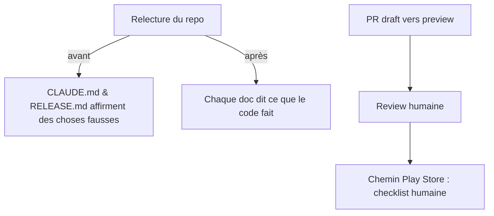

# Instruction: Polish, hygiène docs & préparation release

> **Deux écarts au 2026-08-14.** Le splash sombre n'a pas reçu de `dark.image` : la mesure
> WCAG sur les 40 725 pixels opaques du logo donne 6,94:1 en médiane sur `#141210` et 2,49:1
> sur `#F7F6F3` — c'est le splash _clair_ qui passe sous le seuil, et c'est une décision
> d'asset, pas de config. Le rebase du § « Git » est devenu un merge : 87 commits à réécrire
> plus un force-push se défont mal, et le dépôt écrase l'historique interne au squash-merge
> de toute façon. La PR draft est #608.

La section Polish de `DESIGN_AUDIT_20260814.md`, les mensonges documentaires relevés par l'audit 6 axes, et la mise en ordre git/PR. Clôt le plan ; contient aussi la checklist **humaine** (non exécutable par un agent).

## Architecture projection

```txt
android/src/
├── features/current-month/components/home-hero-card.tsx  ✏️ ›  → icône chevron-right (2 sites)
├── app/(main)/(tabs)/home.tsx                            ✏️ dailyBudget padding retiré ; IconButton compte margin:0+hitSlop
├── core/ui/theme.ts                                      ✏️ tokens morts surfaceTop/overlay tranchés
├── core/…                                                ✅ RECURRENCE_LABELS exporté une fois (6 copies supprimées)
├── app.json                                              ✏️ splash dark.image si contraste insuffisant sur #141210
└── (FAB)                                                 ✏️ doctrine : étendu sur racines, rond sur détails (ou statu quo argumenté)

docs
├── CLAUDE.md                                             ✏️ ligne « quality » : android/package.json définit bien un script quality
├── android/docs-android/RELEASE.md:20                    ✏️ assetlinks.json → frontend/projects/webapp/public/.well-known/ (comme l'AASA iOS), pas landing
├── aidd_docs/tasks/2026_08/2026_08_11_android-expo-port/ ✏️ phase-7 « Reste ouvert » périmé (livré par 0af99f4aa) ; dédupliquer les blockquotes ×2 des phases 6/7/8
└── détail hero « +0 »                                    ✏️ décimales alignées sur la règle iOS Budget Detail (2 décimales) après vérif iOS

git
└── branche rebasée sur origin/preview (9 commits derrière) → PR draft vers preview
```

## User Journey



## Tasks to do

### `1)` Polish visuel (audit, section 4)

1. Chevrons, paddings home, tokens morts, `RECURRENCE_LABELS`, splash dark, doctrine FAB, décimales du détail — chaque item de la section Polish de l'audit, valeurs par tokens uniquement

### `2)` Docs remises à la vérité

1. `CLAUDE.md` (note : `android/package.json` définit `quality` — la parenthèse actuelle est fausse), `RELEASE.md:20`, en-têtes de phases du plan de portage (« Reste ouvert » livré, blockquotes dupliqués)

### `3)` Git & PR

1. Rebase sur `origin/preview` (résoudre en gardant la sémantique des deux côtés — attention à `database.types.ts`, cf. mémoire merge-drops-database-types)
2. `pnpm quality` + suites complètes vertes post-rebase ; PR **draft** vers `preview` avec le résumé de l'audit et le lien vers `DESIGN_AUDIT_20260814.md`

### `4)` Checklist humaine (à cocher par Maxime, hors agent)

1. `eas init` (crée `extra.eas.projectId`) puis `eas credentials` (keystore) — sans quoi workflows `.eas/` et OTA restent inertes
2. Play Console : app créée, service account JSON pour `eas submit`
3. `eas env` : secrets par profil (DSN Sentry, clé PostHog, URLs prod)
4. Publier `assetlinks.json` (avec le SHA-256 du keystore EAS) dans `frontend/projects/webapp/public/.well-known/` — déblocage de l'App Link reset-password
5. Premier build interne + passage TestFlight-équivalent (internal testing track)

## Test acceptance criteria

| Task | Acceptance criteria                                                                                               |
| ---- | ----------------------------------------------------------------------------------------------------------------- |
| 1    | Section Polish de l'audit intégralement traitée ou explicitement reportée ligne par ligne                         |
| 2    | grep des trois affirmations fausses → corrigées ; le plan de portage ne contient plus de « Reste ouvert » périmé  |
| 3    | CI verte sur la PR draft ; base = `preview` ; description contient audit + captures avant/après des phases design |
| 4    | Checklist présente dans la PR, cases non cochées (elles appartiennent à Maxime)                                   |
