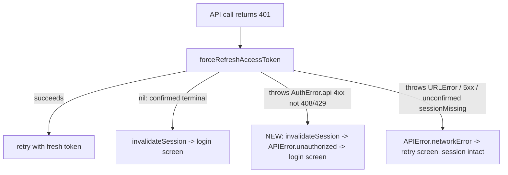
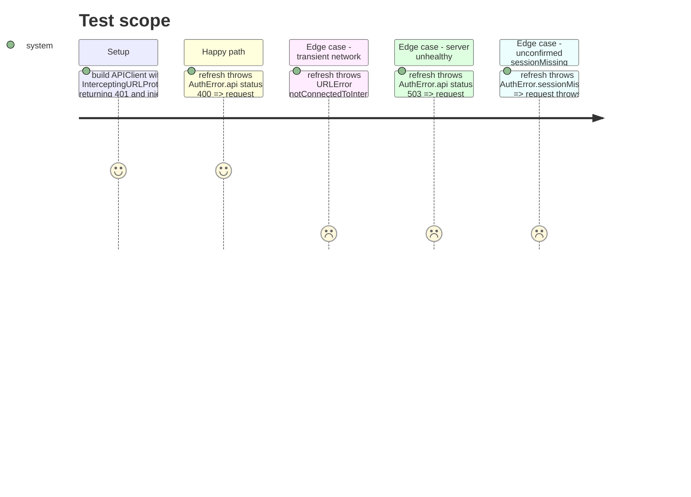

# Instruction: Classify refresh rejection in APIClient

## Architecture projection

> Tree of the final files. ✅ create · ✏️ modify · ❌ delete

```txt
ios
├── Pulpe/Core/Network
│   └── APIClient.swift                                ✏️ classify the caught error in refreshTokenForRetry()
└── PulpeTests/Core/Network
    └── APIClientClientKeyHeaderTests.swift            ✏️ 4 focused tests on the classification boundary
```

## User Journey



## Test Scope



## Tasks to do

### `1)` Classify the error caught in `refreshTokenForRetry()`

> Definitive auth-server rejection ends the session; everything else stays retryable.

1. In the `catch` of `refreshTokenForRetry()` (`APIClient.swift:329`), match `AuthError.api(_, _, _, underlyingResponse)`.
2. If `(400..<500).contains(statusCode)` and status is neither 408 nor 429: `await invalidateSession()` then `throw APIError.unauthorized`.
3. Every other throw (URLError, 5xx `.api`, unconfirmed `.sessionMissing`, non-auth errors) keeps `throw APIError.networkError(error)`.
4. `import Supabase` if not already imported in `APIClient.swift`.

### `2)` Pin the boundary with focused tests

> One test per branch of the classification, reusing the existing seam.

1. In `APIClientClientKeyHeaderTests.swift`, reuse `makeSUT(forceRefreshAccessToken:invalidateSession:)`, `InterceptingURLProtocol` (401 responder), `makeHTTPResponse`, `AtomicFlag`.
2. Add: refresh throws `AuthError.api` 400 => thrown error is `APIError.unauthorized`, `invalidationCalled == true`.
3. Add: refresh throws `URLError(.notConnectedToInternet)` => `.networkError`, no invalidation.
4. Add: refresh throws `AuthError.api` 503 => `.networkError`, no invalidation.
5. Add: refresh throws `AuthError.sessionMissing` => `.networkError`, no invalidation.

## Test acceptance criteria

| Task | Acceptance criteria                                                                                                                                          |
| ---- | ------------------------------------------------------------------------------------------------------------------------------------------------------------ |
| 1    | A 401'd request whose refresh is rejected with a definitive 4xx surfaces `APIError.unauthorized` after `invalidateSession()` posted `.sessionExpired`         |
| 1    | A 401'd request whose refresh fails with URLError, a 5xx auth response, or unconfirmed `sessionMissing` surfaces `APIError.networkError`; session untouched   |
| 2    | The four new tests execute (non-zero count in xcodebuild output) and pass; the pre-existing `request_unauthorized_refreshThrows_doesNotInvalidateSession` still passes |
