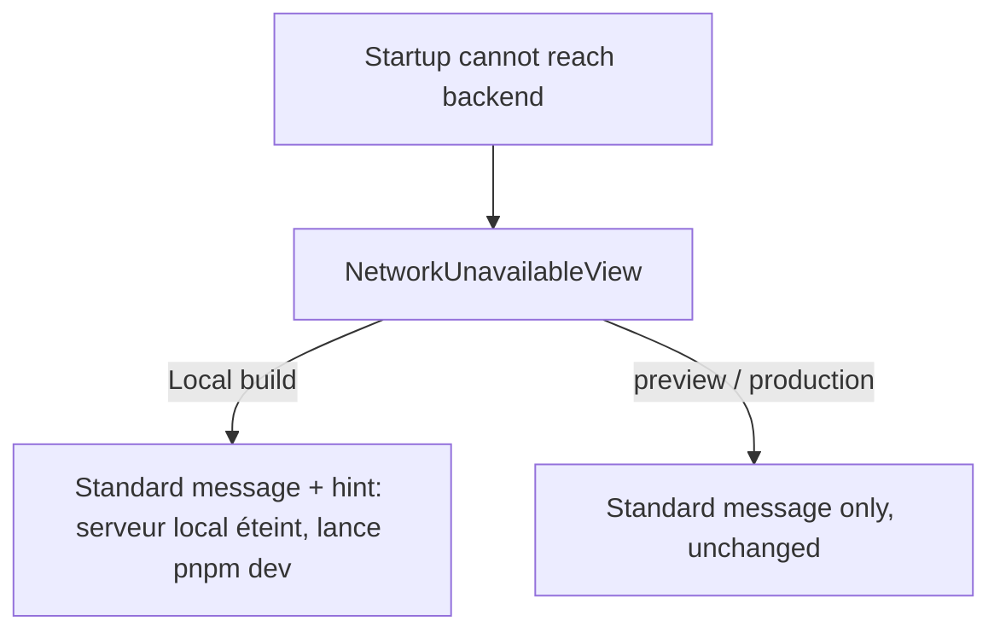
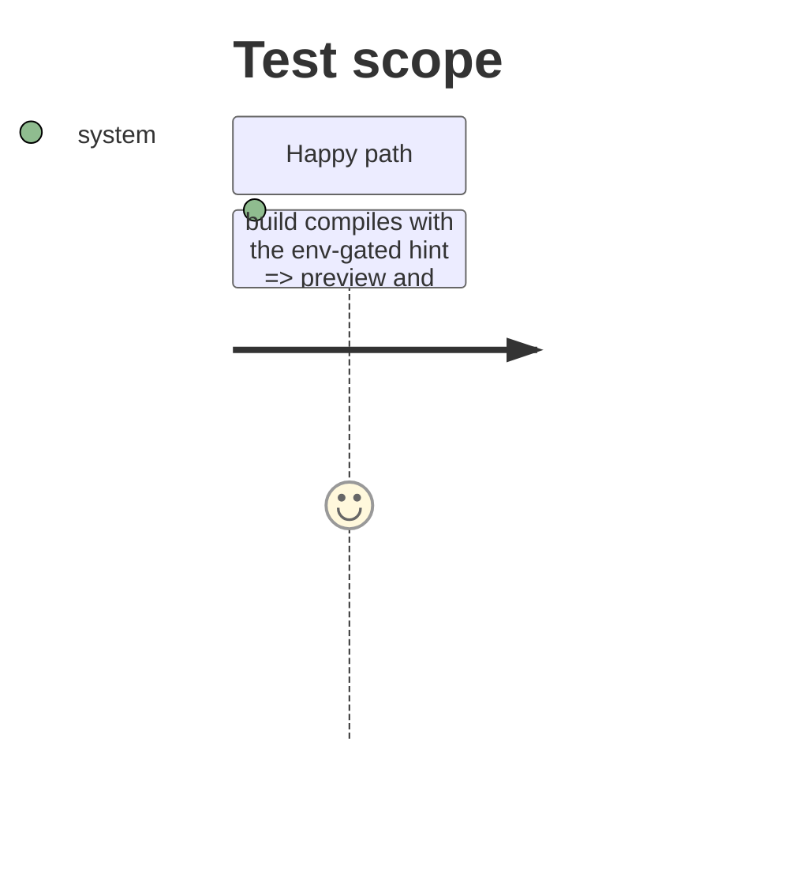

# Instruction: Local-build dead-server hint on NetworkUnavailableView

## Architecture projection

> Tree of the final files. ✅ create · ✏️ modify · ❌ delete

```txt
ios
└── Pulpe/Shared/Components
    └── NetworkUnavailableView.swift    ✏️ append a Local-only hint under the standard subtitle
```

## User Journey



## Test Scope



## Tasks to do

### `1)` Env-gated hint text

> One extra `Text` under the subtitle, visible only when `AppConfiguration.environment == .local`.

1. In `NetworkUnavailableView.swift`, below the existing subtitle `Text`, add `if AppConfiguration.environment == .local { Text("Build Local : le serveur est peut-être éteint — lance pnpm dev.") }` with the same secondary styling.

## Test acceptance criteria

| Task | Acceptance criteria                                                                                       |
| ---- | --------------------------------------------------------------------------------------------------------- |
| 1    | Preview/production copy is byte-identical to today; the hint renders only when `APP_ENV == local`; build and SwiftLint strict pass |
