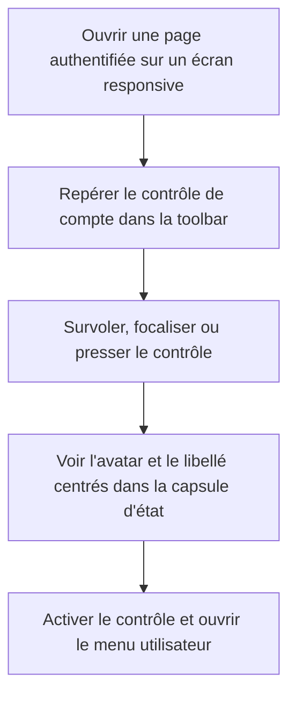
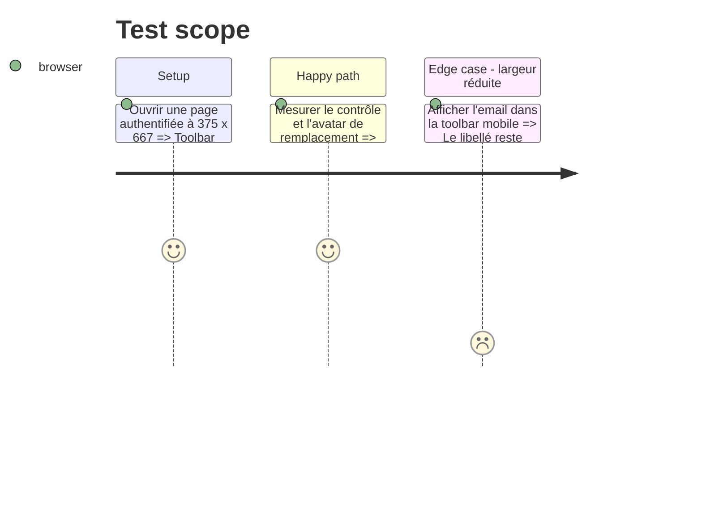

# Instruction: Recentrer et verrouiller le contrôle de compte

## Architecture projection

> Tree of the final files. ✅ create · ✏️ modify · ❌ delete

```txt
.
└── frontend/
    ├── projects/webapp/src/app/layout/
    │   └── ✏️ main-layout.ts
    └── e2e/tests/features/
        └── ✏️ mobile-scroll.spec.ts
```

## User Journey



## Test Scope



## Wireframe

```txt
┌────────────────────────────────────────────┐
│ (1) Toolbar                                │
│ ┌─────┐          ┌─────┐ ┌───────────────┐ │
│ │ (2) │          │ (3) │ │ (4) ○  libellé│ │
│ └─────┘          └─────┘ └───────────────┘ │
├────────────────────────────────────────────┤
│ (5) Contenu de page                        │
└────────────────────────────────────────────┘

1. Toolbar : regroupe le chrome global responsive.
2. Navigation : ouvre le tiroir mobile.
3. Statut : conserve le badge conditionnel existant.
4. Compte : réunit avatar et libellé dans un seul contrôle.
5. Contenu : reste indépendant du correctif du header.
```

## Tasks to do

### `1)` Centrer le contenu projeté

> Supprimer le décalage de ligne de base à l'intérieur du bouton Material existant.

1. Remplacer le contexte `inline-flex` du groupe avatar/email par la mise en page flex locale déjà disponible.
2. Conserver la taille de l'avatar, l'espacement, `min-w-0`, la troncature de l'email et la géométrie accessible du bouton Material.
3. Ne pas surcharger les classes internes de Material ni ajouter de style global.

### `2)` Verrouiller la géométrie responsive

> Couvrir le défaut visuel avec le test Playwright mobile existant.

1. Étendre le scénario handset de `mobile-scroll.spec.ts` avec les sélecteurs déjà présents.
2. Comparer les centres verticaux du contrôle et de l'avatar de remplacement en pixels CSS, avec une tolérance d'un pixel.
3. Vérifier que l'email reste contenu et que l'ouverture du menu fonctionne à largeur réduite.

## Test acceptance criteria

| Task | Acceptance criteria |
| ---- | ------------------- |
| 1 | Sur la toolbar responsive, la photo ou l'initiale et l'email partagent le centre vertical de la capsule d'état du contrôle de compte. |
| 1 | Les états hover, focus et pressed, la cible tactile, la troncature et l'ouverture du menu conservent leur comportement Material actuel. |
| 2 | La vérification navigateur échoue lorsque le centre vertical du contenu s'écarte de plus d'un pixel CSS de celui du contrôle, indépendamment du DPR. |
