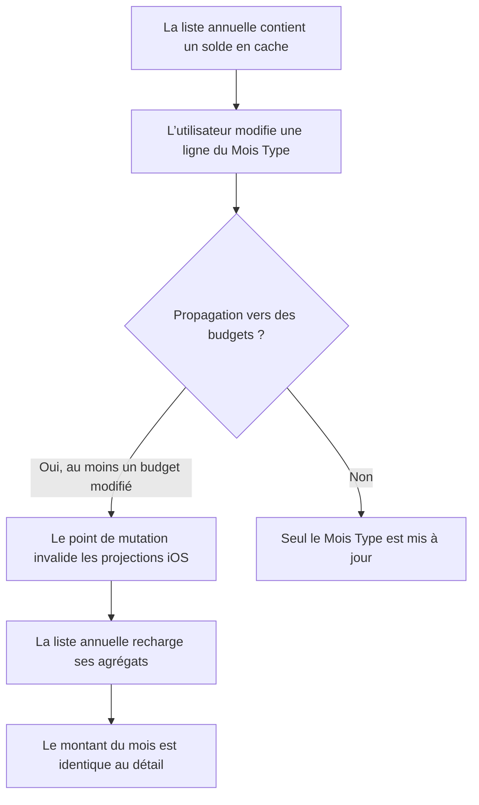
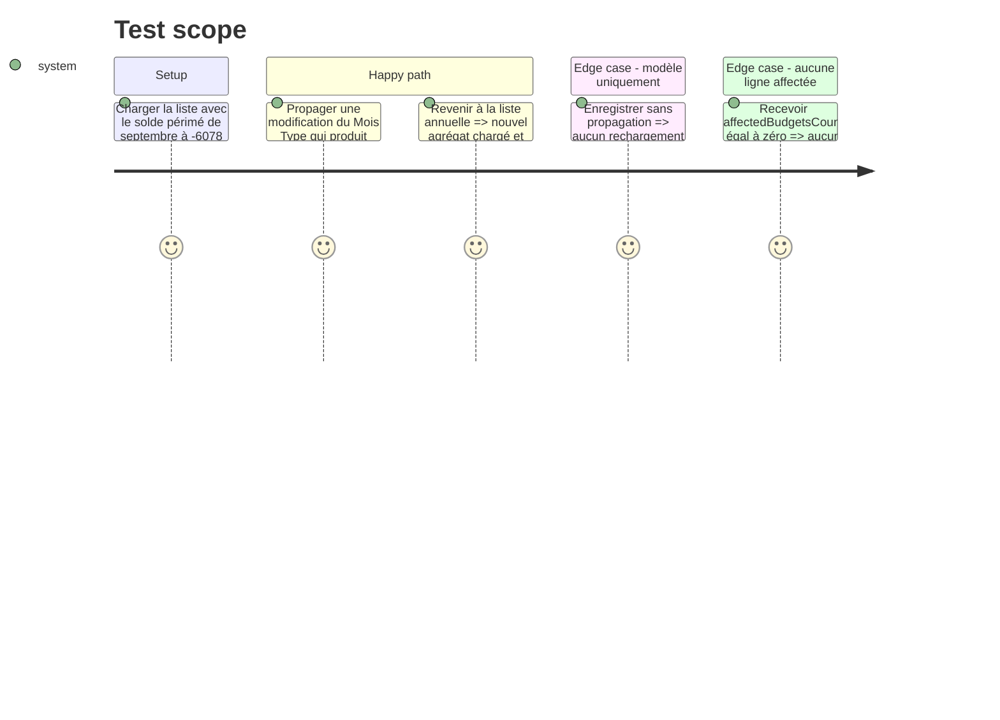

# Instruction: Propager l’invalidation des soldes iOS

## Architecture projection

> Tree of the final files. ✅ create · ✏️ modify · ❌ delete

```txt
ios/
├── Pulpe/Features/Templates/TemplateDetails/
│   ├── EditTemplateLineSheet.swift                 ✏️ signaler une propagation ayant modifié des budgets
│   └── TemplateDetailsView.swift                   ✏️ invalider les stores qui projettent ces budgets
└── PulpeTests/
    ├── Domain/Store/CrossStoreSyncTests.swift      ✏️ couvrir le rechargement après propagation
    └── Features/Templates/EditTemplateLineSheetTests.swift ✏️ couvrir le signal propagation/modèle seul
```

## User Journey



## Test Scope



## Tasks to do

### `1)` Verrouiller la régression au point de mutation

> Reproduire la divergence comme une donnée annuelle en cache après une propagation réussie.

1. Étendre les tests de l’éditeur du Mois Type avec les deux issues explicites : modèle seul et propagation ayant affecté au moins un budget.
2. Ajouter au test de synchronisation inter-stores le cas où la liste contient `-6’078 CHF`, puis doit recharger `-1’771.80 CHF` après le signal de propagation.
3. Conserver dans la fixture les entrées visibles du détail : revenus `11’475`, dépenses `12’962.02`, report `-284.78` ; leur solde attendu est `-1’771.80`.

### `2)` Émettre un unique signal de mutation budget

> Faire remonter le fait « des budgets ont changé » depuis le succès de propagation, sans dupliquer la logique dans chaque branche.

1. Faire distinguer au callback de `EditTemplateLineSheet` une mise à jour du modèle seul d’une propagation dont `affectedBudgetsCount > 0`.
2. Déclencher ce signal uniquement après une réponse serveur réussie ; un échec ou une propagation vide ne doit pas invalider les stores.
3. Garder le calcul financier inchangé : `BudgetFormulas` produit déjà `11’475 − 12’962.02 − 284.78 = -1’771.80` sur le détail.

### `3)` Invalider les projections qui partagent les agrégats

> Réutiliser le mécanisme `invalidateCache()` existant afin que le prochain affichage lise les montants serveur à jour.

1. Relier le signal dans `TemplateDetailsView` aux `BudgetListStore`, `DashboardStore`, `CurrentMonthStore` et `SavingsGoalStore` fournis par l’environnement.
2. Laisser chaque store effectuer son rechargement normal via `loadIfNeeded()` ; ne pas ajouter de nouvelle couche de cache ni de nouvelle formule.
3. Exécuter les suites Swift ciblées de synchronisation inter-stores et de modification du Mois Type, puis le target `PulpeTests`.

## Test acceptance criteria

| Task | Acceptance criteria |
| ---- | ------------------- |
| 1 | Le test reproduit l’état où la liste annuelle conserve `-6’078 CHF` alors que les données propagées donnent `-1’771.80 CHF`, et échoue avant le câblage d’invalidation. |
| 2 | Une propagation réussie avec au moins un budget affecté émet exactement un signal ; modèle seul, réponse en erreur et compteur nul n’en émettent aucun. |
| 3 | Au retour sur Budgets, septembre affiche le même solde que son détail et le potentiel annuel est recalculé depuis la nouvelle dernière valeur ; les autres projections de budget ne restent pas sur leurs agrégats antérieurs. |
