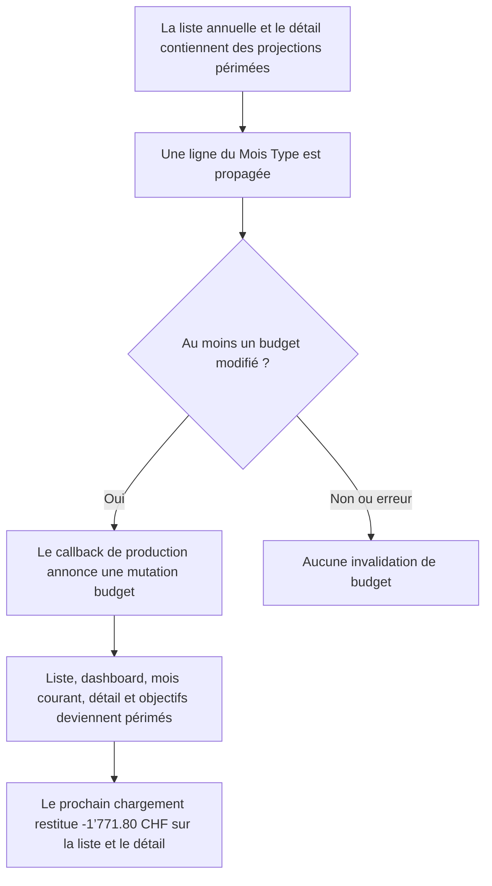

# Instruction: Verrouiller le seam et les caches dérivés

## Architecture projection

> Tree of the final files. ✅ create · ✏️ modify · ❌ delete

```txt
ios/
├── Pulpe/Features/Templates/TemplateDetails/
│   ├── EditTemplateLineSheet.swift                 ✏️ regrouper les read models dépendants de la propagation
│   └── TemplateDetailsView.swift                   ✏️ centraliser le callback et invalider tous les read models
└── PulpeTests/
    ├── Domain/Store/CrossStoreSyncTests.swift         ✏️ déplacer la régression vers le callback réel
    └── Features/Templates/EditTemplateLineSheetTests.swift ✏️ traverser le callback de production avec les deux caches périmés
```

## Cause evidence

- À données propres, la liste sparse et le détail partent des mêmes revenus, dépenses et report : le mapper backend sparse appelle les formules partagées `calculateAvailable` puis `calculateRemaining`, tandis que `BudgetDataStore.metrics` applique leurs miroirs Swift aux lignes et au report du même budget.
- Le web est la référence observée correcte. Le jeu signalé donne sur les deux chemins `11’475 − 12’962.02 − 284.78 = -1’771.80 CHF` ; il n’indique donc pas une divergence de formule.
- La divergence reproduite est temporelle : après la propagation du Mois Type, la liste annuelle iOS et un détail déjà visité peuvent chacun resservir leur projection pendant le TTL court de 30 secondes si ce point de mutation n’invalide pas leurs caches.

## User Journey



## Tasks to do

### `1)` Traverser le callback de production

1. Extraire le comportement du callback de `EditTemplateLineSheet` dans un handler synchrone et testable utilisé par `TemplateDetailsView`.
2. Mettre à jour la ligne du modèle pour chaque succès, puis invalider les projections une seule fois uniquement pour `.budgetsChanged`.
3. Couvrir modèle seul, propagation vide et échec sans ajouter de harness UI ni de dépendance de test.

### `2)` Invalider tous les read models dépendants

1. Conserver l’invalidation de `BudgetListStore`, `DashboardStore` et `CurrentMonthStore`.
2. Invalider `BudgetDetailCache.shared`, qui peut précharger un détail déjà visité pendant le même TTL court.
3. Utiliser `SavingsGoalStore.invalidateFromBudgetMutation()` afin de périmer le cache et d’incrémenter la version observée par un détail d’objectif ouvert.
4. Injecter tous les stores consommés dans la preview de `TemplateDetailsView`.

### `3)` Verrouiller la parité après rechargement

1. Amorcer simultanément une liste annuelle à `-6’078 CHF` et un cache de détail dont les lignes produisent un ancien solde.
2. Traverser le handler du callback avec une propagation réussie et vérifier une seule invalidation, la disparition du cache de détail et l’avancement de la version des objectifs.
3. Recharger les données serveur propres et vérifier que la projection sparse et `BudgetDataStore.metrics.remaining` convergent vers `-1’771.80 CHF`.

## Test acceptance criteria

| Task | Acceptance criteria |
| ---- | ------------------- |
| 1 | Le test traverse le handler utilisé par le callback réel ; `.budgetsChanged` invalide exactement une fois, tandis que modèle seul, compteur nul et erreur n’invalident rien. |
| 2 | Une propagation réussie vide `BudgetDetailCache.shared`, rend les trois stores de budget périmés et incrémente une fois `budgetMutationVersion`. |
| 3 | Après rechargement, la liste sparse et le détail recalculé avec les mêmes entrées valent tous deux `-1’771.80 CHF`, sans modification de formule ni du web/backend. |
