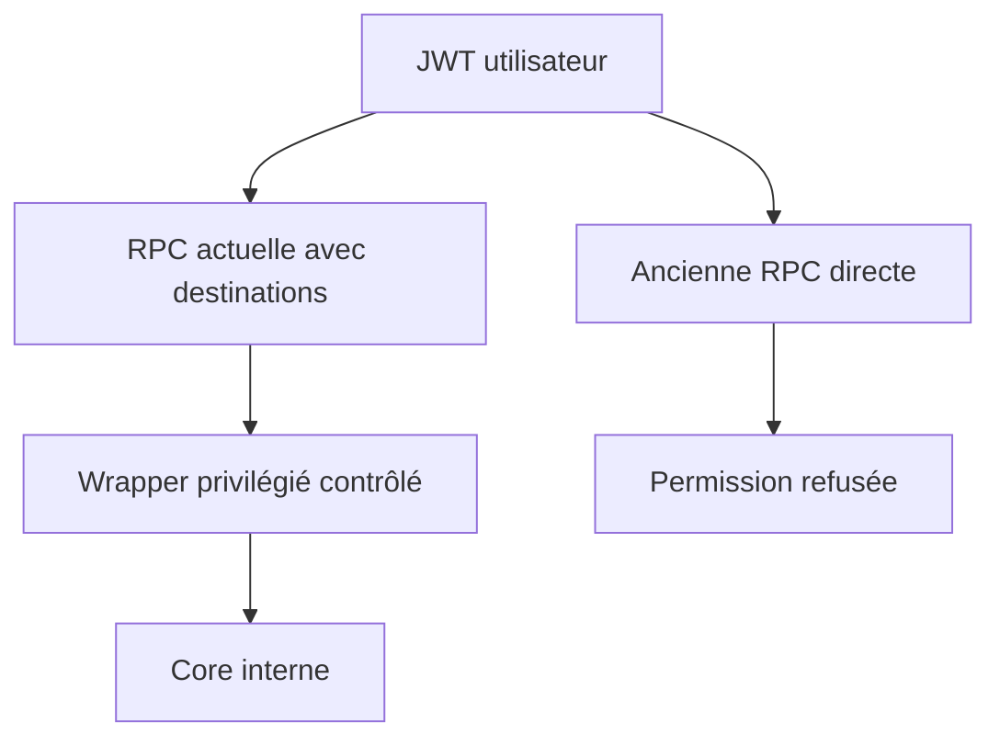
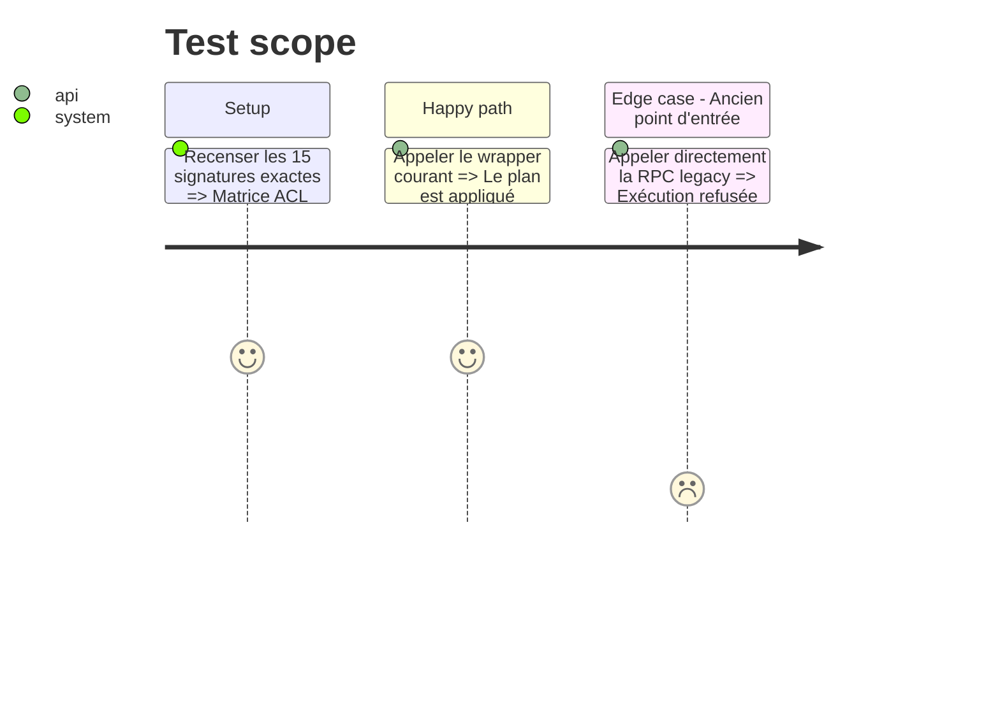

# Instruction: Fermer le point d'entrée legacy et figer le contrat ACL

## Architecture projection

> Tree of the final files. ✅ create · ✏️ modify · ❌ delete

```txt
backend-nest/supabase/
├── migrations/
│   └── ✅ 20260814120000_revoke_legacy_savings_goal_plan_execute.sql  # retire l'appel direct devenu interne
└── tests/
    ├── ✏️ security_definer_function_privileges.sql                    # couvre les 15 RPC et leurs ACL attendues
    └── ✏️ README.md                                                   # décrit le contrat de sécurité élargi
```

## User Journey



## Test Scope



## Tasks to do

### `1)` Contrat ACL et fermeture legacy

> Transformer le test existant en inventaire exécutable puis fermer l'ancien appel direct.

1. Vérifier pour les 15 signatures le mode `prosecdef`, l'absence de droit `PUBLIC`/`anon` et le droit `authenticated` attendu.
2. Vérifier aussi que les helpers/cores de retraits restent inaccessibles à tous les rôles API.
3. Confirmer que les anciens pods utilisant `apply_savings_goal_plan` sont drainés.
4. Révoquer `EXECUTE` à `authenticated` sur cette signature, sans modifier son corps ni sa signature.
5. Régénérer les types locaux et conserver le fichier généré seulement s'il diffère réellement.

## Test acceptance criteria

| Task | Acceptance criteria                                                                                                                                        |
| ---- | ---------------------------------------------------------------------------------------------------------------------------------------------------------- |
| 1    | Le test catalogue détecte toute dérive ACL; l'appel direct à `apply_savings_goal_plan` est refusé tandis que le wrapper courant conserve son comportement. |
