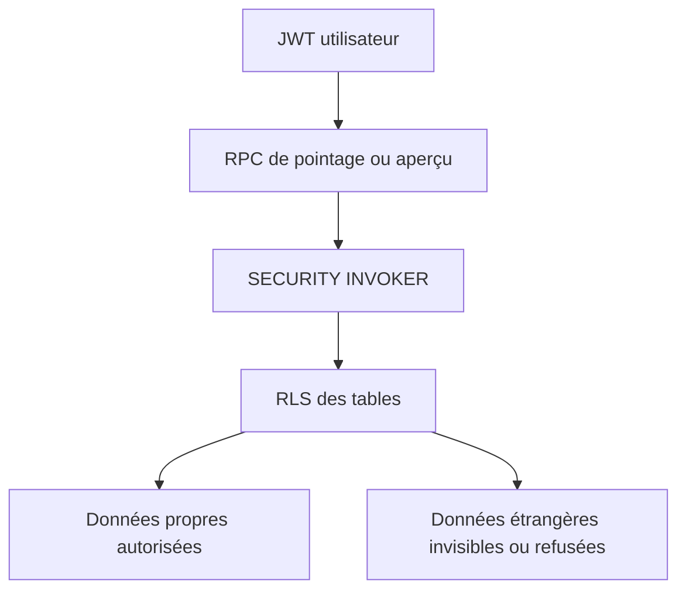
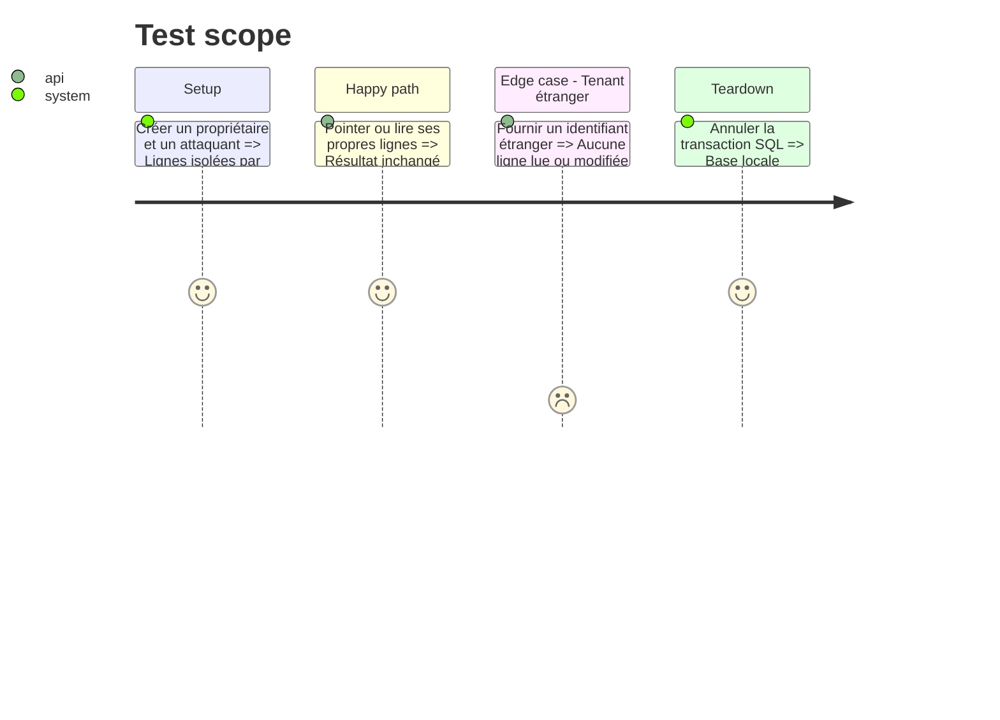

# Instruction: Basculer les RPC de pointage et de lecture vers RLS

## Architecture projection

> Tree of the final files. ✅ create · ✏️ modify · ❌ delete

```txt
backend-nest/supabase/
├── migrations/
│   └── ✅ 20260814121000_use_invoker_for_leaf_rpcs.sql  # réactive RLS sur quatre RPC bornées
└── tests/
    ├── ✅ budget_line_check_rpcs.sql                    # prouve succès propriétaire et refus inter-utilisateur
    ├── ✏️ security_definer_function_privileges.sql      # attend désormais quatre fonctions invoker
    └── ✏️ README.md                                     # référence la nouvelle vérification SQL
```

## User Journey



## Test Scope



## Tasks to do

### `1)` Conversion minimale et preuve RLS

> Passer les quatre fonctions couvertes par les politiques CRUD puis vérifier leur isolation réelle.

1. Appliquer `SECURITY INVOKER` à `check_unchecked_transactions`, `toggle_budget_line_check`, `toggle_transaction_check` et `get_savings_goal_deletion_impact`.
2. Conserver les `GRANT authenticated`, les signatures et les corps actuels.
3. Ajouter le test SQL ciblé des deux RPC de prévision et réutiliser les suites existantes pour la transaction et l'aperçu de suppression.
4. Mettre à jour le test catalogue puis régénérer les types locaux.

## Test acceptance criteria

| Task | Acceptance criteria                                                                                                                                                     |
| ---- | ----------------------------------------------------------------------------------------------------------------------------------------------------------------------- |
| 1    | Les quatre fonctions ont `prosecdef = false`; le propriétaire conserve pointage et aperçu, tandis qu'un second utilisateur ne lit ni ne modifie aucune ligne étrangère. |
