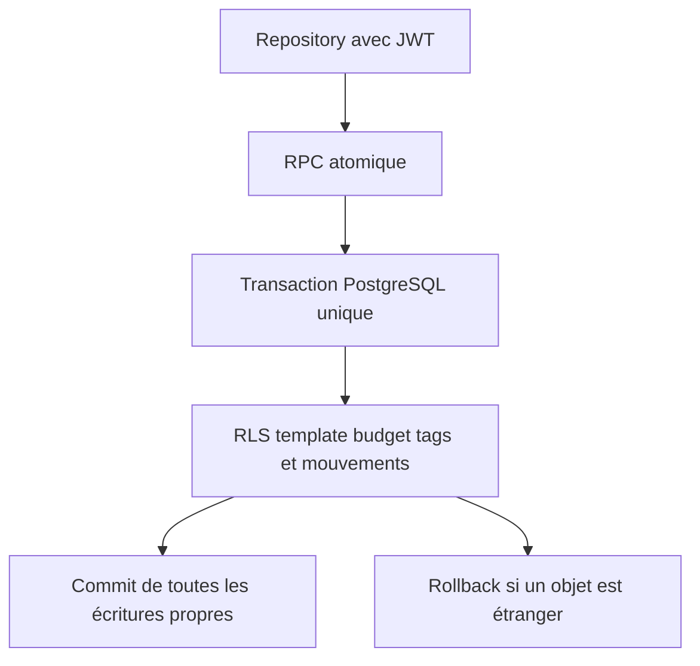
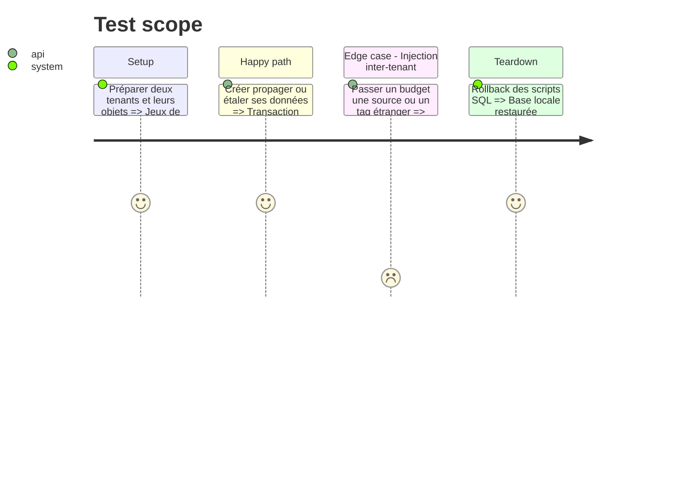

# Instruction: Basculer les RPC atomiques de modèles et d'étalement vers RLS

## Architecture projection

> Tree of the final files. ✅ create · ✏️ modify · ❌ delete

```txt
backend-nest/supabase/
├── migrations/
│   └── ✅ 20260814122000_use_invoker_for_template_and_spread_rpcs.sql  # active RLS sans changer les transactions
└── tests/
    └── ✏️ security_definer_function_privileges.sql                    # attend trois fonctions invoker supplémentaires
```

## User Journey



## Test Scope



## Tasks to do

### `1)` Conversion et régression atomique

> Réutiliser les politiques RLS existantes et prouver que les transactions restent intactes.

1. Passer `apply_template_line_operations`, `create_template_with_lines` et `create_budget_lines_spread` en `SECURITY INVOKER`.
2. Ne pas élargir les privilèges de table si une suite révèle un manque; corriger une politique trop étroite ou conserver l'exception definer avec justification.
3. Exécuter les suites SQL existantes d'atomicité, rollback, cross-user et consommation de source, puis l'intégration de création de modèle avec tags.
4. Mettre à jour le test catalogue et régénérer les types locaux.

## Test acceptance criteria

| Task | Acceptance criteria                                                                                                                                                    |
| ---- | ---------------------------------------------------------------------------------------------------------------------------------------------------------------------- |
| 1    | Les trois RPC s'exécutent comme invoker sans nouveau `GRANT`; les écritures propres restent atomiques et les tentatives inter-tenant échouent sans écriture partielle. |
