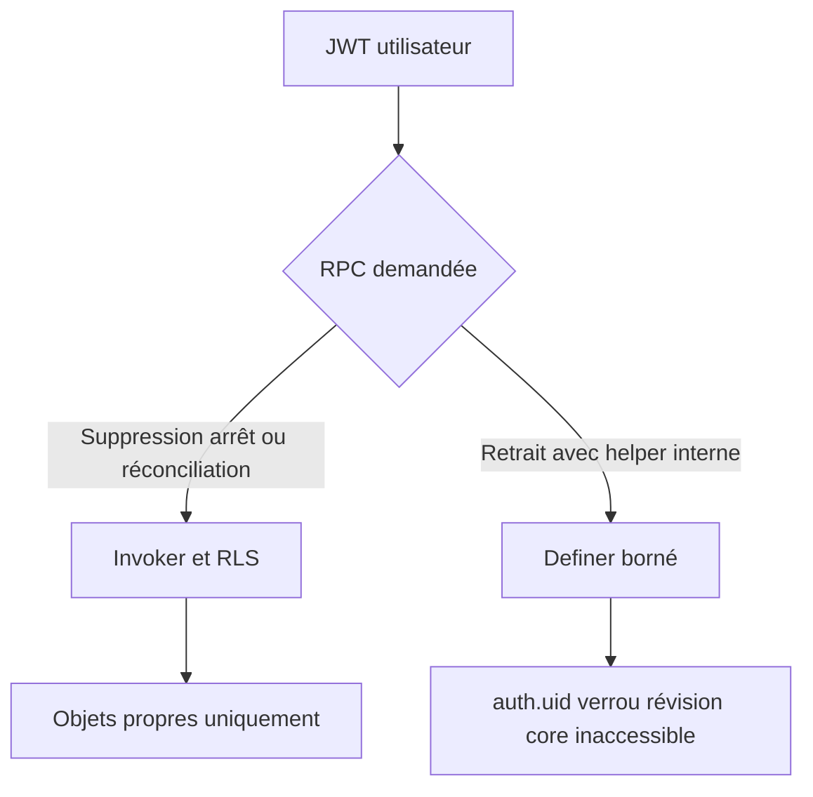
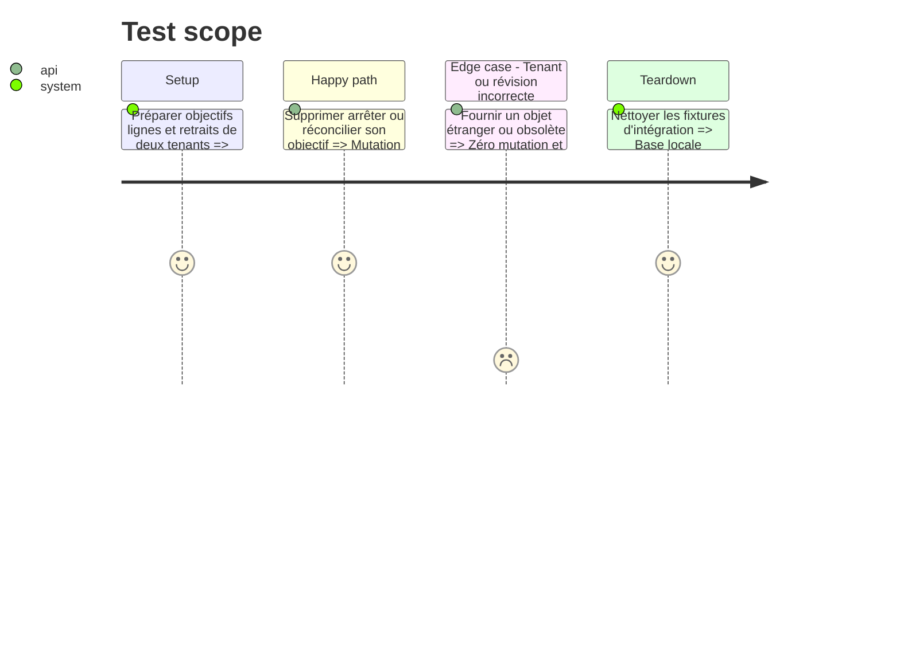

# Instruction: Basculer les mutations d'objectifs compatibles et borner les exceptions

## Architecture projection

> Tree of the final files. ✅ create · ✏️ modify · ❌ delete

```txt
backend-nest/supabase/
├── migrations/
│   └── ✅ 20260814123000_use_invoker_for_savings_goal_rpcs.sql  # active RLS sur trois mutations autonomes
└── tests/
    ├── ✏️ security_definer_function_privileges.sql              # fixe l'allowlist finale de quatre wrappers
    └── ✏️ README.md                                             # documente le résultat et les suites de preuve
```

## User Journey



## Test Scope



## Tasks to do

### `1)` Conversion et allowlist finale

> Réactiver RLS sur les fonctions autonomes et borner les quatre wrappers qui doivent rester privilégiés.

1. Passer `apply_savings_goal_deletion`, `apply_savings_goal_generation_stop` et `reconcile_savings_goal_target_date` en `SECURITY INVOKER`.
2. Conserver les verrous, validations, signatures et payloads chiffrés existants.
3. Maintenir en definer `apply_savings_goal_plan_with_destinations` et les trois RPC `create/update/delete_savings_goal_withdrawal`.
4. Vérifier leur `search_path` vide, leurs gardes `auth.uid()`, leurs ACL minimales et l'inaccessibilité de leurs helpers/cores.
5. Exécuter les suites objectifs/retraits/concurrence, régénérer les types, déployer puis relancer le Security Advisor en production.

## Test acceptance criteria

| Task | Acceptance criteria                                                                                                                                                       |
| ---- | ------------------------------------------------------------------------------------------------------------------------------------------------------------------------- |
| 1    | Les trois mutations autonomes passent sous RLS; le catalogue ne garde que quatre definers allowlistés et le Security Advisor passe de 15 alertes à 4 exceptions prouvées. |
