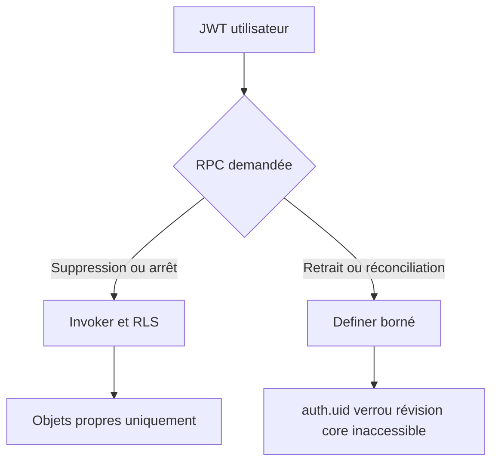
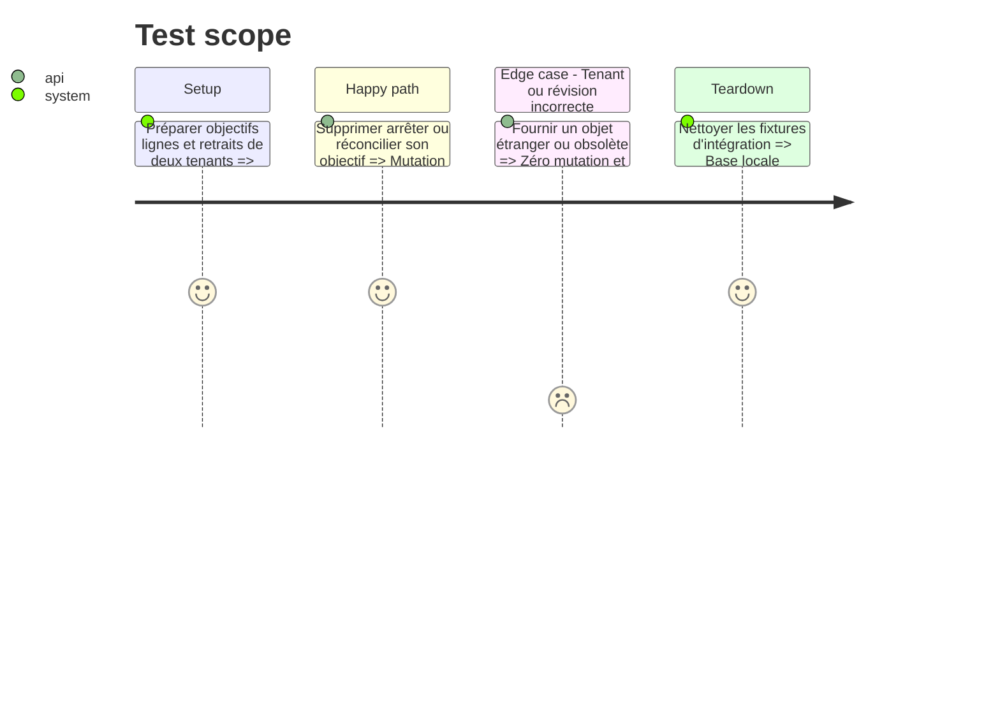

# Instruction: Basculer les mutations d'objectifs compatibles et borner les exceptions

## Architecture projection

> Tree of the final files. ✅ create · ✏️ modify · ❌ delete

```txt
backend-nest/supabase/
├── migrations/
│   └── ✅ 20260814123000_use_invoker_for_savings_goal_rpcs.sql  # active RLS et rétablit le contrat admin ciblé
└── tests/
    ├── ✏️ security_definer_function_privileges.sql              # fixe l'allowlist finale de cinq fonctions
    └── ✏️ README.md                                             # documente le résultat et les suites de preuve
```

## User Journey



## Test Scope



## Tasks to do

### `1)` Conversion et allowlist finale

> Réactiver RLS sur les fonctions autonomes compatibles et borner les cinq fonctions qui doivent rester privilégiées.

1. Passer `apply_savings_goal_deletion` et `apply_savings_goal_generation_stop` en `SECURITY INVOKER`.
2. Accorder explicitement `SELECT, INSERT, UPDATE, DELETE` sur `savings_goal_plan_withdrawal` au seul `service_role`, sans nouveau droit `anon` ou `authenticated`.
3. Conserver les verrous, validations, signatures et payloads chiffrés existants.
4. Maintenir en definer `reconcile_savings_goal_target_date`, `apply_savings_goal_plan_with_destinations` et les trois RPC `create/update/delete_savings_goal_withdrawal`.
5. Vérifier leur `search_path` vide, leurs gardes `auth.uid()`, leurs ACL minimales et l'inaccessibilité de leurs helpers/cores.
6. Exécuter les suites objectifs/retraits/concurrence et régénérer les types. Le déploiement et le Security Advisor en production restent des gates de release.

## Test acceptance criteria

| Task | Acceptance criteria                                                                                                                                                       |
| ---- | ------------------------------------------------------------------------------------------------------------------------------------------------------------------------- |
| 1    | Les deux mutations compatibles passent sous RLS; cinq definers restent allowlistés; un reset frais donne au seul `service_role` le DML admin nécessaire; l'Advisor doit passer de 15 alertes à 5 exceptions prouvées. |
