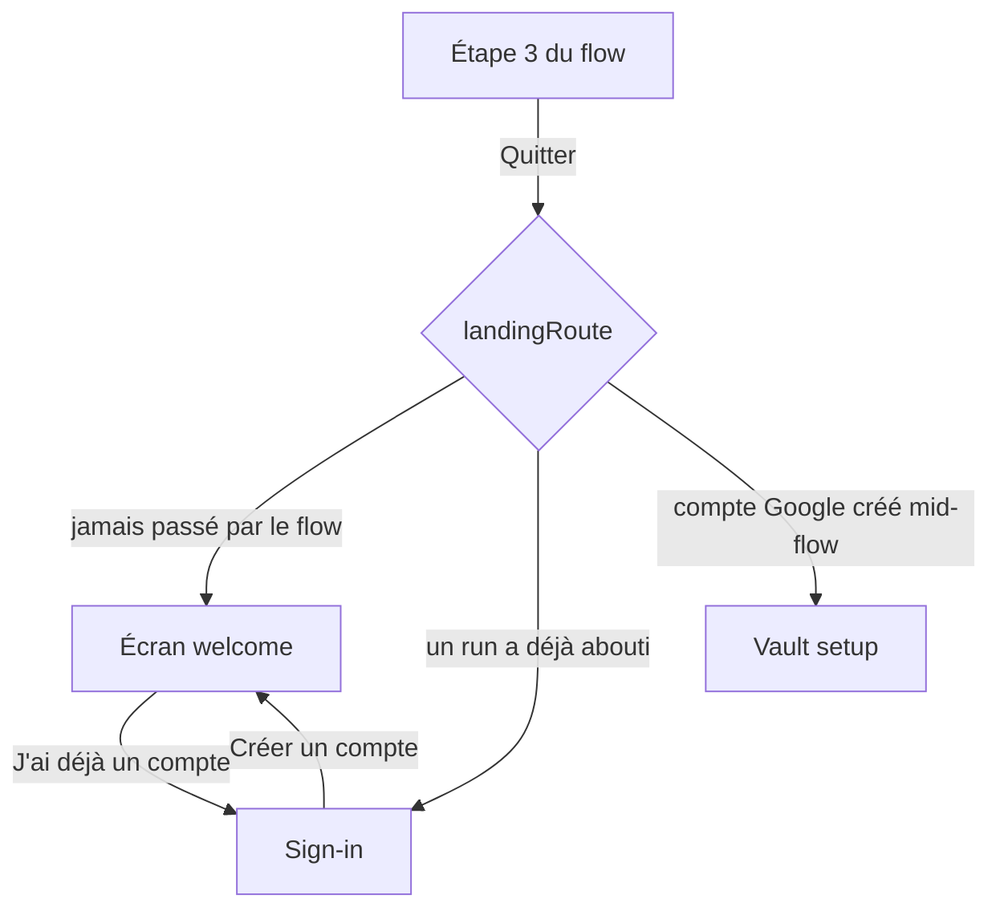
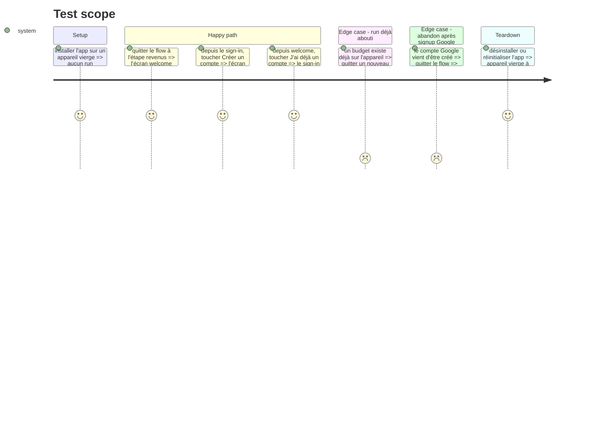

# Instruction: La sortie d'onboarding repasse par la décision d'atterrissage

> Le code de cette phase est **déjà écrit** dans le worktree (`pnpm quality` vert, 463 tests verts).
> Ce qui reste est la vérification sur appareil des trois parcours, avant de la considérer close.

## Architecture projection

```txt
.
└── android/src/app/
    ├── (onboarding)/index.tsx   ✏️ `leaveFlow` rend la main à `/` au lieu de nommer `/sign-in`
    └── (auth)/sign-in.tsx       ✏️ ajoute le retour « Nouveau sur Pulpe ? / Créer un compte »
```

## User Journey



## Test Scope



## Tasks to do

### `1)` Vérifier les trois parcours sur appareil

> La seule chose que les tests ne peuvent pas dire : ce que l'écran fait.

1. Lancer `pnpm dev:android` (JDK 17 + `ANDROID_HOME`, cf. `android/README.md`).
2. Appareil vierge : démarrer le flow, quitter à l'étape revenus, constater le retour au welcome.
3. Depuis le sign-in, toucher « Créer un compte » ; depuis le welcome, « J'ai déjà un compte ». Faire l'aller-retour deux fois : rien ne doit s'empiler ni clignoter.
4. Cas Google : créer un compte Google, quitter le flow à l'étape suivante, vérifier qu'on atterrit sur la création du code et non sur un écran blanc.

### `2)` Décider du sort du drapeau d'appareil

> `hasCompletedOnboarding` survit à un abandon — c'est voulu, il faut juste s'assurer que ça se voit.

1. Sur un appareil qui a déjà un budget, relancer un run puis le quitter : la destination doit être le sign-in (le drapeau tient), et « Créer un compte » doit rouvrir le welcome.
2. Si le comportement observé diffère, ne pas corriger l'écran : corriger `landingRoute` ou `resetOnboarding`, qui sont les deux seuls endroits où ce drapeau se décide.

## Test acceptance criteria

| Task | Acceptance criteria                                                                                                    |
| ---- | ---------------------------------------------------------------------------------------------------------------------- |
| 1    | Quitter le flow sur un appareil vierge ramène au welcome ; le sign-in et le welcome se rejoignent dans les deux sens    |
| 1    | Quitter après un signup Google affiche la création du code, jamais un écran vide                                        |
| 2    | Sur un appareil ayant déjà terminé un run, quitter ramène au sign-in, et le welcome y reste atteignable en un geste     |
