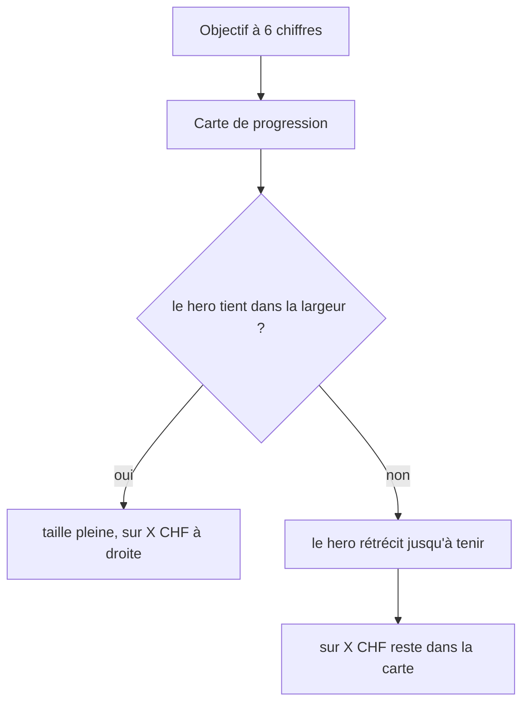
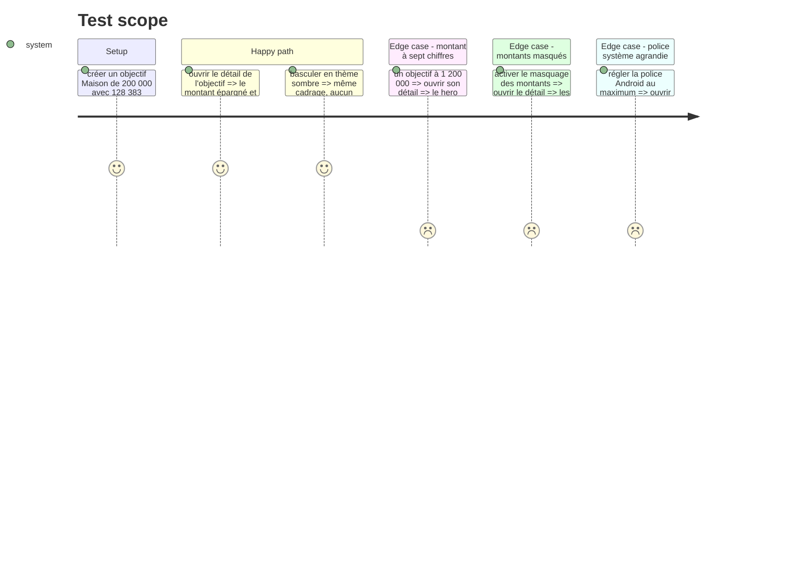

# Instruction: Le hero d'un objectif tient dans sa carte

## Architecture projection

```txt
.
└── android/src/
    ├── features/savings-goals/components/goal-progress-card.tsx  ✏️ la colonne du hero devient compressible
    └── core/ui/amount.tsx                                        ✏️ plancher de rétrécissement du hero
```

## User Journey



## Test Scope



## Wireframe

```txt
┌─────────────────────────────────────────────┐
│ Maison                                  ✎ ⋯ │  (1)
│ Échéance 1 janv. 2028                       │
│ ┌─────────────────────────────────────────┐ │
│ │ Épargné                  sur 200'000 CHF│ │  (2)(3)
│ │ 128'383 CHF                             │ │  (2)
│ │ ▓▓▓▓▓▓▓▓▓░░░░░░░░░░░░░░░░░░░░░░░░░░░░░░ │ │  (4)
│ │ ⧗ Un peu en retrait                     │ │
│ │ Montant de départ           127'970 CHF │ │  (5)
│ └─────────────────────────────────────────┘ │
└─────────────────────────────────────────────┘
```

1. En-tête de l'écran : nom de l'objectif, échéance, actions.
2. Colonne compressible : l'étiquette « Épargné » et le hero. C'est elle qui cède la largeur.
3. Cible, alignée à droite sur la ligne de base du hero. Largeur incompressible : elle ne bouge plus.
4. Les deux barres empilées, plan derrière, confirmé devant. Inchangé.
5. Les statistiques, une par ligne. Inchangé.

## Tasks to do

### `1)` Donner une borne de largeur au hero

> Android sait rétrécir un texte, mais seulement contre une largeur. La ligne ne lui en donnait aucune.

1. Dans `goal-progress-card.tsx`, rendre `headlineLabels` compressible (`flexShrink: 1`) pour que la colonne du hero cède la place plutôt que de pousser sa voisine hors de la carte.
2. Laisser la cible « sur X » incompressible : c'est le repère fixe, et c'est elle qui débordait.
3. Commenter la raison, pas le mécanisme : sans borne, `adjustsFontSizeToFit` n'a rien contre quoi rétrécir, et il désactive l'ellipse — donc le texte sort de la carte au lieu de se couper.

### `2)` Poser un plancher au rétrécissement

> Sans consigne, le plancher Android est 4 dp. Un montant illisible n'est pas mieux qu'un montant qui déborde.

1. Dans `amount.tsx`, donner au hero un `minimumFontScale` (viser ~0.6 : en dessous, le hero cesse d'être le hero).
2. Vérifier que le reste des tailles (`row`, `meta`) n'est pas touché : elles n'ont jamais eu d'autosize.

### `3)` Passer les six autres heros en revue

> Un composant partagé qu'on corrige se vérifie chez tous ses appelants.

1. Relire les six autres `size="hero"` (`home-hero-card`, `budget-detail-hero`, `line/[lineId]`, `goals-intro`, `realized-balance-sheet`, `budget-preview-step`).
2. Chacun est seul sur sa ligne, en colonne : constater qu'aucun ne partage une rangée avec un voisin, et ne rien y changer si c'est bien le cas.
3. Si l'un d'eux partage une rangée, appliquer la même borne qu'en tâche 1 plutôt qu'un correctif local.

## Test acceptance criteria

| Task | Acceptance criteria                                                                                                   |
| ---- | --------------------------------------------------------------------------------------------------------------------- |
| 1    | Sur l'objectif « Maison », « sur 200'000 CHF » est entièrement dans la carte, en clair comme en sombre                 |
| 2    | Un objectif à sept chiffres affiche un hero rétréci mais lisible, sur une seule ligne, sans ellipse                    |
| 3    | Les six autres écrans à hero sont inchangés à l'œil, ou corrigés par la même borne de largeur                          |
