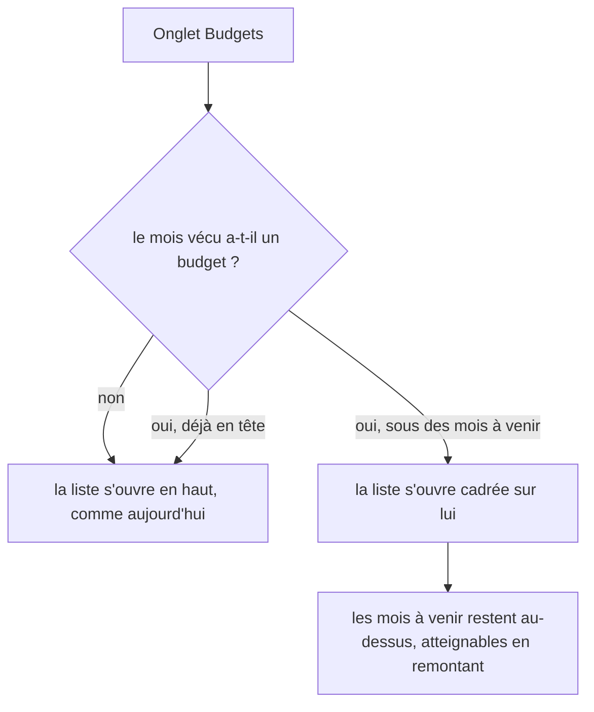
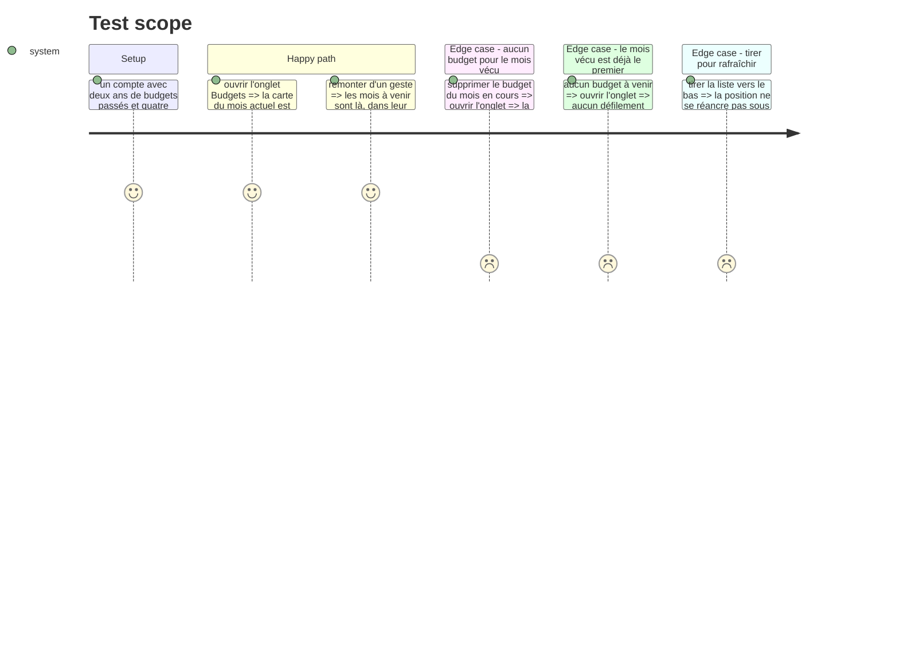

# Instruction: La liste des budgets s'ouvre sur le mois vécu

> Vérifié sur émulateur. La tâche `3.4` a payé deux fois : `SectionList` numérote
> l'en-tête d'année comme la rangée `0` de sa section, donc l'index du budget doit être
> décalé d'une unité, et `scrollToLocation` mesure lui-même cet en-tête collant — la marge
> qu'on ajoutait à la main le comptait une seconde fois. Un troisième écart n'était visible
> que sur l'appareil : `scrollToIndex` refuse de partir sans `getItemLayout` **ou**
> `onScrollToIndexFailed`, et il lève au lieu de rendre la main. Sur cet onglet, cela
> ressortait en crash natif de montage (`The specified child already has a parent`), pas en
> défilement resté sur place.
>
> Le compte de démonstration ne descend pas assez bas sous le mois vécu pour que la position
> demandée soit atteignable : la liste bute sur sa fin, et la carte reste visible sans se
> poser en haut. Le cadrage exact a donc été observé écran raccourci (`wm size 1080x1400`),
> où la carte « Mois actuel » vient bien entière sous l'en-tête `2026`.

## Architecture projection

```txt
.
└── android/src/
    ├── features/budgets/budget-list-selectors.ts       ✏️ nouveau sélecteur pur : où se trouve le mois vécu
    ├── features/budgets/budget-list-selectors.spec.ts  ✏️ ses cas : présent, absent, déjà en tête
    └── app/(main)/(tabs)/budgets.tsx                   ✏️ ancre la liste sur cette position au premier rendu
```

## User Journey



## Test Scope



## Wireframe

```txt
┌─────────────────────────────────────┐
│ Budgets                             │  (1)
│ 2026                                │  (2)
│ ┌─────────────────────────────────┐ │
│ │ Décembre           +1'200 CHF   │ │  (3)
│ ├─────────────────────────────────┤ │
│ │ …                               │ │
│ ├═════════════════════════════════┤ │
│ │ Août  ⟨Mois actuel⟩  +413 CHF   │ │  (4)  ← haut de la fenêtre à l'ouverture
│ ├─────────────────────────────────┤ │
│ │ Juillet              -80 CHF    │ │  (5)
│ └─────────────────────────────────┘ │
│                               ( + ) │  (6)
└─────────────────────────────────────┘
```

1. Titre, en tête de liste. Il défile avec elle.
2. En-tête d'année, collant. Il recouvre la carte qui passe dessous : le cadrage doit en tenir compte.
3. Mois à venir : au-dessus du mois vécu, l'ordre de la liste ne change pas.
4. Le mois vécu, carte cerclée. C'est lui qui vient se poser en haut de la fenêtre.
5. Mois passés, sous lui.
6. Le FAB, inchangé.

## Tasks to do

### `1)` Déduire la position du mois vécu

> L'ordre de la liste est déjà décidé dans un module pur et testé ; sa position s'y déduit.

1. Dans `budget-list-selectors.ts`, ajouter un sélecteur qui rend, pour des sections et une période, l'index de section, l'index d'élément, et le nombre de rangées au-dessus (en-têtes d'année compris).
2. Rendre `null` quand le mois vécu n'a pas de budget, et quand il est déjà la première rangée : dans les deux cas, il n'y a rien à ancrer.
3. Nommer par l'intention (où est le mois vécu), pas par le mécanisme (scroll).

### `2)` Couvrir le sélecteur

> C'est la seule partie de cette phase qu'une machine peut juger.

1. Étendre `budget-list-selectors.spec.ts` : mois vécu enterré sous des mois à venir, mois vécu absent, mois vécu déjà en tête, mois vécu dans une année qui n'est pas la première section.
2. Vérifier le comptage des rangées au-dessus contre l'ordre réel produit par `budgetYearSections`, pas contre un tableau écrit à la main.

### `3)` Ancrer la liste au premier rendu

> `SectionList` ne sait pas défiler hors de sa fenêtre de rendu sans `getItemLayout` — et les cartes n'ont pas de hauteur fixe.

1. Dans `budgets.tsx`, déclarer la ref et l'effet **avant** les retours anticipés de chargement et d'erreur : les sortir de l'ordre des hooks casserait le composant.
2. Élargir la fenêtre de rendu initiale jusqu'au mois vécu (`initialNumToRender`), pour que la cible soit montée quand on demande à l'atteindre — c'est ce qui remplace un `getItemLayout` sur des cartes de hauteur variable.
3. Appeler `scrollToLocation` une seule fois par montage, sans animation, en compensant l'en-tête d'année collant avec `viewOffset`.
4. Vérifier sur appareil si l'index d'élément compte l'en-tête de section : c'est un décalage connu de `SectionList`. Ajuster d'une unité si la carte se pose sous l'en-tête, et le noter en commentaire.
5. Ne rien déclencher quand le sélecteur rend `null`.

## Test acceptance criteria

| Task | Acceptance criteria                                                                                            |
| ---- | ---------------------------------------------------------------------------------------------------------------- |
| 1    | Le sélecteur rend `null` quand le mois vécu manque ou est déjà en tête, et sa position sinon                    |
| 2    | `pnpm test` couvre les quatre cas, et les positions sont dérivées de `budgetYearSections`                        |
| 3    | Sur un compte à deux ans de budgets et quatre mois à venir, l'onglet s'ouvre sur la carte « Mois actuel » entière |
| 3    | Sans budget pour le mois vécu, la liste s'ouvre en haut, sans saut visible                                       |
