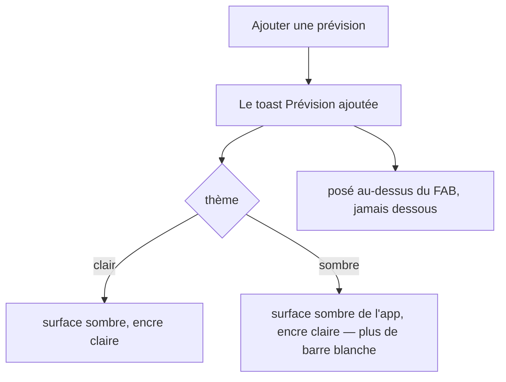
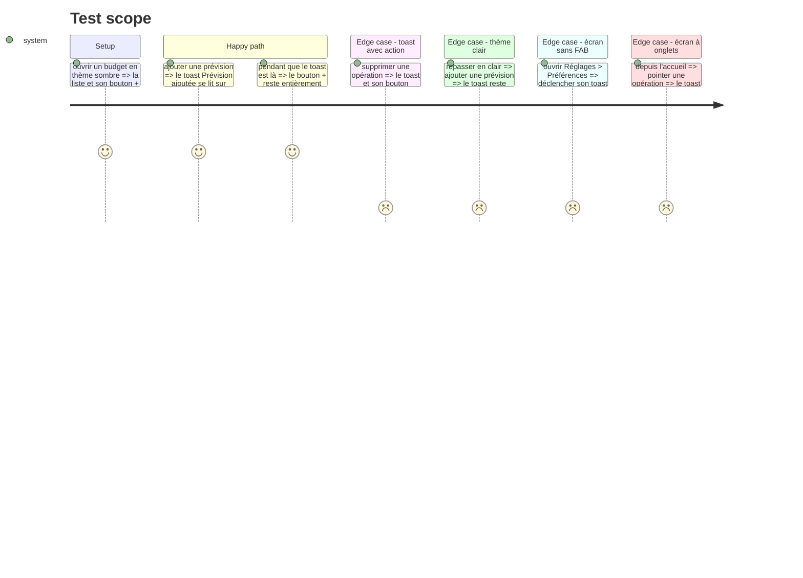

# Instruction: Un seul toast, lisible en sombre et au-dessus du FAB

> Vérifié sur émulateur. Le défaut exact remonté — « Prévision ajoutée » blanc et sous le
> bouton `+` en thème sombre — ne se reproduit plus : surface sombre, encre claire, FAB
> entièrement dégagé. Sur l'accueil, « Freelance pointé / Annuler » passe au-dessus du FAB
> et de la barre d'onglets. En clair, rien n'a bougé. Les écrans de réglages n'ont pas été
> pilotés sur l'appareil : ils appellent `<Notice>` sans `clearsFab`, donc le `bottom` de
> Paper s'applique exactement comme avant — constaté dans le code, pas à l'écran.
>
> Le plan comptait neuf `<Snackbar>` ; il y en avait treize. Le compte est corrigé ci-dessous.

## Architecture projection

```txt
.
└── android/src/
    ├── core/ui/notice.tsx                          ✅ le toast de l'app : fond, encre, garde au-dessus du FAB
    └── app/(main)/
        ├── (tabs)/home.tsx                         ✏️ 3 <Snackbar> nus → <Notice>
        ├── budget/[id].tsx                         ✏️ 4 <Snackbar> nus → <Notice>
        ├── budget/[id]/line/[lineId].tsx           ✏️ 4 <Snackbar> nus → <Notice>
        ├── settings/preferences.tsx                ✏️ 1 <Snackbar> nu → <Notice>
        └── settings/security.tsx                   ✏️ 1 <Snackbar> nu → <Notice>
```

## User Journey



## Test Scope



## Wireframe

```txt
┌─────────────────────────────────────┐
│ Août 2026                           │
│ ┌─────────────────────────────────┐ │
│ │ liste des prévisions            │ │  (1)
│ │                                 │ │
│ └─────────────────────────────────┘ │
│ ┌─────────────────────────────────┐ │
│ │ Prévision ajoutée      ANNULER  │ │  (2)
│ └─────────────────────────────────┘ │
│                               ( + ) │  (3)
└─────────────────────────────────────┘
```

1. Le contenu de l'écran. Inchangé.
2. Le toast : pleine largeur moins la gouttière, posé **au-dessus** du FAB. Fond et encre viennent du thème de l'app, plus du rôle inversé de MD3.
3. Le FAB, à sa place. Il n'est plus recouvert, et il ne recouvre plus rien.

## Tasks to do

### `1)` Écrire le toast de l'app

> Treize `<Snackbar>` nus, c'est la même décision prise treize fois — et jamais prise pour le thème sombre.

1. Créer `core/ui/notice.tsx` : une enveloppe autour du `Snackbar` de Paper, même API d'appel (`visible`, `onDismiss`, `action`, enfants).
2. Le fond vient d'une surface du thème de l'app, l'encre du rôle qui lui répond. Ne pas toucher `inverseSurface`/`inverseOnSurface` dans `theme.ts` : le rôle MD3 est correct, c'est son usage par le `Snackbar` qui ne convient pas à Pulpe, et d'autres composants Paper lisent ces mêmes rôles.
3. Réserver la hauteur du FAB sous le toast, en réutilisant la constante de garde déjà définie dans `theme.ts` plutôt qu'un nombre neuf.
4. Commenter la raison : en sombre, le fond par défaut d'un `Snackbar` est presque blanc, et le FAB Android passe au-dessus par son élévation quelle que soit sa place dans l'arbre.

### `2)` Basculer les treize appels

> Aucun écran ne doit avoir à se souvenir de ces réglages.

1. Remplacer les treize `<Snackbar>` des cinq écrans par `<Notice>`, sans changer un seul message.
2. Vérifier qu'aucun `Snackbar` de Paper ne subsiste hors de `notice.tsx`.

### `3)` Vérifier sur appareil, dans les deux thèmes

> Le défaut est visuel : il ne se ferme que les yeux dessus.

1. Thème sombre, écran budget : ajouter une prévision, lire le toast, vérifier qu'il ne recouvre pas le FAB et que le FAB ne le recouvre pas.
2. Thème clair : constater que rien n'a bougé.
3. Accueil (onglets) et Réglages (ni FAB ni onglets) : vérifier que le toast se pose correctement dans les deux cas.

## Test acceptance criteria

| Task | Acceptance criteria                                                                                        |
| ---- | ------------------------------------------------------------------------------------------------------------ |
| 1    | `notice.tsx` est le seul fichier qui importe `Snackbar` de Paper                                            |
| 2    | Les treize messages sont inchangés, y compris les libellés d'action « Annuler » et « Fermer »                  |
| 3    | En thème sombre, le toast est sombre à encre claire, entièrement lisible                                     |
| 3    | Le toast et le FAB ne se recouvrent jamais, dans aucun des deux sens                                         |
| 3    | Sur un écran sans FAB, le toast ne laisse pas de vide sous lui ; sur l'accueil, il passe au-dessus des onglets |
