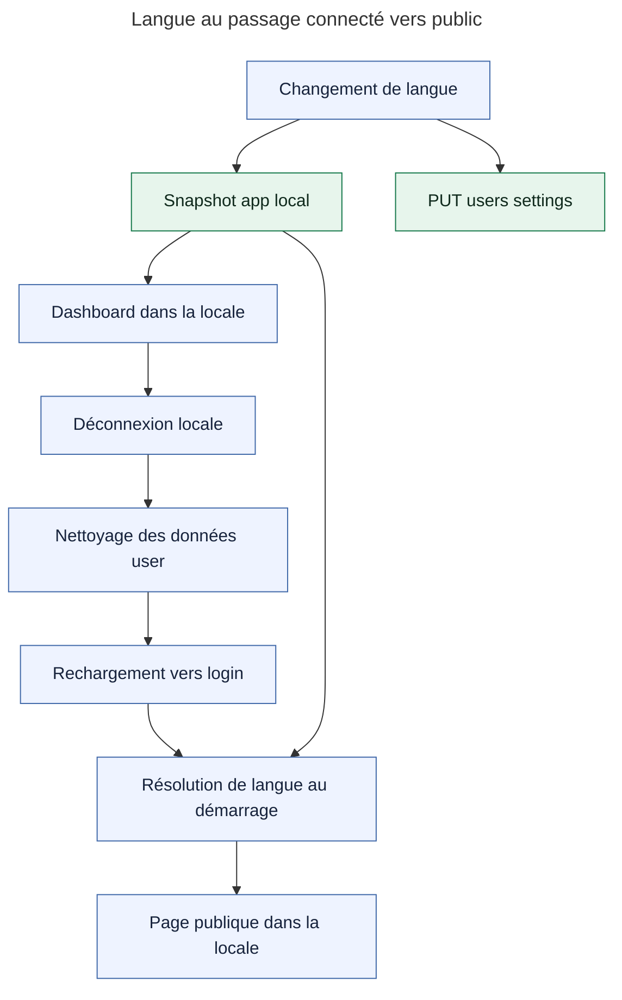

# Task: Langue perdue après déconnexion

Le dashboard connecté est en anglais, mais la déconnexion ramène vers une page publique dans une autre langue. Le backend de preview ne semble pas inclure le contrat `locale` de la branche.

## Root cause

Le flux courant de la branche conserve correctement la locale sur le même navigateur ; le comportement observé vient donc d’un décalage entre les artefacts réellement déployés, non détecté faute de test E2E permanent couvrant dashboard → logout → page publique.

## Action path

## Five whys

1. La page publique n’a pas repris la langue visible avant logout parce que son nouveau bootstrap n’a pas résolu la même locale.
2. Le bootstrap dépend du snapshot local avant le navigateur et ne doit pas dépendre d’un appel backend après déconnexion.
3. Sur la branche courante, ce snapshot est `app`-scoped et le nettoyage logout ne retire que les clés `user`-scoped.
4. Le parcours exact passe localement ; l’artefact observé ne correspond donc pas au comportement de la source courante ou à son backend attendu.
5. La divergence a pu être publiée parce que les tests couvraient séparément le stockage et le logout, jamais leur parcours complet ni la cohérence des versions frontend/backend.

## Hypotheses

| Status | Hypothesis | Evidence | Confidence |
| ------ | ---------- | -------- | ---------- |
| Invalidated | Le logout courant supprime `pulpe-settings-language`. | `SETTINGS_LANGUAGE` est `app`-scoped ; `clearAllUserData()` ne retire que la portée `user` ; le parcours Playwright temporaire conserve la clé. | 10/10 |
| Invalidated | Le backend non déployé suffit à expliquer la perte sur le même navigateur. | `LanguageService` écrit le snapshot avant le PUT et continue après un échec réseau ; le resolver le lit avant le navigateur. | 9/10 |
| Validated | Les préférences serveur vivent dans `auth.users.user_metadata`. | `SupabaseUserRepository.findSettings()` lit `auth.getUser()` et `updateSettings()` appelle `auth.admin.updateUserById(... user_metadata)`. Aucun `user_settings` n’existe dans les migrations. | 10/10 |
| Validated | La preview exécutée est incohérente avec la source courante. | Le backend est signalé comme ancien ; sur la branche, 86 tests ciblés et le parcours Playwright exact passent. | 8/10 |
| Validated | La couverture ne protège pas le passage connecté → public. | Les tests existants couvrent le logout, la portée du vault et la résolution de langue séparément, sans assertion permanente sur la locale après logout. | 10/10 |

## Verification

- Frontend ciblé : 5 fichiers, 86 tests passés.
- Backend user settings : 19 tests passés.
- Parcours Playwright temporaire : dashboard anglais → logout → page publique anglaise, passé ; fichier temporaire supprimé après validation.

## Next steps

- Ajouter un E2E permanent sur la langue après logout et une vérification des versions déployées frontend/backend.
- Séparer les préférences métier de `auth.users` dans `public.user_settings`, avec `user_id` comme PK/FK `auth.users(id) ON DELETE CASCADE`, contraintes SQL et RLS propriétaire.
- Migrer les valeurs existantes avant de basculer les lectures/écritures, puis retirer les dépendances à `user_metadata` pour les préférences.
