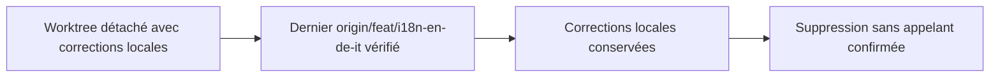
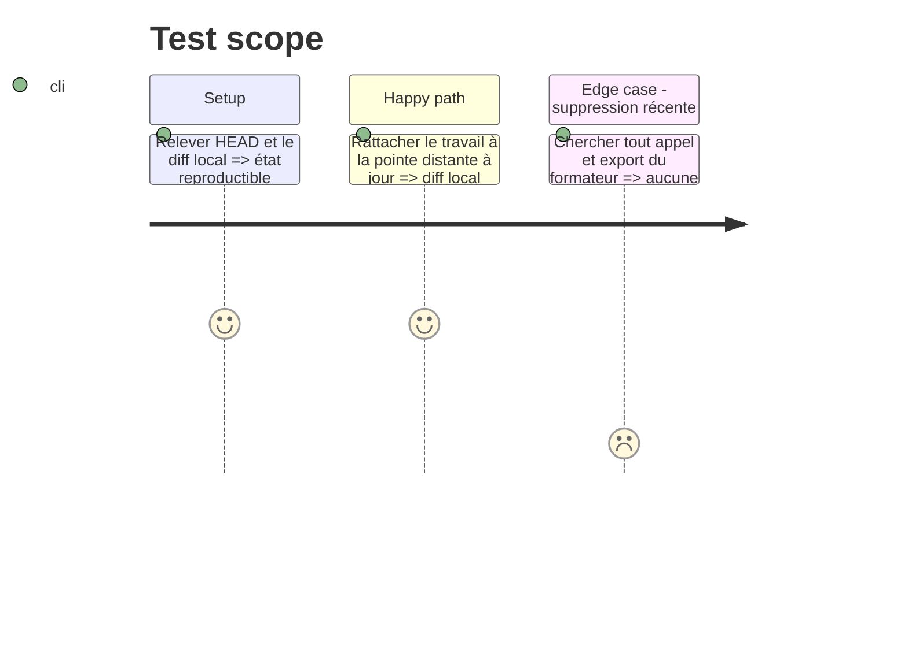

# Instruction: Synchroniser et contrôler la pointe distante

## Architecture projection

> Tree of the final files. ✅ create · ✏️ modify · ❌ delete

```txt
frontend/projects/webapp/src/app/core/budget/rollover/
├── ❌ rollover-types.spec.ts
└── ❌ rollover-types.ts
```

## User Journey



## Test Scope



## Tasks to do

### `1)` Rattacher le worktree à la branche à jour

> Appliquer les corrections locales sur la dernière pointe vérifiée de `origin/feat/i18n-en-de-it` sans stash destructif ni perte de fichier.

1. Capturer `git status`, HEAD et la liste des fichiers locaux.
2. Basculer sur `feat/i18n-en-de-it`, puis vérifier HEAD et le diff.

### `2)` Valider le dernier commit

> Confirmer que la suppression du formateur de report reste un retrait de code mort.

1. Vérifier l’absence d’import, d’export et d’appel à `formatRolloverDisplayName`.
2. Conserver la suppression si le build et les tests frontend restent verts.

## Test acceptance criteria

| Task | Acceptance criteria |
| ---- | ------------------- |
| 1 | HEAD contient la dernière pointe distante vérifiée de `feat/i18n-en-de-it` — `38ae006` au moment du plan — et tous les fichiers de correction locale sont encore présents. |
| 2 | Les deux fichiers supprimés sont absents, aucune référence au symbole ou au module ne subsiste et la compilation frontend les ignore. |
