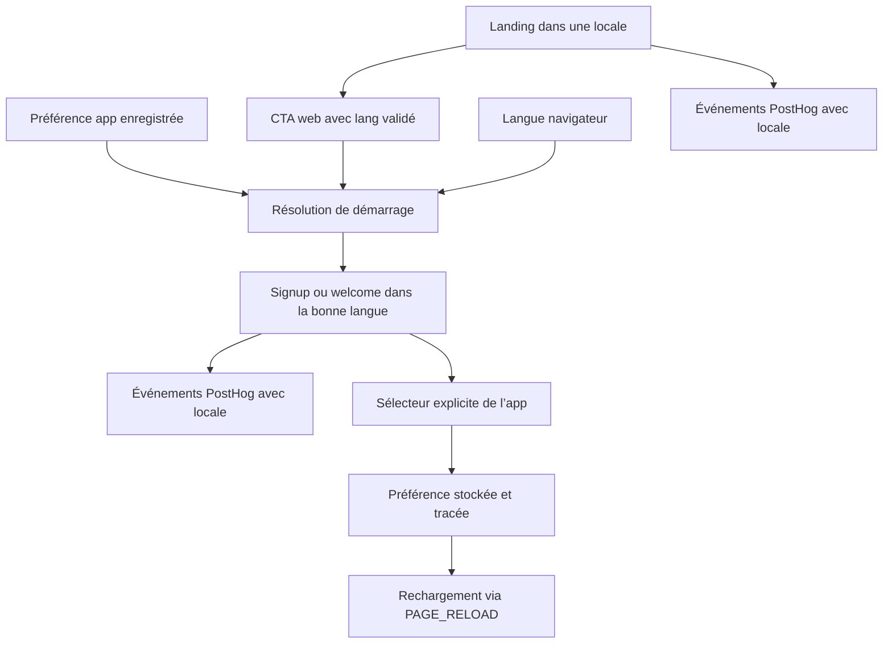
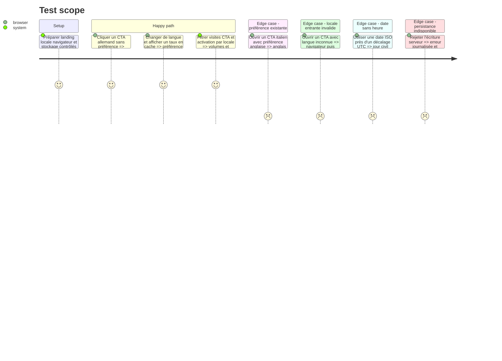

# Instruction: Finaliser les corrections fonctionnelles et le passage de locale

## Architecture projection

> Tree of the final files. ✅ create · ✏️ modify · ❌ delete

```txt
.
├── ✏️ .github/scripts/lexicon.test.mjs
├── landing/
│   ├── ✏️ app/accessibility.test.tsx
│   ├── ✏️ lib/config.ts
│   ├── ✏️ lib/posthog.ts
│   └── components/
│       ├── ✏️ PostHogProvider.tsx
│       ├── ✏️ pages/Home.tsx
│       ├── ✏️ pages/Support.tsx
│       ├── ✏️ guides/ArticleLayout.tsx
│       ├── ✏️ sections/Header.tsx
│       ├── ✏️ sections/Hero.tsx
│       ├── ✏️ sections/FinalCTA.tsx
│       ├── ✏️ sections/Platforms.tsx
│       └── ✏️ ui/StickyCTA.tsx
├── ios/
│   ├── Pulpe/Core/Analytics/
│   │   ├── ✏️ AnalyticsService.swift
│   │   └── ✏️ CurrencyAnalyticsSyncModifier.swift
│   └── PulpeTests/Core/Analytics/
│       └── ✏️ AnalyticsServiceTests.swift
└── frontend/
    ├── ✏️ e2e/tests/features/authentication.spec.ts
    └── projects/webapp/src/app/
        ├── core/analytics/
        │   ├── ✏️ analytics.ts
        │   ├── ✏️ posthog.spec.ts
        │   └── ✏️ posthog.ts
        ├── core/i18n/
        │   ├── ✏️ language-resolver.ts
        │   ├── ✏️ language-resolver.spec.ts
        │   ├── ✅ language.service.spec.ts
        │   ├── ✏️ language.service.ts
        │   └── ✏️ transloco-config.ts
        └── ui/
            ├── conversion-preview-line/
            │   ├── ✏️ conversion-preview-line.spec.ts
            │   └── ✏️ conversion-preview-line.ts
            └── currency-conversion-badge/
                └── ✏️ currency-conversion-badge.ts
```

## User Journey



## Test Scope



## Tasks to do

### `1)` Transmettre la locale depuis chaque CTA web

> Faire de la langue de la landing le défaut de la webapp pour un visiteur sans préférence.

1. Ajouter la locale courante aux URL `/signup`, `/welcome` et `/settings` générées par la landing, en conservant les UTM.
2. Valider le paramètre entrant sur FR/EN/DE/IT et résoudre dans l’ordre préférence enregistrée, CTA, navigateur, français.
3. Mémoriser une locale CTA valide seulement en l’absence de préférence existante, afin que les redirections et rechargements gardent la même langue.
4. Couvrir les quatre locales, tous les CTA web, la priorité de la préférence et le rejet des valeurs inconnues.

### `2)` Corriger les invariants i18n

> Rendre la bascule testable, séparer date et devise, et garder le catalogue iOS complet.

1. Injecter `PAGE_RELOAD` et couvrir no-op, anonyme, authentifié et échec de persistance.
2. Réutiliser `parseIsoDateLocal` ; formater les dates par `LOCALE_ID` et les montants par devise.
3. Parcourir récursivement chaque `stringUnit` iOS traduisible et exiger DE/EN/IT à l’état traduit.

### `3)` Exposer la langue dans PostHog

> Segmenter tous les volumes et funnels par langue sans traduire le contrat analytics.

1. Enregistrer `locale` comme super-propriété PostHog sur landing, webapp et iOS, avec une valeur strictement limitée à `fr`, `en`, `de` ou `it`.
2. Mettre la super-propriété à jour depuis la source canonique de chaque surface afin que chaque événement conserve la langue active au moment de sa capture.
3. Conserver `locale` comme propriété de personne sur les comptes identifiés et l’événement anglais `language_changed` avec `from`, `to` et `surface`.
4. Couvrir l’initialisation, le changement de langue, le reset/logout et l’absence de propriété invalide, sans modifier les noms d’événements existants.

## Test acceptance criteria

| Task | Acceptance criteria |
| ---- | ------------------- |
| 1 | Depuis une landing FR/EN/DE/IT, chaque CTA web ouvre `/signup`, `/welcome` ou `/settings` dans cette langue quand aucune préférence n’existe ; une préférence app existante reste prioritaire et une valeur inconnue est ignorée. |
| 2 | La bascule produit les effets attendus ; `2026-04-22` reste le 22 avril dans la langue UI sans changer le format monétaire ; toute traduction iOS DE/EN/IT absente ou incomplète est signalée avec sa clé. |
| 3 | Chaque événement landing, webapp et iOS capturé après initialisation contient `locale=fr|en|de|it` ; un changement affecte les événements suivants, les profils identifiés gardent la valeur courante et un reset ne perd pas la locale publique résolue. |
