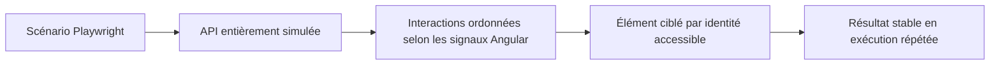
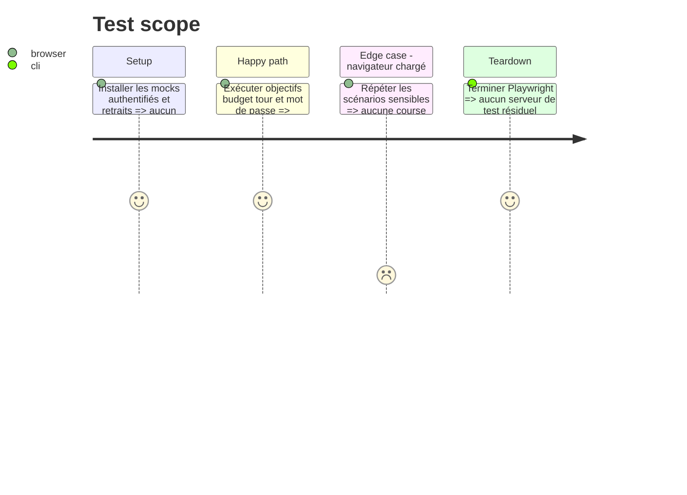

# Instruction: Fiabiliser la couverture automatisée

## Architecture projection

> Tree of the final files. ✅ create · ✏️ modify · ❌ delete

```txt
frontend/
├── e2e/
│   ├── tests/features/
│   │   ├── ✏️ financial-overview-calculations.spec.ts
│   │   ├── ✏️ product-tour-accessibility.spec.ts
│   │   ├── ✏️ savings-goal-initial-amount.spec.ts
│   │   └── ✏️ savings-goals-progress.spec.ts
│   └── utils/
│       └── ✏️ auth-bypass.ts
└── projects/webapp/src/app/feature/settings/components/
    └── ✏️ change-password-dialog.ts
```

## User Journey



## Test Scope



## Tasks to do

### `1)` Stabiliser le harnais E2E

> Fermer les appels réseau et les courses sans attente arbitraire.

1. Simuler GET `/savings-goals/:id/withdrawals` dans `setupApiMocks`.
2. Ordonner dates, montants et noms selon les mises à jour des signal forms ; retirer l’interaction hors sujet.
3. Cibler le bouton du tour par son test id et poser les trois valeurs `autocomplete` natives.

## Test acceptance criteria

| Task | Acceptance criteria |
| ---- | ------------------- |
| 1 | Aucun appel réel ni 401 ne survient ; les quatre parcours sensibles passent sans délai arbitraire et le scénario mot de passe reste stable sur dix répétitions. |
