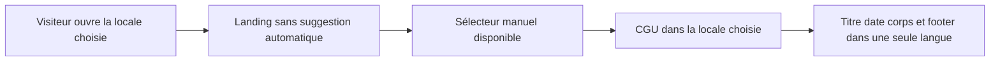
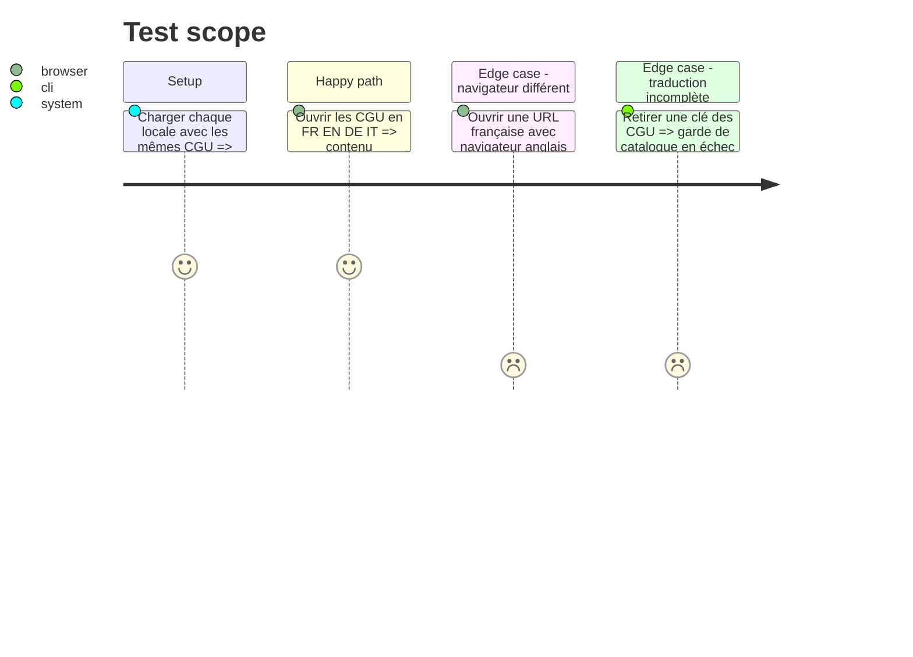

# Instruction: Supprimer la suggestion automatique et traduire les CGU

## Architecture projection

> Tree of the final files. ✅ create · ✏️ modify · ❌ delete

```txt
.
├── ✏️ docs/I18N.md
├── landing/
│   ├── ❌ components/LanguageBanner.tsx
│   ├── ✏️ components/pages/Home.tsx
│   ├── ✏️ components/pages/Changelog.tsx
│   ├── ✏️ components/pages/Support.tsx
│   ├── ✏️ components/pages/SupportGuide.tsx
│   └── ✏️ lib/i18n.ts
└── frontend/projects/webapp/
    ├── ✏️ public/i18n/fr.json
    ├── ✏️ public/i18n/en.json
    ├── ✏️ public/i18n/de.json
    ├── ✏️ public/i18n/it.json
    └── src/app/feature/legal/components/
        ├── ✏️ terms-of-service.ts
        └── ✅ terms-of-service.spec.ts
```

## User Journey



## Test Scope



## Wireframe

```txt
┌─────────────────────────────────────────┐
│ (1) Landing sans bandeau                │
│     header · contenu · footer           │
│     (2) sélecteur manuel                │
└─────────────────────────────────────────┘

┌─────────────────────────────────────────┐
│ (3) Titre CGU · date localisée          │
├─────────────────────────────────────────┤
│ (4) Sections et listes dans la locale   │
├─────────────────────────────────────────┤
│ (5) Lien vers la confidentialité        │
└─────────────────────────────────────────┘
```

## Tasks to do

### `1)` Supprimer la suggestion automatique

> Respecter la locale de l’URL et laisser le changement à l’utilisateur.

1. Retirer le composant des quatre pages, puis supprimer son état local et les copies associées.
2. Conserver le sélecteur, les URL localisées et les `hreflang` existants.

### `2)` Traduire les CGU complètes

> Utiliser les clés Transloco dans le template existant, sans moteur de document ni HTML injecté.

1. Extraire chaque bloc dans les catalogues FR/EN/DE/IT, le français restant canonique.
2. Localiser la date depuis sa valeur ISO et préserver titres, listes, emphases, liens, durées et références légales.
3. Employer un registre juridique cohérent dans chaque langue, sans modifier les obligations ni les affirmations produit.

### `3)` Verrouiller la parité

> Faire échouer la validation avant que les CGU redeviennent partielles.

1. Tester la route dans les quatre langues, sa structure, ses liens et sa date.
2. Étendre les gardes de catalogues et effectuer une relecture croisée des trois traductions.

## Test acceptance criteria

| Task | Acceptance criteria |
| ---- | ------------------- |
| 1 | Aucune landing n’affiche de bandeau ou ne lit `navigator.language` pour suggérer une autre page ; le sélecteur manuel fonctionne toujours. |
| 2 | En FR/EN/DE/IT, les CGU rendent titre, date, sections, listes et footer dans la même langue, sans français résiduel hors noms propres. |
| 3 | Les quatre variantes ont les mêmes sections, liens et obligations ; une clé absente ou un lien divergent fait échouer la validation. |
