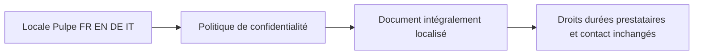
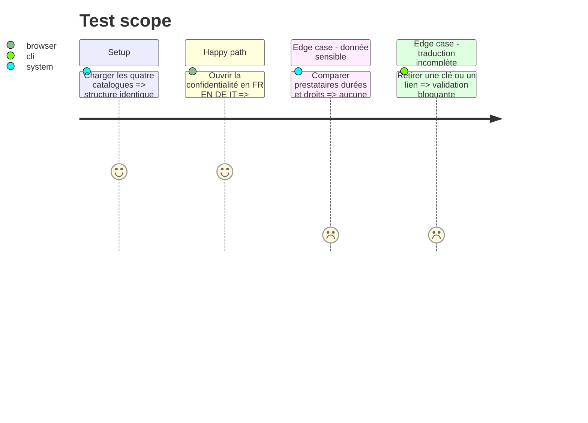

# Instruction: Traduire la politique de confidentialité

## Architecture projection

> Tree of the final files. ✅ create · ✏️ modify · ❌ delete

```txt
frontend/projects/webapp/
├── ✏️ public/i18n/fr.json
├── ✏️ public/i18n/en.json
├── ✏️ public/i18n/de.json
├── ✏️ public/i18n/it.json
└── src/app/feature/legal/components/
    ├── ✏️ privacy-policy.ts
    └── ✅ privacy-policy.spec.ts
```

## User Journey



## Test Scope



## Wireframe

```txt
┌─────────────────────────────────────────┐
│ (1) Confidentialité · date localisée    │
├─────────────────────────────────────────┤
│ (2) Données · finalités · conservation  │
│ (3) Prestataires · transferts · droits  │
├─────────────────────────────────────────┤
│ (4) Contacts et liens inchangés         │
└─────────────────────────────────────────┘
```

## Tasks to do

### `1)` Traduire le document complet

> Garder le template actuel et le français comme texte juridique canonique.

1. Extraire chaque bloc dans les catalogues FR/EN/DE/IT et localiser la date depuis sa valeur ISO.
2. Préserver exactement les prestataires, finalités, durées de conservation, liens, contacts et références RGPD/LPD.
3. Relire les traductions EN/DE/IT comme des documents complets, sans mélanger les langues ni changer la portée des déclarations.

### `2)` Verrouiller le contenu sensible

> Détecter automatiquement une traduction manquante ou une divergence structurelle.

1. Tester le rendu des quatre locales, l’ordre des sections, les liens, les prestataires, les durées et la date.
2. Étendre la parité des catalogues et faire échouer la suite sur une clé absente ou une valeur juridique structurante perdue.

## Test acceptance criteria

| Task | Acceptance criteria |
| ---- | ------------------- |
| 1 | En FR/EN/DE/IT, la politique rend titre, date, sections, listes et footer dans la même langue, sans français résiduel hors noms propres et références officielles. |
| 2 | Les quatre variantes conservent les mêmes prestataires, liens, contacts, durées, droits et obligations ; toute divergence structurante fait échouer la validation. |
