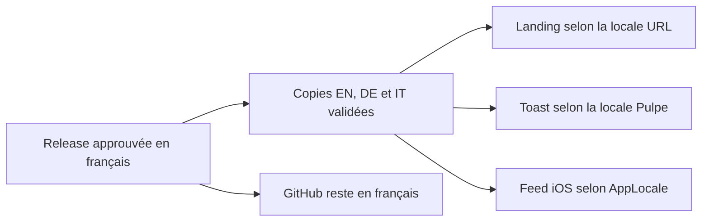
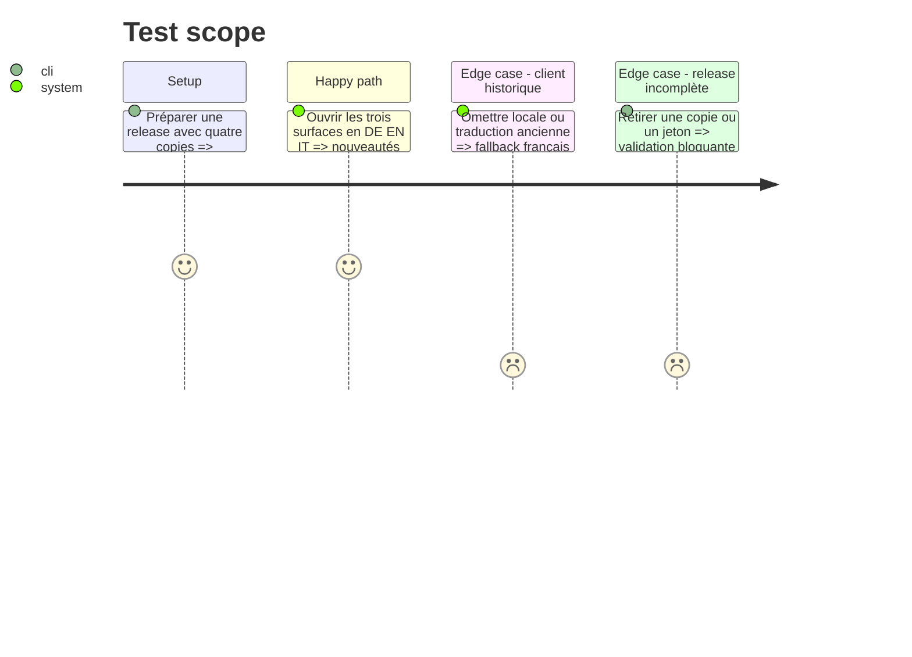

# Instruction: Internationaliser les nouveautés et le pipeline de release

## Architecture projection

> Tree of the final files. ✅ create · ✏️ modify · ❌ delete

```txt
.
├── shared/
│   └── ✏️ schemas.ts
├── landing/
│   ├── ✏️ package.json
│   ├── ✏️ components/pages/Changelog.tsx
│   ├── ✏️ content/dictionaries/fr.ts, en.ts, de.ts, it.ts
│   └── data/
│       ├── ✏️ releases.json
│       └── ✅ releases.test.ts
├── frontend/projects/webapp/src/app/layout/whats-new/
│   ├── ✏️ whats-new-releases.ts
│   ├── ✏️ whats-new-releases.spec.ts
│   ├── ✏️ whats-new-toast.ts
│   └── ✏️ whats-new-toast.spec.ts
├── backend-nest/src/modules/whats-new/
│   ├── domain/
│   │   ├── ✏️ releases-data.ts
│   │   ├── ✏️ releases-data.parity.spec.ts
│   │   ├── ✏️ whats-new-payload.ts
│   │   └── ✏️ whats-new-payload.spec.ts
│   └── infrastructure/http/
│       ├── ✏️ whats-new.controller.ts
│       └── ✏️ whats-new.controller.spec.ts
├── ios/Pulpe/
│   ├── ✏️ Core/Network/Endpoints.swift
│   ├── ✏️ Domain/Services/WhatsNewService.swift
│   └── ✏️ Domain/Store/WhatsNewStore.swift
├── ios/PulpeTests/Domain/Store/
│   └── ✏️ WhatsNewStoreTests.swift
└── .claude/skills/release/
    ├── ✏️ SKILL.md
    └── scripts/
        ├── ❌ validate-ios-release.ts
        └── ✅ validate-whats-new-release.ts
```

## User Journey



## Test Scope



## Wireframe

```txt
┌──────────────────────────────────────────┐
│ (1) En-tête et titre localisés           │
├──────────────────────────────────────────┤
│ (2) Releases localisées                  │
│     version · date · plateformes · notes │
├──────────────────────────────────────────┤
│ (3) Accès à l’archive historique FR      │
├──────────────────────────────────────────┤
│ (4) Footer et sélecteur de langue        │
└──────────────────────────────────────────┘
```

## Tasks to do

### `1)` Étendre le contrat éditorial

> Garder la copie française canonique et exiger EN/DE/IT pour la release i18n et les suivantes.

1. Ajouter les variantes localisées aux titres, descriptions et catégories visibles ; conserver les anciennes entrées en français.
2. Garder en anglais les identifiants stables, catégories internes, cibles de projection et autres champs techniques.
3. Rendre la landing par locale et proposer l’archive FR sans injecter les 36 anciennes releases dans les pages traduites.

### `2)` Localiser les projections webapp et iOS

> Sélectionner la copie à partir de la préférence Pulpe, jamais du navigateur seul.

1. Donner au toast webapp quatre listes et les sélectionner depuis la locale active.
2. Ajouter `locale` à la requête iOS, avec défaut serveur `fr`, puis projeter le contenu backend correspondant.
3. Garder le cadre SwiftUI dans le String Catalog et le contenu dynamique dans la réponse API.

### `3)` Durcir `/release`

> Rendre impossible une nouvelle release produit partiellement traduite.

1. Faire approuver FR/EN/DE/IT, écrire les trois projections, mais publier GitHub depuis le français seulement.
2. Remplacer le validateur iOS par un validateur global : complétude, parité, scopes, limites et modes silencieux.
3. Vérifier que le pipeline ne traduit ni ne renomme les événements/propriétés analytics, les clés techniques ou la mécanique SEO.

## Test acceptance criteria

| Task | Acceptance criteria |
| ---- | ------------------- |
| 1 | `/`, `/en`, `/de` et `/it` changelog rendent la release i18n dans leur langue ; les pages traduites ne mélangent aucune ancienne note française et donnent accès à l’archive FR. |
| 2 | Le toast webapp et la feuille iOS affichent la même release en FR/EN/DE/IT selon la préférence Pulpe ; un ancien client sans `locale` reçoit le français. |
| 3 | Le workflow refuse toute copie manquante ou projection divergente ; la GitHub Release reste exclusivement française. |
