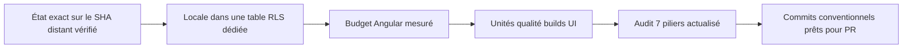
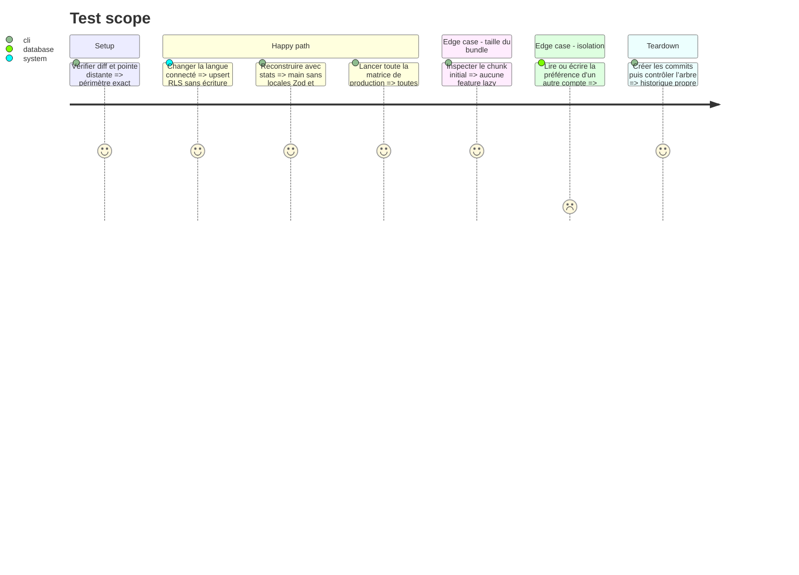

# Instruction: Réduire le bundle, exécuter les gates, documenter et commiter

## Architecture projection

> Tree of the final files. ✅ create · ✏️ modify · ❌ delete

```txt
.
├── ✏️ frontend/angular.json
├── ✏️ docs/I18N.md
├── backend-nest/
│   ├── ✏️ src/modules/user/domain/user.entity.ts
│   ├── ✏️ src/modules/user/domain/ports/user-repository.port.ts
│   ├── ✏️ src/modules/user/infrastructure/persistence/supabase-user.repository.ts
│   ├── ✏️ src/modules/user/infrastructure/persistence/supabase-user.repository.spec.ts
│   ├── ✏️ src/types/database.types.ts
│   └── supabase/
│       ├── ✅ migrations/20260815100000_create_user_locale_preference.sql
│       ├── ✏️ tests/README.md
│       └── ✅ tests/user_locale_preference_rls.sql
└── aidd_docs/tasks/2026_08/
    ├── 2026_08_13_i18n-en-de-it/
    │   └── ✏️ review.md
    └── 2026_08_15_audit/
        ├── ✅ architecture.md
        ├── ✅ code-quality.md
        ├── ✅ dependencies.md
        ├── ✅ performance.md
        ├── ✅ report.md
        ├── ✅ security.md
        ├── ✅ tests.md
        └── ✅ ui.md
```

## User Journey



## Test Scope



## Tasks to do

### `1)` Mesurer et recalibrer le bundle initial

> Garder le plus petit changement qui reflète le coût réel de la feature i18n.

1. Mesurer la baseline avec `ng build --stats-json`, puis vérifier si les imports Zod nommés retirent réellement `zod/v4/locales/*` de `main`.
2. Annuler l’essai si l’entrée publique Zod conserve ces locales et si le gain ne justifie pas le diff ; relever alors uniquement le warning avec une marge limitée, sans toucher au plafond d’erreur.
3. Ne toucher ni aux routes ni aux stratégies de préchargement : les stats prouvent déjà que `feature/`, `layout/` et `ui/` contribuent chacun à 0 octet dans `main`.

### `2)` Rejouer et documenter la matrice complète

> Valider l’état réellement commité et porter les sept piliers sur le SHA distant enregistré en phase 1.

1. Exécuter unités, qualité, builds, Playwright, suites iOS, `git diff --check` et répétitions ciblées.
2. Comparer le bundle à la baseline ; ne relever le seuil Angular que si le build reste légitimement plus lourd après suppression de l’inclusion Zod accidentelle.
3. Vérifier que les événements et propriétés PostHog/analytics, les logs, les contrats et la mécanique SEO gardent leurs identifiants anglais ; seules les copies visibles sont localisées.
4. Reporter uniquement les résultats observés et séparer bloqueurs de branche des warnings hérités.

### `3)` Sortir la locale des métadonnées Auth

> Persister la préférence produit dans une table applicative propriétaire.

1. Créer une table à une ligne par utilisateur avec contrainte FR/EN/DE/IT, cascade Auth, RLS et privilèges minimaux.
2. Backfiller les anciennes métadonnées valides et conserver une lecture de compatibilité uniquement pendant le rolling deploy.
3. Upserter la locale avec le client JWT ; une mise à jour locale-only ne doit jamais appeler le service role.
4. Prouver la contrainte, les grants et l'isolation cross-user sur Postgres local, puis régénérer les types.

### `4)` Créer l’historique mergeable

> Commiter séparément corrections testées et preuves AIDD.

1. Revérifier la pointe distante, créer des commits conventionnels sans fichier parasite, puis intégrer ces commits à `feat/i18n-en-de-it` et contrôler l’arbre.
2. Ne pousser qu’après demande explicite.

## Test acceptance criteria

| Task | Acceptance criteria                                                                                                                                                                                                                              |
| ---- | ------------------------------------------------------------------------------------------------------------------------------------------------------------------------------------------------------------------------------------------------ |
| 1    | Les 710 tests shared et les 55 tests Angular de schémas restent verts ; l’essai Zod et son annulation sont mesurés, le total initial respecte le warning 1,40 MB, et l’erreur reste à 1,50 MB.                                                   |
| 2    | Toutes les gates terminent avec succès ; les huit rapports et la review nomment le SHA distant enregistré en phase 1, reflètent les compteurs rejoués et ne cachent aucun finding bloquant.                                                      |
| 3    | `locale` est contrainte et owner-scoped dans `user_locale_preference` ; le backfill conserve les valeurs valides, la lecture legacy ne sert qu'en absence de ligne, l'upsert locale-only n'utilise pas le service role et le test SQL RLS passe. |
| 4    | Les commits contiennent tout le diff prévu ; `feat/i18n-en-de-it` les contient après une dernière vérification distante et son arbre est propre.                                                                                                 |
