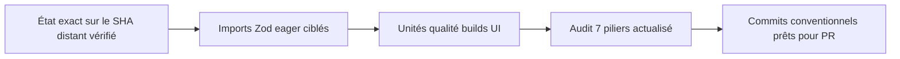
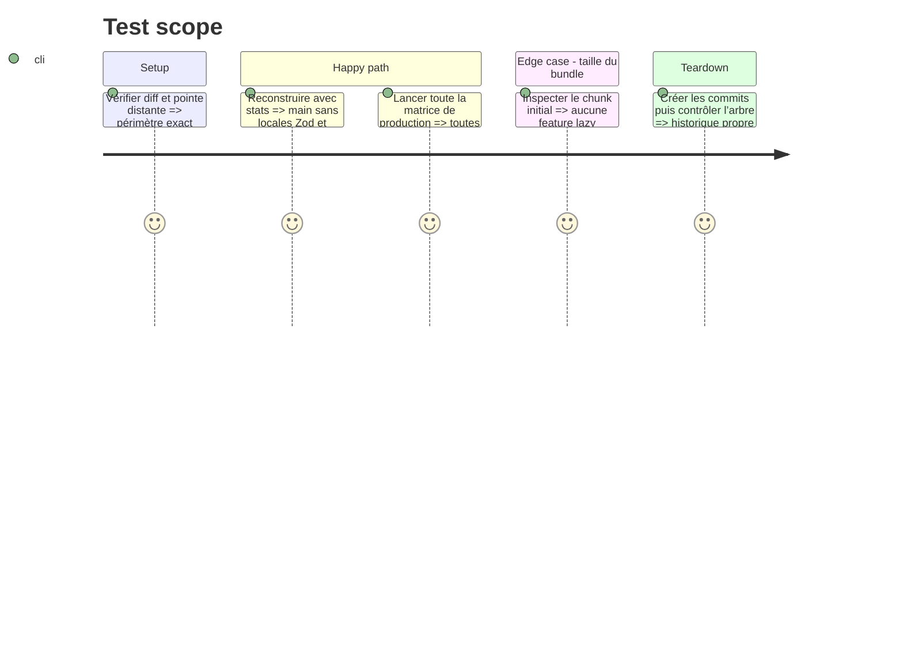

# Instruction: Réduire le bundle, exécuter les gates, documenter et commiter

## Architecture projection

> Tree of the final files. ✅ create · ✏️ modify · ❌ delete

```txt
.
├── ✏️ shared/schemas.ts
├── ✏️ shared/src/api-response.ts
├── frontend/projects/webapp/src/app/core/
│   ├── config/✏️ config.schema.ts
│   ├── maintenance/✏️ maintenance-api.ts
│   └── storage/✏️ storage-schemas.ts
└── aidd_docs/tasks/2026_08/
    ├── 2026_08_13_i18n-en-de-it/
    │   └── ✏️ review.md
    └── 2026_08_14_audit/
        ├── ✅ architecture.md
        ├── ✅ code-quality.md
        ├── ✅ dependencies.md
        ├── ✅ performance.md
        ├── ✅ report.md
        ├── ✅ security.md
        ├── ✅ tests.md
        └── ✅ ui.md
```

## User Journey



## Test Scope



## Tasks to do

### `1)` Retirer les locales Zod du chunk initial

> Corriger l’inclusion eager mesurée sans refondre le routage Angular.

1. Remplacer l’import de l’objet agrégé `z` dans les modules eager par les imports Zod nommés réellement utilisés, sans changer les schémas ni leurs messages.
2. Rejouer les tests de schémas puis `ng build --stats-json` ; exiger l’absence de `zod/v4/locales/*` dans `main` et mesurer le nouveau total initial.
3. Ne toucher ni aux routes ni aux stratégies de préchargement : les stats prouvent déjà que `feature/`, `layout/` et `ui/` contribuent chacun à 0 octet dans `main`.

### `2)` Rejouer et documenter la matrice complète

> Valider l’état réellement commité et porter les sept piliers sur le SHA distant enregistré en phase 1.

1. Exécuter unités, qualité, builds, Playwright, suites iOS, `git diff --check` et répétitions ciblées.
2. Comparer le bundle à la baseline ; ne relever le seuil Angular que si le build reste légitimement plus lourd après suppression de l’inclusion Zod accidentelle.
3. Vérifier que les événements et propriétés PostHog/analytics, les logs, les contrats et la mécanique SEO gardent leurs identifiants anglais ; seules les copies visibles sont localisées.
4. Reporter uniquement les résultats observés et séparer bloqueurs de branche des warnings hérités.

### `3)` Créer l’historique mergeable

> Commiter séparément corrections testées et preuves AIDD.

1. Revérifier la pointe distante, créer des commits conventionnels sans fichier parasite, puis intégrer ces commits à `feat/i18n-en-de-it` et contrôler l’arbre.
2. Ne pousser qu’après demande explicite.

## Test acceptance criteria

| Task | Acceptance criteria |
| ---- | ------------------- |
| 1 | Les tests de schémas restent verts ; `main` ne contient plus les locales Zod inutilisées et le total initial respecte 1,25 MB, ou toute impossibilité mesurée justifie explicitement un nouveau seuil. |
| 2 | Toutes les gates terminent avec succès ; les huit rapports et la review nomment le SHA distant enregistré en phase 1, reflètent les compteurs rejoués et ne cachent aucun finding bloquant. |
| 3 | Les commits contiennent tout le diff prévu ; `feat/i18n-en-de-it` les contient après une dernière vérification distante et son arbre est propre. |
