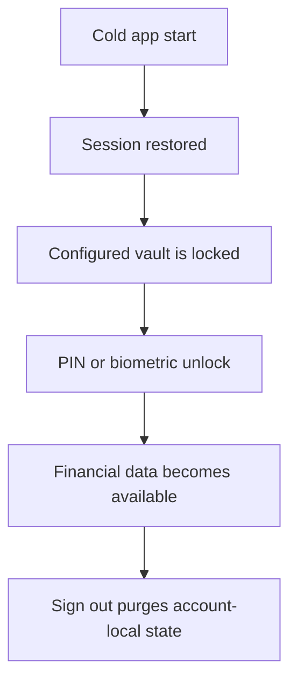
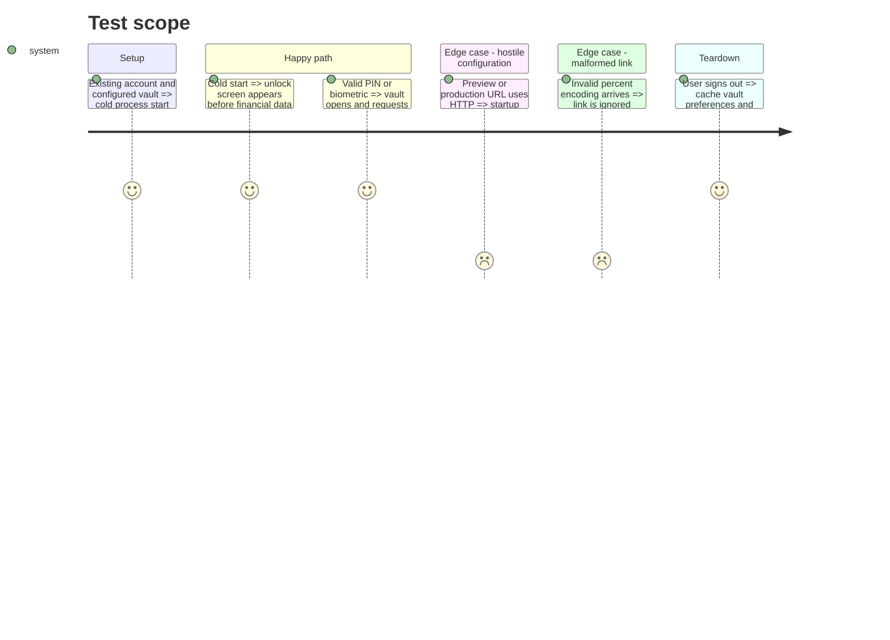

# Instruction: Secure device and account boundaries

## Architecture projection

> Tree of the final files. ✅ create · ✏️ modify · ❌ delete

```txt
android/
├── app.json ✏️
└── src/core/
    ├── auth/session-store.spec.ts ✅
    ├── config/env.ts ✏️
    ├── config/env.spec.ts ✅
    ├── crypto/client-key-manager.ts ✏️
    ├── crypto/client-key-manager.spec.ts ✏️
    ├── linking/deep-links.ts ✏️
    ├── linking/deep-links.spec.ts ✏️
    └── vault/
        ├── vault-store.ts ✏️
        └── vault-store.spec.ts ✏️
```

## User Journey



## Test Scope



## Tasks to do

### `1)` Lock every cold launch

> Remove automatic restoration of the non-biometric key.

1. Keep the client key in memory plus the authenticated biometric slot only.
2. Delete the legacy standard slot during bootstrap and expose `locked` with biometric availability.
3. Replace the existing “stored key unlocks bootstrap” tests with cold-process regression coverage.

### `2)` Harden external boundaries

> Fail closed before sensitive data leaves the device.

1. Set `android.allowBackup` to `false`.
2. Require HTTPS for preview/production service URLs; permit HTTP only for local loopback hosts.
3. Make malformed deep-link decoding return `null` and extend its existing tests.

### `3)` Prove account purge

> Protect separation between two accounts on one device.

1. Add one session-store test covering awaited sign-out, cache clear, vault reset, landing reset and key deletion.

## Test acceptance criteria

| Task | Acceptance criteria                                                                                  |
| ---- | ---------------------------------------------------------------------------------------------------- |
| 1    | A configured vault is locked after process restart and opens only after PIN or biometric validation. |
| 2    | Sensitive drafts are not backup-eligible; non-local HTTP builds and malformed links fail closed.     |
| 3    | Anonymous session state is published only after every account-local store and key has been purged.   |
