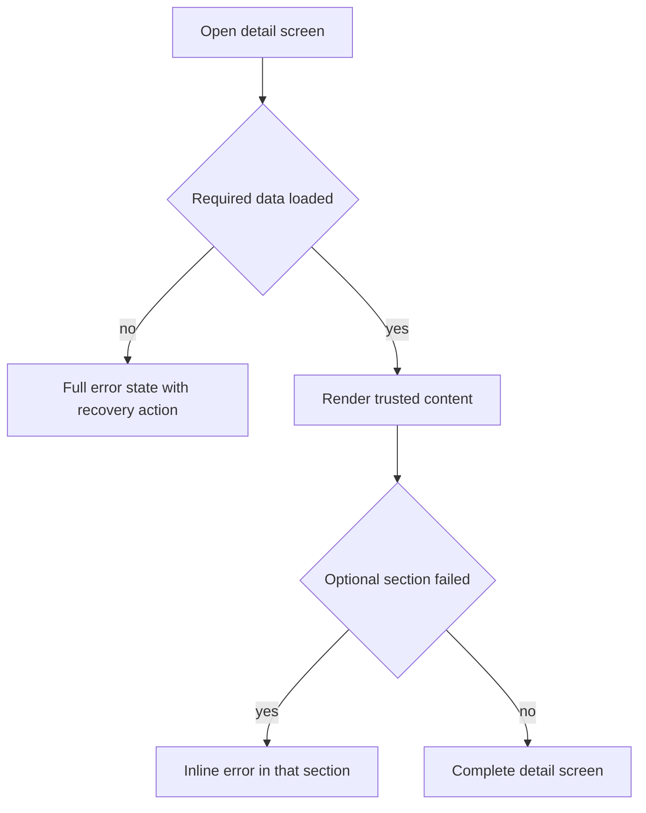
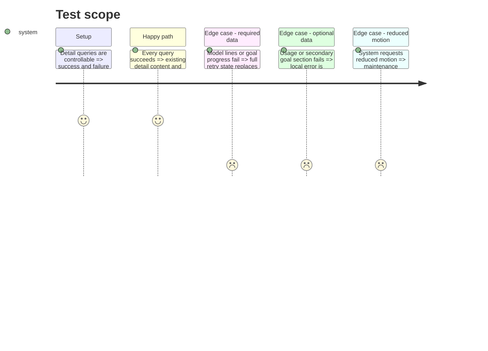

# Instruction: Make query failures honest and visible

## Architecture projection

> Tree of the final files. ✅ create · ✏️ modify · ❌ delete

```txt
android/src/
├── app/(main)/goal/[id].tsx ✏️
├── app/(main)/template/[id].tsx ✏️
└── core/
    ├── system/detail-query-states.spec.ts ✅
    ├── system/system-gate-screen.tsx ✏️
    └── ui/inline-query-error.tsx ✅
```

## User Journey



## Test Scope



## Wireframe

```txt
Template detail
┌─────────────────────────────────────┐
│ (1) Header                          │
├─────────────────────────────────────┤
│ (2) Totals and model lines          │
│ (3) Optional usage or local error   │
│ (4) Editing actions                 │
└─────────────────────────────────────┘

Goal detail
┌─────────────────────────────────────┐
│ (1) Header                          │
├─────────────────────────────────────┤
│ (2) Required progress region        │
│ (3) Plan and projection regions     │
│ (4) Optional activity or local error│
└─────────────────────────────────────┘

System gate
┌─────────────────────────────────────┐
│ (1) Motion-aware media region       │
│ (2) Status explanation              │
│ (3) Recovery action                 │
└─────────────────────────────────────┘
```

1. Header: existing navigation and title.
2. Required region: content that cannot be represented safely when missing.
3. Optional region: secondary content or an error occupying the same place.
4. Actions: controls whose required query state is known.

## Tasks to do

### `1)` Separate missing, failed and empty data

> Never turn a network failure into an empty model or a zero impact.

1. Reuse `PlaceholderScreen` for required-query failures with one retry action.
2. Add one accessible inline query error for optional panels and reuse it on both detail routes.
3. Disable edits/completion paths while their usage or future-line query is unknown or failed.

### `2)` Respect reduced motion

> Keep the maintenance gate useful without forced animation.

1. Read `useReducedMotion` from the installed Reanimated package and render the Lottie as a static frame when requested.
2. Add a small source contract covering the two error gates and reduced-motion branch.

## Test acceptance criteria

| Task | Acceptance criteria                                                                                             |
| ---- | --------------------------------------------------------------------------------------------------------------- |
| 1    | Failed queries are visibly distinct from empty data, offer recovery, and never enable actions from fake zeroes. |
| 2    | Maintenance content is static under reduced motion and unchanged otherwise.                                     |
