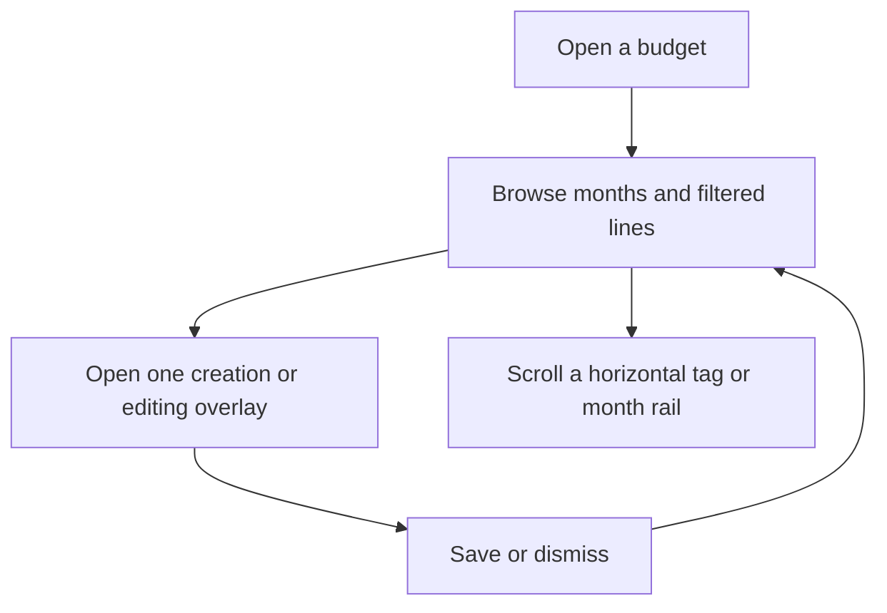
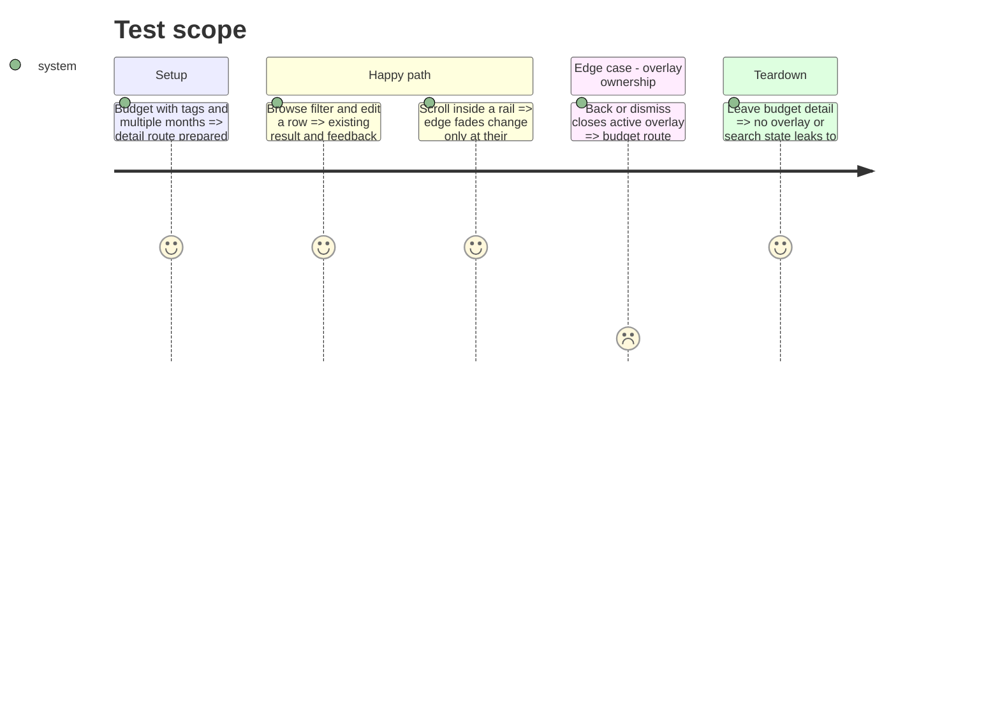

# Instruction: Simplify boundaries and render hot path

## Architecture projection

> Tree of the final files. ✅ create · ✏️ modify · ❌ delete

```txt
PRODUCT.md ✏️
aidd_docs/memory/architecture.md ✏️
aidd_docs/memory/mobile.md ✏️
android/src/
├── app/(main)/budget/[id].tsx ✏️
├── app/(main)/budget/[id]/line/[lineId].tsx ✏️
├── app/(main)/settings/tags.tsx ✏️
├── core/tags/ ❌
├── core/ui/fading-rail.tsx ✏️
├── core/ui/fading-rail.spec.ts ✅
└── features/
    ├── budget-details/components/budget-detail-overlays.tsx ✅
    ├── current-month/components/activity-card.tsx ✏️
    ├── tags/ ✅
    │   ├── tag-api.ts
    │   ├── tag-picker.tsx
    │   ├── tag-queries.ts
    │   ├── tag-selection.ts
    │   └── tag-selection.spec.ts
    └── transactions/components/transaction-sheet.tsx ✏️
```

## User Journey



## Test Scope



## Wireframe

```txt
┌─────────────────────────────────────┐
│ (1) Header or search                │
├─────────────────────────────────────┤
│ (2) Month rail                      │
├─────────────────────────────────────┤
│ (3) Hero · filters · budget rows    │
│                                     │
│                              (4) FAB│
├─────────────────────────────────────┤
│ (5) One active sheet/menu/notice    │
└─────────────────────────────────────┘
```

1. Header: current title and search takeover.
2. Rail: month navigation.
3. Content: existing summary, filters and virtualized rows.
4. FAB: existing creation entry point.
5. Overlay: one contextual action surface at a time.

## Tasks to do

### `1)` Restore feature boundaries

> Keep `core` independent of budget features.

1. Move the complete tag slice from `core/tags` to `features/tags` and update its five consumers.
2. Keep budget invalidation inside the tag feature mutation; add no new registry or interface.

### `2)` Stop per-frame React renders

> Track rail edge visibility, not raw scroll offset.

1. Update state only when leading or trailing visibility changes.
2. Cover boundary transitions with one focused test.

### `3)` Reduce the budget route's responsibilities

> Extract the existing overlay cluster without changing layout or data ownership.

1. Move sheets, mutation feedback and their local visibility state into `BudgetDetailOverlays`.
2. Leave queries, derived budget content and navigation orchestration in the route.
3. Refresh Android entries in product and architecture memory.

## Test acceptance criteria

| Task | Acceptance criteria                                                                                         |
| ---- | ----------------------------------------------------------------------------------------------------------- |
| 1    | No `core` module imports a feature, and every tag surface behaves as before.                                |
| 2    | Mid-rail scrolling with unchanged edge visibility produces no new React state value.                        |
| 3    | Budget browsing, editing, undo, withdrawal and realized-balance flows are unchanged with one overlay owner. |
