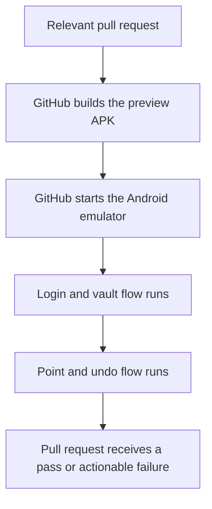
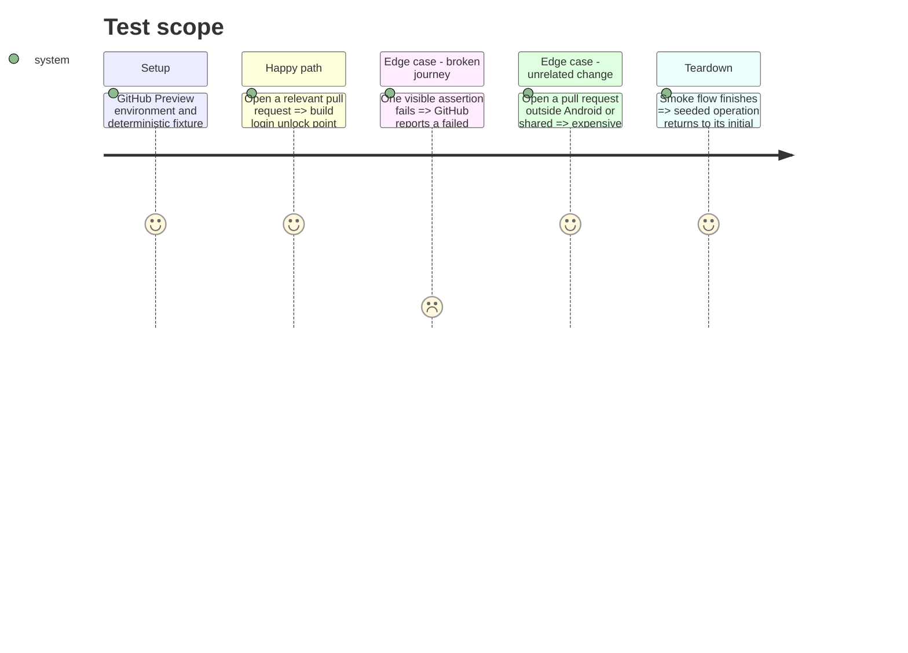

# Instruction: Clean dependencies and automate smoke QA

## Architecture projection

> Tree of the final files. ✅ create · ✏️ modify · ❌ delete

```txt
pnpm-lock.yaml ✏️
android/
├── .eas/workflows/deploy-preview.yml ✏️
├── README.md ✏️
├── app.json ✏️
├── docs-android/RELEASE.md ✏️
├── maestro/
│   ├── login-vault.yaml ✏️
│   └── smoke.yaml ✅
└── package.json ✏️
.github/workflows/android-e2e.yml ✅
```

## User Journey



## Test Scope



## Tasks to do

### `1)` Remove unused direct dependencies

> Shrink install and native-autolinking surface without substitutions.

1. Remove the six unused runtime packages and `@types/d3` identified by the audit.
2. Regenerate the lockfile and verify Expo compatibility, quality and export.
3. Apply only Expo-compatible advisory updates; leave upstream toolchain advisories documented instead of forcing overrides.

### `2)` Make existing Maestro flows repeatable

> Compose the two stable journeys once for local use and GitHub Actions.

1. Add `maestro/smoke.yaml` chaining `login-vault` then `check-operation`.
2. Read `MAESTRO_EMAIL`, `MAESTRO_PASSWORD` and `MAESTRO_PIN` in the login flow, retaining explicit local-seed fallbacks only for local development.
3. Expose the smoke flow as the Android package's `test:e2e` script and document its emulator/backend prerequisites.
4. Keep onboarding manual because it creates real accounts.

### `3)` Add a GitHub Actions Maestro pull-request gate

> Build and exercise the APK without requiring Expo's paid Maestro job.

1. Keep EAS responsible for distributable preview builds and configure protected credentials in the GitHub `Preview` environment for a deterministic account containing an unchecked `Loyer` fixture.
2. Trigger GitHub Actions for pull requests touching `android/**`, `shared/**` or workspace manifests; keep manual dispatch.
3. Generate a release x86_64 APK, boot an API 35 emulator and run a checksum-verified Maestro 2.7.0 CLI.
4. Capture a screenshot and logcat on failure, then burn in five consecutive green runs before making the status required.

## Test acceptance criteria

| Task | Acceptance criteria                                                                                                         |
| ---- | --------------------------------------------------------------------------------------------------------------------------- |
| 1    | Expo export and quality pass with no import/config reference to a removed package.                                          |
| 2    | One documented local command deterministically signs in, unlocks, points and restores the seeded operation.                 |
| 3    | A relevant pull request receives a GitHub APK-plus-Maestro status while unrelated monorepo pull requests skip the workflow. |
