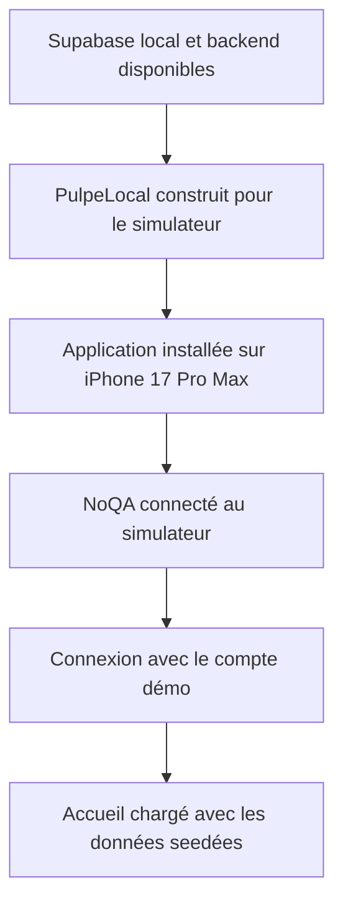
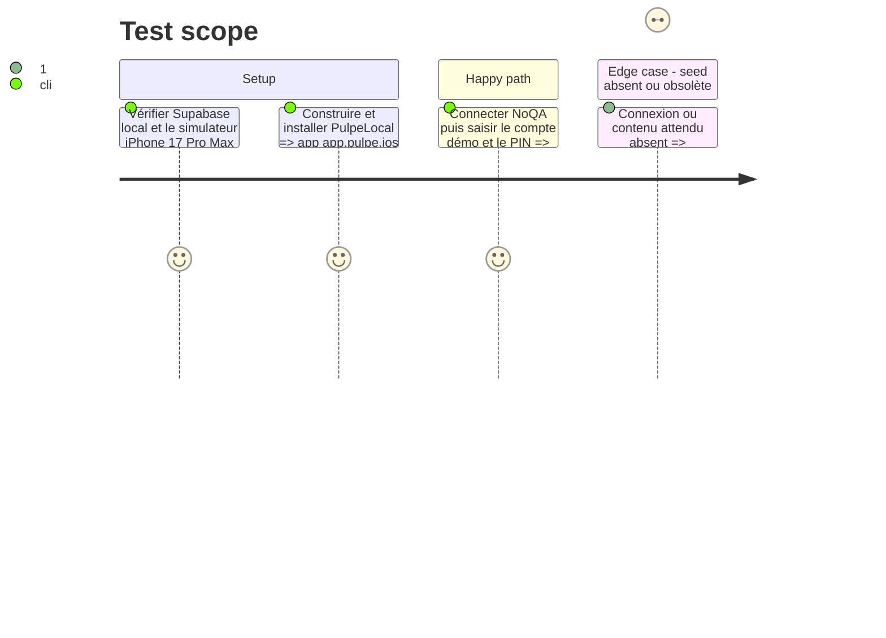

# Instruction: Préparer la session locale déterministe

## Architecture projection

> Tree of the final files. ✅ create · ✏️ modify · ❌ delete

```txt
.
└── aucun fichier du dépôt — services, build, simulateur et session NoQA uniquement
```

## User Journey



## Test Scope



## Tasks to do

### `1)` Stabiliser les services locaux

> Utiliser le seed local existant sans toucher à une base liée.

1. Confirmer que Supabase répond dans `backend-nest/` et que l’API backend écoute sur `127.0.0.1:3000`.
2. Démarrer le backend si nécessaire.
3. Ne lancer `bun run supabase:reset` que si la connexion démo ou les données attendues échouent ; ne jamais utiliser `db reset` ni une commande destructive sur une base liée.

### `2)` Construire et installer PulpeLocal

> Réutiliser le projet Xcode et le schéma existants.

1. Construire `PulpeLocal` en Debug pour `iphonesimulator`, destination `AAF01FC0-2FE7-4357-8CCA-0AC250788542`.
2. Désinstaller uniquement `app.pulpe.ios` du simulateur pour effacer une ancienne session, puis installer le `.app` produit.
3. Lancer en français (`fr_CH`) et en apparence claire.

### `3)` Ouvrir la session démo avec NoQA

> Piloter l’interface par inspection avant chaque action.

1. Ouvrir l’application NoQA, vérifier l’authentification du compte NoQA et connecter l’iPhone 17 Pro Max.
2. Inspecter l’écran avec `noqa screen`, saisir `demo@pulpe.test` et le mot de passe local du seed, puis valider.
3. Saisir le PIN local du seed si le flux le demande et fermer uniquement les écrans d’introduction qui masquent les vues à photographier.
4. Confirmer que l’Accueil, les budgets 2026, les deux modèles et les trois objectifs sont chargés.

## Test acceptance criteria

| Task | Acceptance criteria |
| ---- | ------------------- |
| 1 | Supabase local et l’API répondent ; aucune base liée n’a subi de commande destructive |
| 2 | `app.pulpe.ios` démarre sur l’iPhone 17 Pro Max iOS 26.5 en français et en mode clair |
| 3 | NoQA est connecté et l’Accueil authentifié affiche les données du compte démo, sans onboarding ni verrou bloquant |
