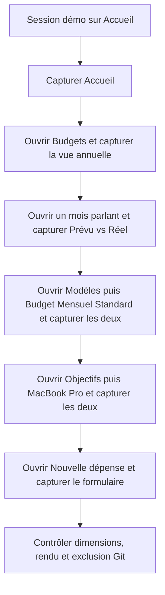
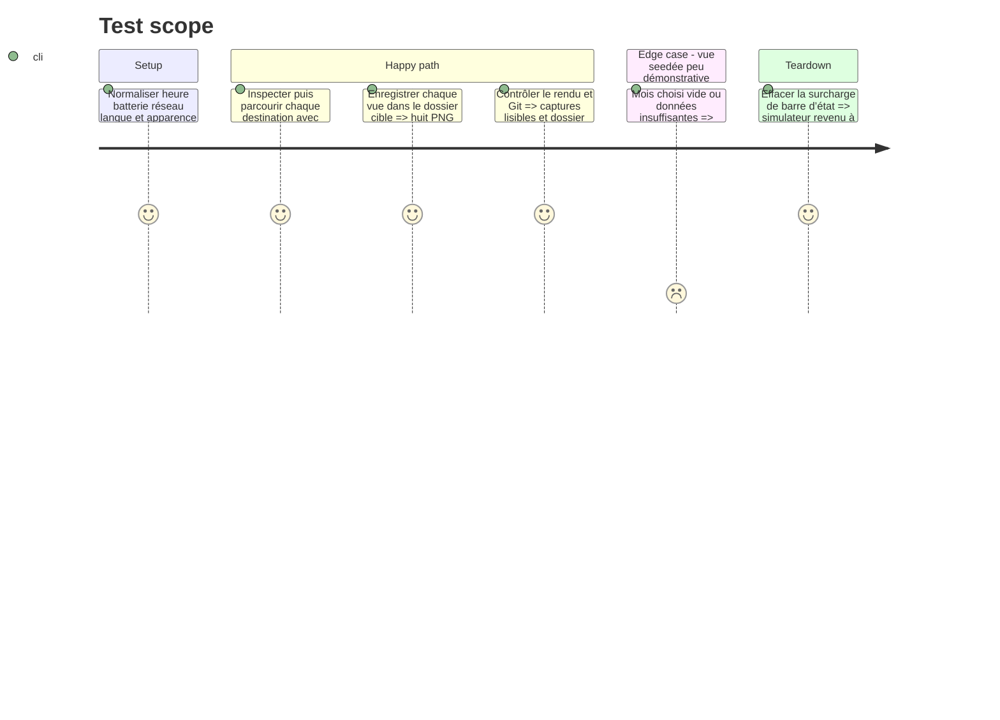

# Instruction: Capturer et contrôler les huit écrans

## Architecture projection

> Tree of the final files. ✅ create · ✏️ modify · ❌ delete

```txt
.
├── .gitignore                                                   ✏️ ignore les sorties locales
└── appstore-screenshots/                                        ✅ captures brutes locales
    ├── 01-accueil.png                                           ✅
    ├── 02-vue-annuelle.png                                      ✅
    ├── 03-modeles.png                                           ✅
    ├── 04-modele-budget-mensuel-standard.png                    ✅
    ├── 05-prevu-vs-reel.png                                     ✅
    ├── 06-nouvelle-depense.png                                  ✅
    ├── 07-objectifs-epargne.png                                 ✅
    └── 08-objectif-macbook-pro.png                              ✅
```

## User Journey



## Test Scope



## Tasks to do

### `1)` Normaliser le rendu du simulateur

> Obtenir des assets homogènes avec les planches 1320 × 2868.

1. Créer `appstore-screenshots/` et ajouter `/appstore-screenshots/` au `.gitignore` racine.
2. Forcer la barre d’état du simulateur à 09:41, batterie chargée à 100 %, Wi-Fi et réseau pleins.
3. Vérifier avant capture : français, mode clair, clavier fermé, montants visibles, aucune alerte, toast, astuce ou animation en cours.

### `2)` Capturer les vues avec NoQA

> Une planche peut consommer deux captures ; huit fichiers couvrent les six références.

1. Pour chaque navigation, exécuter la boucle `noqa screen` → action ciblée → `noqa screen`, puis attendre le chargement stable avant `noqa screenshot`.
2. Capturer `01-accueil.png` sur l’onglet Accueil, avec le résumé et les opérations à pointer visibles.
3. Capturer `02-vue-annuelle.png` sur Budgets, année 2026, avec le potentiel annuel et la progression mensuelle visibles.
4. Capturer `03-modeles.png`, puis ouvrir `Budget Mensuel Standard` et capturer `04-modele-budget-mensuel-standard.png`.
5. Ouvrir le budget 2026 seedé offrant le contraste le plus lisible entre prévu et réel, puis capturer `05-prevu-vs-reel.png`.
6. Depuis l’Accueil, ouvrir `Ajouter une opération`, conserver le type Dépense et capturer `06-nouvelle-depense.png` sans laisser le clavier masquer le formulaire.
7. Capturer `07-objectifs-epargne.png`, puis ouvrir `MacBook Pro` et capturer `08-objectif-macbook-pro.png` avec la progression et la trajectoire visibles.

### `3)` Contrôler les sorties

> Une capture incorrecte est reprise immédiatement, pas livrée comme preuve partielle.

1. Vérifier visuellement les huit PNG contre les écrans attendus des six planches ; reprendre toute vue vide, chargée, masquée ou mal cadrée.
2. Vérifier que chaque fichier mesure exactement 1320 × 2868, est opaque et porte son nom fonctionnel.
3. Vérifier avec Git que `appstore-screenshots/` est ignoré et que seule la règle `.gitignore` est une modification source attendue.
4. Effacer la surcharge de barre d’état du simulateur après les contrôles.

## Test acceptance criteria

| Task | Acceptance criteria |
| ---- | ------------------- |
| 1 | Toutes les captures montrent une barre d’état homogène à 09:41, le français, le mode clair et aucun élément parasite |
| 2 | Les huit fichiers listés existent et couvrent les écrans nécessaires aux planches 1 à 5 ; la planche 6 ne nécessite aucune capture d’app |
| 3 | Chaque PNG fait 1320 × 2868, affiche des données démo lisibles et `git check-ignore` confirme l’exclusion du dossier entier |
