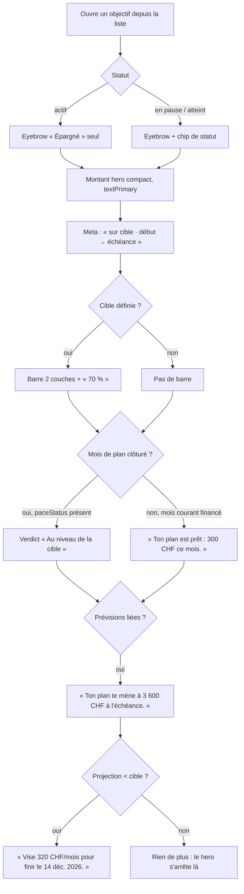
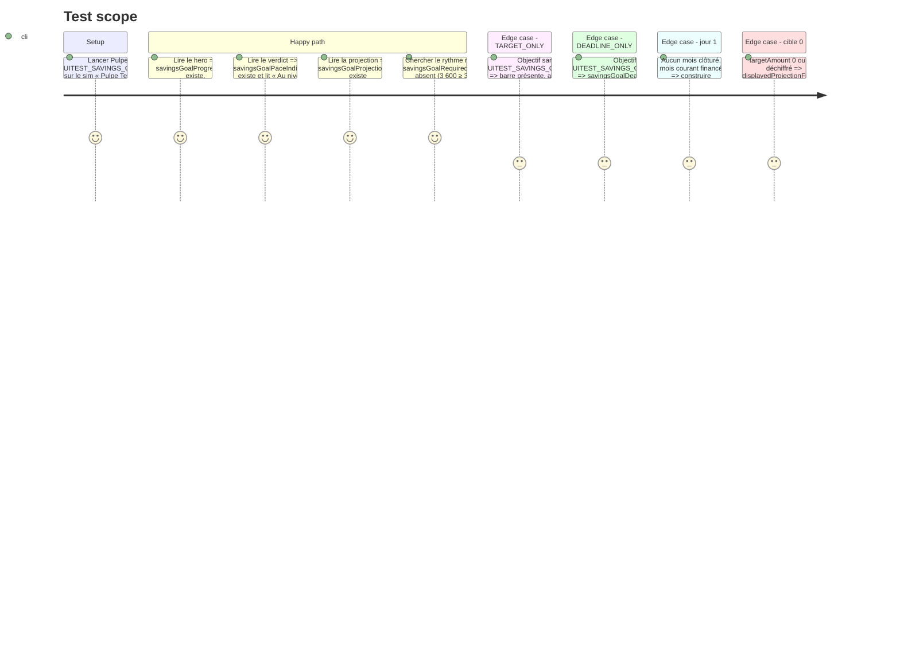

# Instruction: Hero plat `GoalProgressHero` porté par `GoalHeroPresentation`

## Architecture projection

> Tree of the final files. ✅ create · ✏️ modify · ❌ delete

```txt
ios/
├── DESIGN.md                                                            ✏️ Hero Flat Rule : ajouter le hero d'objectif (mêmes contraintes que Budget Detail)
├── Pulpe/
│   ├── Domain/Models/SavingsGoalProgress.swift                          ✏️ + displayedProjection, + displayedProjectionFraction ; − plannedFraction, − projectedFraction
│   ├── Features/SavingsGoals/
│   │   ├── SavingsGoalDetailView.swift                                  ✏️ − header(progress:), − requiredMatchesPlannedPace ; content() ouvre sur GoalProgressHero
│   │   └── Components/
│   │       ├── GoalProgressCard.swift                                   ❌ git mv → GoalProgressHero.swift
│   │       ├── GoalProgressHero.swift                                   ✅ vue plate, aucune logique conditionnelle : rend une GoalHeroPresentation
│   │       ├── GoalHeroPresentation.swift                               ✅ struct pure Equatable : eyebrow, montant, meta, barre, verdict, projection, rythme requis, beat jour-1
│   │       └── SavingsGoalStatusBadge.swift                             ✏️ − showsIcon (dernier appelant supprimé)
│   └── Resources/Localizable.xcstrings                                  ✏️ + nouvelles clés (fr source, en/de/it translated) ; − clés orphelines
├── PulpeTests/
│   ├── Domain/Models/SavingsGoalProgressCodableTests.swift              ✏️ fractions : projected ?? plannedProjection ; garde cible 0
│   └── Features/SavingsGoals/
│       ├── GoalHeroPresentationTests.swift                              ✅ une @Test par ligne conditionnelle du hero
│       └── SavingsGoalDetailViewModelTests.swift                        ✏️ − les 3 tests requiredMatchesPlannedPace_*
└── PulpeUITests/SavingsGoalIntervalUITests.swift                        ✏️ FULL : hasRequiredAmount → false (le plan atteint la cible : 3 600 ≥ 3 000)
```

## User Journey



## Test Scope



## Wireframe

```txt
┌────────────────────────────────────────┐
│ ‹ Objectifs            Voyage Japon  ⋯ │  nav bar système (inchangée)
├────────────────────────────────────────┤
│ (1) ÉPARGNÉ                 [En pause] │
│ (2) 2 100 CHF                          │
│ (3) sur 3 000 CHF · 5 janv. → 14 déc.  │
│     Dont 500 CHF de départ             │
│ (4) ████████████░░░░░░░░░░░░░░   70 %  │
│ (5) Au niveau de la cible              │
│ (6) Ton plan te mène à 3 600 CHF       │
│     à l'échéance.                      │
│ (7) Vise 320 CHF/mois pour finir       │
│     le 14 déc. 2026.                   │
│                                        │
│  ┌──────────────────────────────────┐  │
│  │ (8) cartes d'état dérivé         │  │  inchangées (GoalDerivedStateCards)
│  └──────────────────────────────────┘  │
│  … sections suivantes (phases 2-4)     │
└────────────────────────────────────────┘
```

1. Eyebrow `metricLabel` `textSecondary` ; chip `SavingsGoalStatusBadge` à droite **seulement** si statut ≠ actif.
2. Montant confirmé `amountHero`, `textPrimary`, `asCompactCurrency`, `sensitiveAmount`. Plat sur le canvas : aucune carte, aucun fond.
3. Meta `labelMedium` `textSecondary` : cible compacte + dates ; l'un ou l'autre absent → fragment omis, séparateur « · » omis. Les ids `savingsGoalDeadlineRange` / `savingsGoalDeadlineDate` restent sur le `Text` de date. Ligne « Dont X de départ » `textTertiary` seulement si `initialAmount > 0`.
4. Barre 2 couches (`ProgressBarShape`) : confirmé plein, `displayedProjectionFraction` en `Opacity.strong` ; pourcentage `achievementPercent` `metricLabelBold` à droite. Id `savingsGoalTargetProgressBar`, a11y inchangée. Absente sans cible.
5. Verdict `labelLarge` `textPrimary`, sans icône, id `savingsGoalPaceIndicator`. Rendu si `paceStatus != nil && hasClosedPlanMonth`. Sinon, si `currentMonthPlannedAmount != nil`, beat jour-1 « Ton plan est prêt : X à mettre de côté ce mois. » à la même place.
6. Projection `labelMedium` `textSecondary`, id `savingsGoalProjectionStat`, rendue si `linkedLineCount > 0`. Suffixe « à l'échéance » avec date, « au total » sans.
7. Rythme requis `labelMedium` `textSecondary`, id `savingsGoalRequiredPaceStat`, rendu si `required != nil && hasClosedPlanMonth && displayedProjection < targetAmount`.
8. Le reste de l'écran ne bouge pas dans cette phase.

## Tasks to do

### `1)` Modèle : une projection affichée

> `SavingsGoalProgress` expose la seule projection que l'écran montre.

1. Ajouter `var displayedProjection: Decimal { projected ?? plannedProjection }` avec le doc-comment « miroir web `displayedProjection` ».
2. Ajouter `var displayedProjectionFraction: Double?` = `displayedProjection / targetAmount`, `nil` si cible absente ou ≤ 0, borné à `[0, 1]` comme `confirmedFraction`.
3. Supprimer `plannedFraction` et `projectedFraction` ; corriger `SavingsGoalProgressCodableTests` (lignes ~152, ~193, ~241-271) pour la nouvelle propriété, y compris la garde cible 0.

### `2)` `GoalHeroPresentation`, struct pure

> Toute la conditionnalité du hero vit dans une valeur testable sans SwiftUI.

1. Créer `Components/GoalHeroPresentation.swift` : `struct GoalHeroPresentation: Equatable` avec `init(progress:status:currency:)`.
2. Champs : `showsStatusChip: Bool` (statut ≠ `.active`), `amount: String`, `metaLine: String?`, `initialAmountLine: String?`, `bar: (confirmed: Double, displayed: Double, percent: Int)?`, `verdict: String?`, `dayOneBeat: String?`, `projection: String?`, `requiredPace: String?`.
3. Verdict = `paceStatus` → « Au-dessus de la cible » / « Au niveau de la cible » / « En dessous de la cible », uniquement si `SavingsGoalDetailViewModel.hasClosedPlanMonth`.
4. `dayOneBeat` = « Ton plan est prêt : \(X) à mettre de côté ce mois. » via `currentMonthPlannedAmount`, uniquement si `paceStatus != nil` et pas de mois clôturé (même porte qu'aujourd'hui).
5. `projection` = « Ton plan te mène à \(displayedProjection) à l'échéance. » si `targetDateValue`, sinon « … au total. » ; `nil` si `linkedLineCount == 0`.
6. `requiredPace` = « Vise \(required)/mois pour finir le \(date). » sous la condition du wireframe (7). Vérifier dans `docs/SAVINGS.md` que `required` implique une échéance ; sinon prévoir la variante « pour tenir ton échéance ».
7. Tous les libellés en `AppLocale.string`, une clé entière par phrase (jamais de proposition subordonnée isolée).

### `3)` `GoalProgressHero`, vue plate

> `git mv GoalProgressCard.swift GoalProgressHero.swift`, puis réécrire le corps.

1. `VStack(alignment: .leading, spacing: Spacing.sm)` rendant la présentation, sans `pulpeCard()`, sans `Label`/SF Symbol.
2. Conserver `.accessibilityElement(children: .contain)` **avant** `.accessibilityIdentifier("savingsGoalProgressCard")` (`BudgetLineLongPressTests` l'attend).
3. Barre : réutiliser le `layeredBar` existant avec `displayedProjectionFraction` ; ajouter le pourcentage à droite dans un `HStack`.
4. Retirer `statRow`, `deadlineReconciliation`, `paceIcon`, `planReadyIndicator`, `paceLabel`.
5. Retirer `header(progress:)` de `SavingsGoalDetailView` ; `content()` commence par `GoalProgressHero(presentation:)`. Retirer `requiredMatchesPlannedPace` du ViewModel et ses 3 tests.
6. `SavingsGoalStatusBadge` : supprimer `showsIcon` et le paramètre `icon:` qui en dépend si plus aucun appelant.

### `4)` Chaînes et docs

> Aucune clé sans ses trois traductions ; aucune clé morte.

1. `Localizable.xcstrings` : ajouter chaque nouvelle phrase avec `en`/`de`/`it` en `state: "translated"` (`pnpm test:lexicon` échoue sinon) ; retirer « Un peu en retrait », « Sur la bonne voie », « En avance », « Montant de départ », « Déjà prévu », « Projection du plan », « Pour tenir ton échéance », les deux « Ton rythme prévu … », « Ton plan est prêt — … » si plus aucun usage (`grep` avant suppression, « Pile sur ton plan » est partagé avec `HomeHeroCard`).
2. `ios/DESIGN.md` § Hero Flat Rule : une phrase « le hero d'objectif d'épargne obéit à la même règle : montant confirmé `amountHero` `textPrimary`, la couleur ne vient que de la barre ».

### `5)` Vérification

> Build + tests ciblés + capture avant/après.

1. `xcodegen generate --use-cache` puis build `PulpeLocal` sur « Pulpe Tests ».
2. `xcodebuild test -scheme PulpeLocal -only-testing:PulpeTests/GoalHeroPresentationTests -only-testing:PulpeTests/SavingsGoalProgressCodableTests -only-testing:PulpeTests/SavingsGoalDetailViewModelTests` ; lire le nombre de tests exécutés.
3. `xcodebuild test -scheme PulpeUITests -only-testing:PulpeUITests/SavingsGoalIntervalUITests -only-testing:PulpeUITests/BudgetLineLongPressTests` ; récupérer les captures `*_full-light-large` et `*_target_only-light-large`.
4. `swiftlint --strict` sur les fichiers touchés ; `pnpm test:lexicon`.

## Test acceptance criteria

| Task | Acceptance criteria                                                                                                                                                                       |
| ---- | ----------------------------------------------------------------------------------------------------------------------------------------------------------------------------------------- |
| 1    | `displayedProjection` vaut `projected` quand présent, `plannedProjection` sinon ; `displayedProjectionFraction` est `nil` pour une cible 0 et borné à 1 au-delà de la cible.                |
| 2    | Pour la fixture FULL : `verdict == "Au niveau de la cible"`, `projection` contient « 3 600 », `requiredPace == nil`, `showsStatusChip == false`. Sans mois clôturé : `verdict == nil`, `dayOneBeat` non nil. |
| 3    | Le hero n'a ni fond ni bordure ; aucun `Image(systemName:)` dans `GoalProgressHero.swift` ; `savingsGoalProgressCard` reste résolu par `BudgetLineLongPressTests`.                        |
| 3    | Le chip de statut est absent sur un objectif actif et présent sur un objectif en pause ou atteint.                                                                                         |
| 4    | `pnpm test:lexicon` passe ; `grep` des anciennes clés dans `ios/Pulpe` ne trouve rien hors `Localizable.xcstrings`.                                                                        |
| 5    | `testFourDetailStatesRenderOnlyApplicableRegions` vert avec `hasRequiredAmount: false` sur FULL ; captures jointes montrent le hero plat sans carte.                                       |
