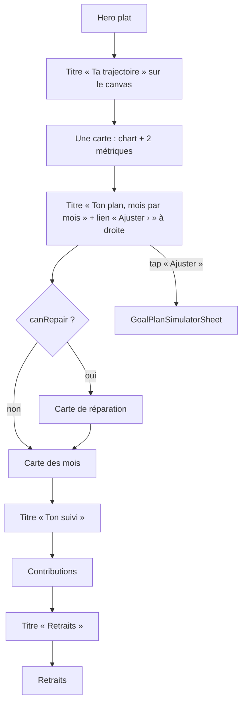
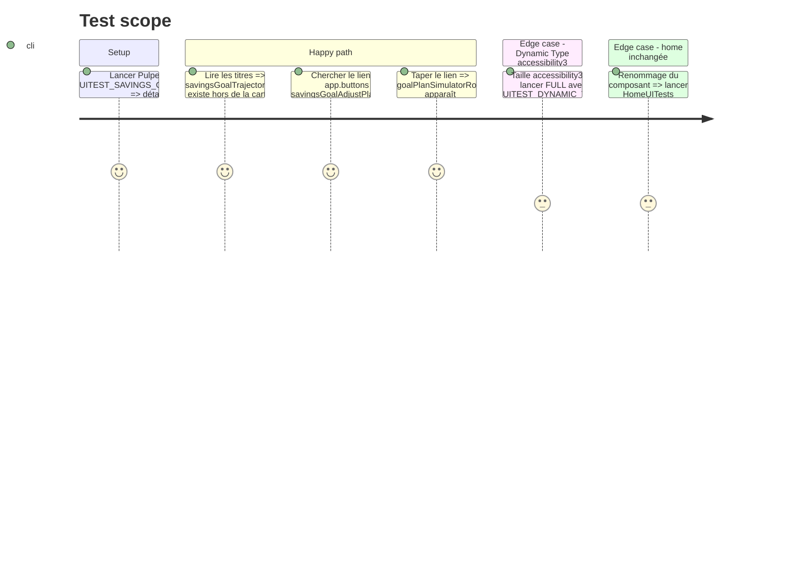

# Instruction: `SectionHeader` partagé, sections de l'objectif alignées sur la home

## Architecture projection

> Tree of the final files. ✅ create · ✏️ modify · ❌ delete

```txt
.claude/rules/03-frameworks-and-libraries/swiftui-hit-areas.md               ✏️ HomeSectionHeader → SectionHeader dans l'exemple
ios/
├── DESIGN.md                                                                ✏️ Home Ledger Rule : HomeSectionHeader → SectionHeader (2 mentions) ; noter que l'objectif l'utilise
├── Pulpe/
│   ├── Shared/Components/SectionHeader.swift                                ✅ git mv depuis CurrentMonth ; type renommé ; + linkAccessibilityIdentifier: String?
│   ├── Features/CurrentMonth/Components/
│   │   ├── HomeSectionHeader.swift                                          ❌ déplacé
│   │   ├── ActivityCard.swift                                               ✏️ appel renommé
│   │   ├── DriftCard.swift                                                  ✏️ appel renommé
│   │   ├── UncheckedOperationsCard.swift                                    ✏️ appel renommé
│   │   └── HomeHeroCard.swift                                               ✏️ commentaire renommé
│   └── Features/SavingsGoals/
│       ├── SavingsGoalDetailView.swift                                      ✏️ spacing du VStack : xl → xxl (rythme home)
│       ├── Components/GoalProjectionChart.swift                             ✏️ GoalTrajectorySection : titre hors carte via SectionHeader ; carte = chart + métriques
│       ├── Components/GoalPlanTimelineSection.swift                         ✏️ SectionHeader(title:link:) « Ajuster » sans icône ; carte de réparation puis carte des mois
│       ├── GoalContributionsSection.swift                                   ✏️ titre « Ton suivi » via SectionHeader
│       └── GoalWithdrawalsSection.swift                                     ✏️ titre « Retraits » via SectionHeader
└── PulpeUITests/SavingsGoalIntervalUITests.swift                            ✏️ aucun changement d'attente : les ids survivent (vérifier)
```

## User Journey



## Test Scope



## Wireframe

```txt
┌────────────────────────────────────────┐
│ (hero, phase 1)                        │
│                                        │
│ (1) Ta trajectoire                     │
│  ┌──────────────────────────────────┐  │
│  │ (2) chart                        │  │
│  │     En retard sur ton plan  Atteinte estimée │
│  │     300 CHF                 mars 2027        │
│  └──────────────────────────────────┘  │
│                                        │
│ (3) Ton plan, mois par mois  Ajuster › │
│  ┌──────────────────────────────────┐  │
│  │ (4) mai 2026 · 300 CHF   pointé  │  │
│  │ ───────────────────────────────  │  │
│  │     juin 2026 · 300 CHF  en cours│  │
│  │ ───────────────────────────────  │  │
│  │     Voir tout le plan            │  │
│  └──────────────────────────────────┘  │
│                                        │
│ (5) Ton suivi                          │
│  (contributions, phase 4)              │
│ (6) Retraits                           │
│  (retraits, phase 4)                   │
└────────────────────────────────────────┘
```

1. `SectionHeader(title:)` sur le canvas, `sectionTitle` (Manrope 20), id `savingsGoalTrajectoryTitle` posé sur le header (pas de lien → aucun id enfant à écraser).
2. Carte unique `pulpeCard()` : chart puis rangée de métriques. Le libellé change en phase 3.
3. `SectionHeader(title:link:)`, lien « Ajuster » `pulpePrimary` + chevron, sans `slider.horizontal.3`, `linkAccessibilityIdentifier: "savingsGoalAdjustPlanButton"`, rendu seulement si `canAdjust`.
4. Carte des mois inchangée (rangées + `Divider` internes + toggle « Voir tout le plan »).
5. et 6. Titres via `SectionHeader(title:)` ; contenu retravaillé en phase 4.

## Tasks to do

### `1)` Promouvoir le header

> Le composant change de dossier et de nom, pas de comportement.

1. `git mv ios/Pulpe/Features/CurrentMonth/Components/HomeSectionHeader.swift ios/Pulpe/Shared/Components/SectionHeader.swift` ; renommer le type et le `#Preview`.
2. Ajouter `var linkAccessibilityIdentifier: String?` appliqué sur le `Button` du lien (après `.accessibilityLabel`).
3. Mettre à jour les 3 appelants de la home et le commentaire de `HomeHeroCard.swift` ; `grep -rn HomeSectionHeader ios/ .claude/ ios/DESIGN.md` doit rendre 0 ligne.
4. `.claude/rules/03-frameworks-and-libraries/swiftui-hit-areas.md` et `ios/DESIGN.md` : remplacer les mentions.

### `2)` Adopter le header dans l'objectif

> Chaque section : titre dehors, une carte dedans.

1. `GoalTrajectorySection` : `VStack(spacing: Spacing.md)` { `SectionHeader(title: "Ta trajectoire").accessibilityIdentifier("savingsGoalTrajectoryTitle")` ; carte `pulpeCard()` { chart ; métriques } }. Retirer `.padding(lg).pulpeCardBackground()` du conteneur.
2. `GoalPlanTimelineSection` : remplacer le `HStack` titre + bouton par `SectionHeader(title:, link: canAdjust ? ("Ajuster", onAdjust) : nil, linkAccessibilityIdentifier: "savingsGoalAdjustPlanButton")` ; supprimer le `Label` avec icône et l'a11y label « Ajuster le plan » (le header compose « Ajuster, Ton plan, mois par mois »).
3. `GoalContributionsSection` et `GoalWithdrawalsSection` : titre `title2` → `SectionHeader(title:)` ; sous-titres internes inchangés jusqu'à la phase 4.
4. `SavingsGoalDetailView.content` : `spacing: Spacing.xl` → `Spacing.xxl` ; à l'intérieur de chaque section, titre → carte en `Spacing.md` (ratio 2:1 de la home).

### `3)` Vérification

> Home intacte, objectif conforme.

1. Build `PulpeLocal` ; `swiftlint --strict` sur les fichiers touchés.
2. `xcodebuild test -scheme PulpeUITests -only-testing:PulpeUITests/SavingsGoalIntervalUITests` ; `testAccessibilityDynamicTypeKeepsFormAndDetailActionable` reste vert.
3. Lancer les UI tests de la home qui capturent (`grep -l attachScreenshot ios/PulpeUITests` pour la liste) ; comparer les captures avant/après : identiques au pixel.

## Test acceptance criteria

| Task | Acceptance criteria                                                                                                                                                 |
| ---- | ------------------------------------------------------------------------------------------------------------------------------------------------------------------- |
| 1    | `HomeSectionHeader` n'existe plus nulle part ; les trois cartes de la home compilent et rendent au pixel près comme avant.                                            |
| 1    | `SectionHeader(title:link:linkAccessibilityIdentifier:)` expose le `Button` sous l'identifiant fourni et garde le label a11y « \(link), \(title) ».                  |
| 2    | `savingsGoalTrajectoryTitle` est un ancêtre distinct de la carte du chart (pas dans le même `pulpeCard`) ; `savingsGoalAdjustPlanButton` est un `Button` sans icône. |
| 2    | Aucun titre de section de l'écran objectif n'utilise `PulpeTypography.title2` ; aucun `Image(systemName:)` dans un titre de section.                                  |
| 3    | Suite `SavingsGoalIntervalUITests` verte ; captures home inchangées.                                                                                                |
