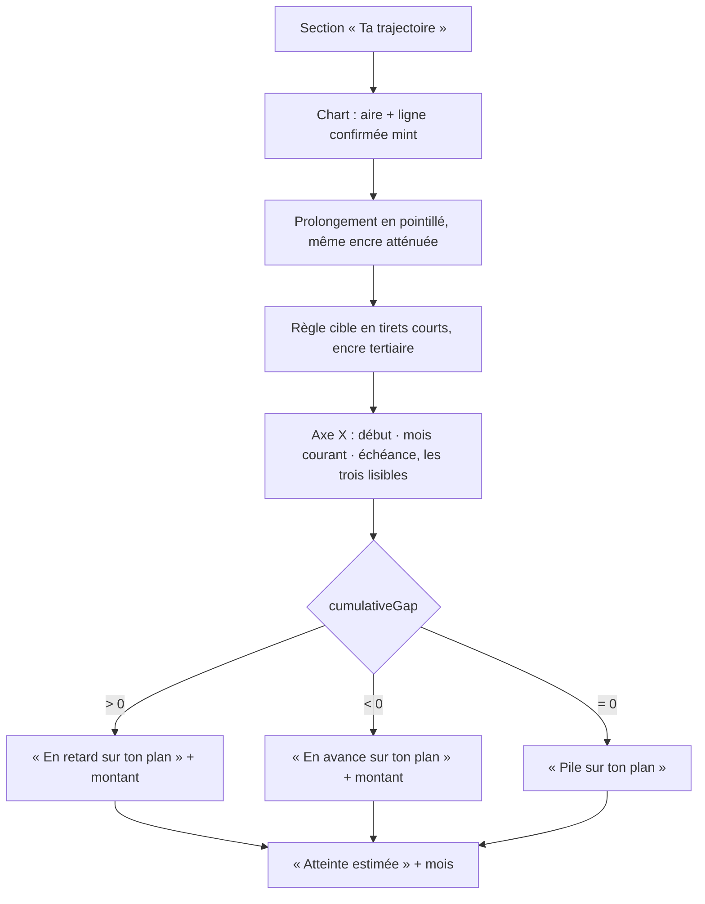
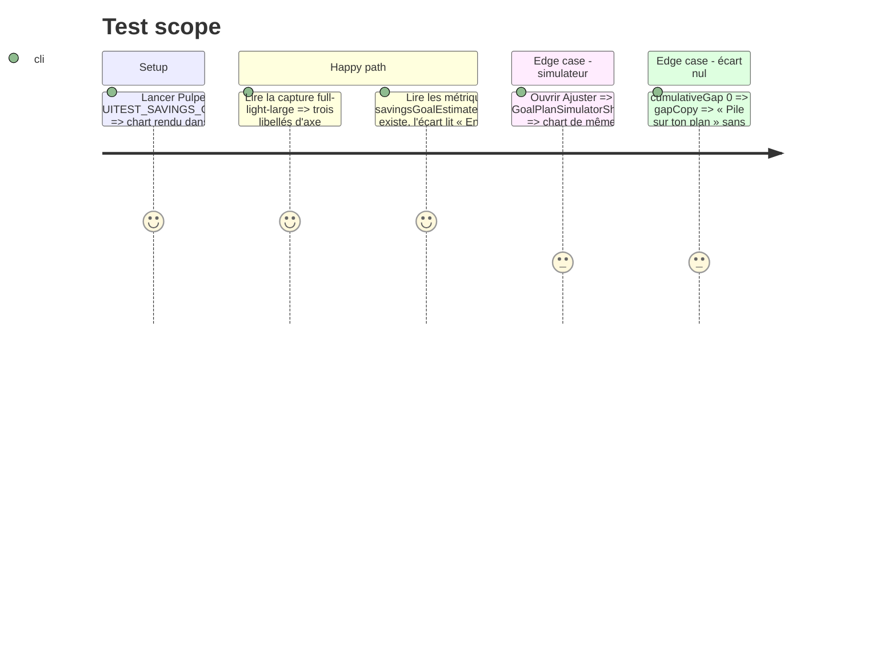

# Instruction: Trajectoire sur tokens, encre unique, tick d'échéance visible, verdict d'écart nommé

## Architecture projection

> Tree of the final files. ✅ create · ✏️ modify · ❌ delete

```txt
ios/
├── Pulpe/
│   ├── Shared/Design/DesignTokens+Chart.swift                              ✏️ + goalHeight = 160
│   ├── Features/SavingsGoals/
│   │   ├── Components/GoalProjectionChart.swift                            ✏️ height par défaut = Chart.goalHeight ; cible en Chart.markerDash ; projection en financialSavings muted + Chart.dash ; label du dernier tick garanti ; gapCopy renommé
│   │   └── Simulator/GoalPlanSimulatorSheet.swift                          ✏️ − height: 160 (le défaut suffit)
│   └── Resources/Localizable.xcstrings                                     ✏️ + « En retard sur ton plan » / « En avance sur ton plan » (en/de/it) ; − « Il te manque » / « Tu es en avance de » si orphelines
└── PulpeTests/Features/SavingsGoals/GoalProjectionSeriesTests.swift        ✏️ gapCopy : nouveaux libellés ; + ticks contient toujours le dernier index
```

## User Journey



## Test Scope



## Wireframe

```txt
┌────────────────────────────────────────┐
│ Ta trajectoire                         │
│  ┌──────────────────────────────────┐  │
│  │ (1) ─ ─ ─ ─ ─ ─ ─ ─ ─ ─ 3 000   │  │
│  │ (2)            ╭╌╌╌╌╌╌╌╌╌╌╌╌╌   │  │
│  │ (3)  ▁▂▃▄▅▆▇█╯                  │  │
│  │ (4) janv. 26      juin 26  déc. 26│  │
│  │                                  │  │
│  │ (5) En avance sur ton plan  Atteinte estimée │
│  │     300 CHF                 mars 2027        │
│  └──────────────────────────────────┘  │
└────────────────────────────────────────┘
```

1. `RuleMark` cible : `textTertiary` à `Opacity.heavy`, `Chart.markerDash`, `BorderWidth.thin`.
2. Projection : `LineMark` `Color.financialSavings.opacity(Opacity.heroInkMuted)` + `Chart.dash` (encre de la home, plus de `financialIncome` bleu).
3. Confirmé : aire dégradée + ligne `financialSavings`, inchangés ; opacité 0 de fin de dégradé via un token existant (`Opacity.transparent` s'il existe, sinon garder `0` documenté).
4. Trois ticks max : premier (si séparation ≥ `minimumTickSeparation`), courant, dernier ; le dernier label reste dans le cadre.
5. Métriques `metricLabel`/`metricLabelBold`, libellés du plan (référent nommé), `savingsGoalEstimatedCompletion` inchangé.

## Tasks to do

### `1)` Tokens

> Aucune valeur magique dans le chart.

1. `DesignTokens+Chart.swift` : `static let goalHeight: CGFloat = 160` avec un commentaire (« lecture d'une tendance sur ~24 mois, pas un dashboard 120 »).
2. `GoalProjectionChart.height` par défaut = `DesignTokens.Chart.goalHeight` ; `GoalPlanSimulatorSheet.swift:76` retire `height: 160`.
3. Cible : `dash: [4]` → `DesignTokens.Chart.markerDash`. Projection : `dash: [5, 4]` → `DesignTokens.Chart.dash`, `Color.financialIncome` → `Color.financialSavings.opacity(DesignTokens.Opacity.heroInkMuted)`.

### `2)` Tick d'échéance

> Le mois d'échéance est le seul repère qui compte ; il doit se lire.

1. Reproduire sur la fixture FULL (capture `*_full-light-large`) : le label du dernier tick est-il rendu ou coupé au bord droit ?
2. Si coupé : ancrer le label (`AxisValueLabel(anchor:)` trailing pour le dernier index) ou réserver la place (`.chartXScale(range: .plotDimension(endPadding:))` sur un token `Spacing`). Choisir la solution qui ne décale pas la courbe.
3. `GoalProjectionSeriesTests` : `ticks(for:currentIndex:)` contient toujours `months.count - 1` (test explicite sur 2, 3 et 24 mois).

### `3)` Verdict d'écart

> Le référent est dans le libellé.

1. `gapCopy` : « Il te manque » → « En retard sur ton plan » ; « Tu es en avance de » → « En avance sur ton plan » ; « Pile sur ton plan » inchangé (partagé avec `HomeHeroCard`).
2. `GoalProjectionSeriesTests` lignes ~73/77 : mettre à jour les attentes.
3. `Localizable.xcstrings` : deux nouvelles clés en/de/it `translated` ; retirer les deux anciennes si `grep` ne trouve plus d'usage.

### `4)` Vérification

> Build, tests unitaires, capture.

1. Build `PulpeLocal` ; `swiftlint --strict` ; `pnpm test:lexicon`.
2. `xcodebuild test -scheme PulpeLocal -only-testing:PulpeTests/GoalProjectionSeriesTests` ; lire le nombre exécuté.
3. `xcodebuild test -scheme PulpeUITests -only-testing:PulpeUITests/SavingsGoalIntervalUITests` ; vérifier sur la capture les trois ticks et l'encre unique.

## Test acceptance criteria

| Task | Acceptance criteria                                                                                                                                       |
| ---- | --------------------------------------------------------------------------------------------------------------------------------------------------------- |
| 1    | `grep -nE "height: (200|160)|dash: \[" ios/Pulpe/Features/SavingsGoals` ne rend rien ; le chart du simulateur et du détail ont la même hauteur.             |
| 1    | Aucune occurrence de `financialIncome` dans `GoalProjectionChart.swift`.                                                                                  |
| 2    | Sur la capture FULL, le label du mois d'échéance est entier et aligné sur la fin de la courbe projetée ; le test `ticks` couvre 2, 3 et 24 mois.           |
| 3    | Un écart positif lit « En retard sur ton plan » + montant, négatif « En avance sur ton plan » + montant, nul « Pile sur ton plan » sans montant.            |
| 4    | `GoalProjectionSeriesTests` vert avec un compte exécuté > 0 ; `pnpm test:lexicon` vert.                                                                     |
