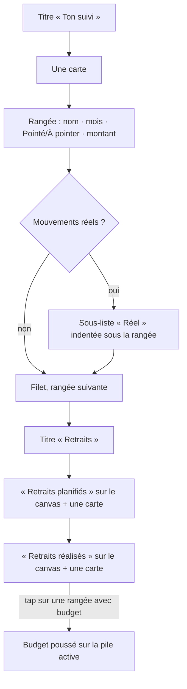
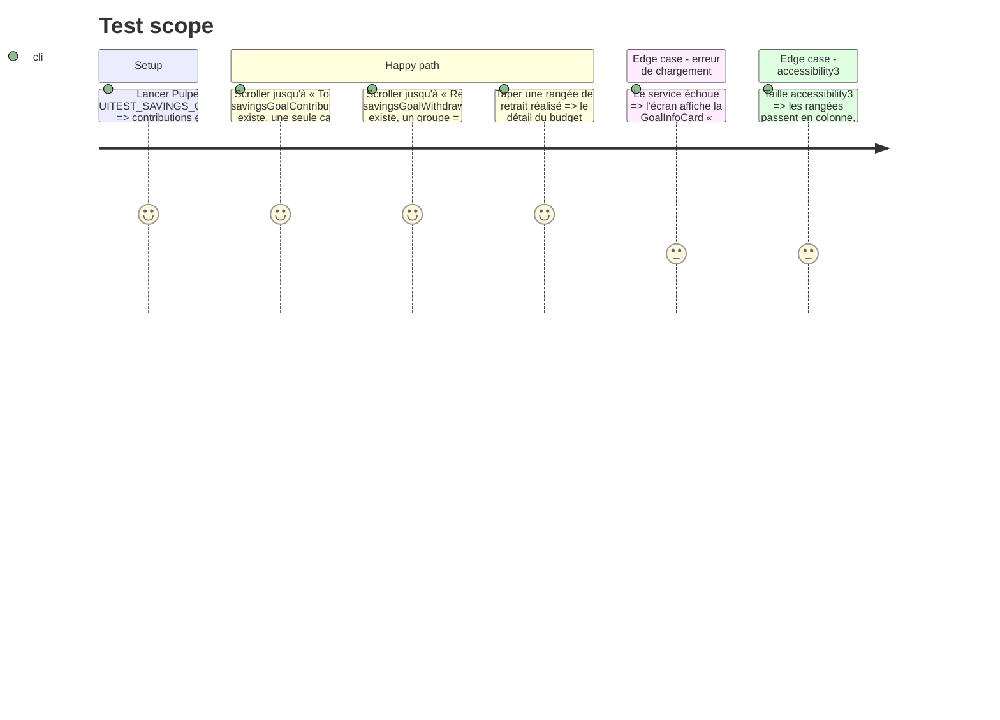

# Instruction: « Ton suivi » et « Retraits » en ledger : une carte par groupe, rangées séparées d'un filet

## Architecture projection

> Tree of the final files. ✅ create · ✏️ modify · ❌ delete

```txt
ios/
├── DESIGN.md                                                    ✏️ Home Ledger Rule : une phrase « RowIcon seulement quand les rangées d'une carte sont de natures différentes ; une liste homogène s'en passe »
└── Pulpe/Features/SavingsGoals/
    ├── GoalContributionsSection.swift                           ✏️ une pulpeRowCard() pour toutes les contributions, Divider entre elles ; montant amountMedium ; « Réel » imbriqué inchangé
    └── GoalWithdrawalsSection.swift                             ✏️ un groupe = label sur le canvas + une pulpeRowCard() ; − glyphes calendar / calendar.badge.minus / arrow.up.right ; chevron conservé sur les rangées tappables
```

## User Journey



## Test Scope



## Wireframe

```txt
┌────────────────────────────────────────┐
│ (1) Ton suivi                          │
│  ┌──────────────────────────────────┐  │
│  │ (2) Épargne voyage      300 CHF  │  │
│  │     Juin 2026 · Pointé           │  │
│  │       Réel                       │  │
│  │       Virement Yuh    300 CHF    │  │
│  │ ───────────────────────────────  │  │
│  │     Épargne voyage      300 CHF  │  │
│  │     Juillet 2026 · À pointer     │  │
│  └──────────────────────────────────┘  │
│                                        │
│ (3) Retraits                           │
│ (4) Retraits planifiés                 │
│  ┌──────────────────────────────────┐  │
│  │ (5) Billets d'avion   −800 CHF › │  │
│  │     Sept. 2026 · Prévu           │  │
│  │ ───────────────────────────────  │  │
│  │     Hôtel             −400 CHF › │  │
│  └──────────────────────────────────┘  │
│ (4) Retraits réalisés                  │
│  ┌──────────────────────────────────┐  │
│  │ (5) Acompte           −200 CHF › │  │
│  └──────────────────────────────────┘  │
└────────────────────────────────────────┘
```

1. `SectionHeader(title:)` (phase 2).
2. Une `pulpeRowCard()` ; rangée = nom `listRowTitle`, méta `listRowSubtitle` avec « Pointé » en `financialSavings`, montant `amountMedium` ; sous-liste « Réel » indentée `Spacing.md` avec ses propres `Divider`, inchangée ; `Divider()` entre deux contributions.
3. `SectionHeader(title:)` (phase 2).
4. Label de groupe `labelMedium` `textSecondary` sur le canvas, comme le jour dans `ActivityCard`.
5. Une `pulpeRowCard()` par groupe ; rangée sans glyphe de tête ; `Button` + chevron `caption` `textTertiary` seulement si `budgetId` ; `frame(minHeight: TapTarget.minimum)` reste correct ici : la rangée occupe seule sa ligne.

## Tasks to do

### `1)` Contributions en une carte

> Le nombre de contributions ne multiplie plus les cartes.

1. `GoalContributionsSection.body` : `ForEach(contributions)` dans un `VStack(spacing: Spacing.md)` avec `if index > 0 { Divider() }`, le tout dans une seule `.pulpeRowCard()` ; retirer `.pulpeCard()` de `contributionCard`.
2. Montant de contribution `amountCard` → `amountMedium` ; les rangées « Réel » gardent `metricLabelBold`.
3. États `isLoading` / `error` inchangés (spinner et `GoalInfoCard` hors carte).

### `2)` Retraits en un groupe = un label + une carte

> Même grammaire que l'activité de la home.

1. `GoalWithdrawalsSection.body` : chaque sous-titre `headline` → `Text` `labelMedium` `textSecondary` ; en dessous une `.pulpeRowCard()` contenant les rangées séparées de `Divider()`.
2. `plannedRowContent` / `realizedRow` : retirer `Image(systemName:)` de tête et le `.pulpeCard()` de rangée ; garder `Button` + `plainPressedButtonStyle` + `contentShape` + `accessibilityElement(children: .ignore)` + labels a11y ; garder `plannedChevron` uniquement sur les rangées tappables.
3. Vérifier `swiftlint --strict` sur le fichier (417 lignes aujourd'hui, plafond réel 500) : si la réécriture le fait grossir, extraire `GoalWithdrawalsSection+Rows.swift`.
4. `ios/DESIGN.md` § Home Ledger Rule : ajouter la phrase sur `RowIcon` réservé aux listes hétérogènes.

### `3)` Vérification

> Build, tests unitaires du ViewModel, capture, tap-through.

1. Build `PulpeLocal` ; `swiftlint --strict`.
2. `xcodebuild test -scheme PulpeLocal -only-testing:PulpeTests/SavingsGoalDetailViewModelTests` (les sections consomment `contributions` / `withdrawals` / `plannedWithdrawals` sans changement de contrat).
3. `xcodebuild test -scheme PulpeUITests -only-testing:PulpeUITests/SavingsGoalIntervalUITests` ; capture FULL : une carte sous « Ton suivi », une par groupe sous « Retraits », aucun glyphe de tête.
4. Sur le simulateur interactif : taper un retrait réalisé, vérifier que Back revient sur l'objectif.

## Test acceptance criteria

| Task | Acceptance criteria                                                                                                                                                  |
| ---- | -------------------------------------------------------------------------------------------------------------------------------------------------------------------- |
| 1    | `GoalContributionsSection.swift` ne contient qu'un seul appel à `pulpeRowCard()` et aucun à `pulpeCard()` ; le montant de contribution est en `amountMedium`.           |
| 2    | `GoalWithdrawalsSection.swift` ne contient aucun `Image(systemName:)` autre que `chevron.right` ; les rangées avec `budgetId` restent des `Button` avec label a11y et hint. |
| 2    | Aucun fichier de `Features/SavingsGoals` ne dépasse 500 lignes après la réécriture.                                                                                    |
| 3    | Suite `SavingsGoalIntervalUITests` verte ; sur la capture FULL, chaque groupe d'historique tient dans une seule carte, filets internes seulement.                      |
