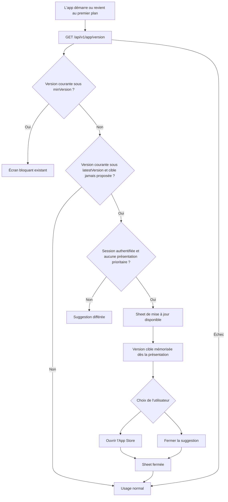
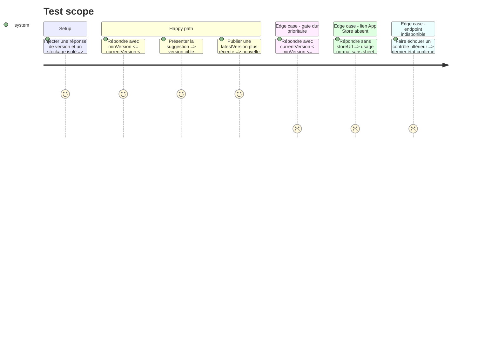

# Instruction: ajouter le prompt doux iOS de bout en bout

## Architecture projection

> Tree of the final files. ✅ create · ✏️ modify · ❌ delete

```txt
.
├── backend-nest/src/modules/app-version/app-version.controller.ts ✏️ documenter les réponses douce et bloquante dans le contrat HTTP
├── docs/VERSIONING.md ✏️ remplacer l'état « latestVersion ignorée » par le comportement iOS livré
├── ios
│   ├── Pulpe
│   │   ├── App
│   │   │   └── PulpeApp.swift ✏️ présenter la sheet au bon niveau et relier ses actions
│   │   ├── Core
│   │   │   └── Config/AppUpdateFlagsStore.swift ✅ mémoriser la version cible déjà proposée
│   │   ├── Domain
│   │   │   ├── Services/AppVersionService.swift ✏️ décrire et journaliser une politique de version, plus seulement le gate dur
│   │   │   ├── Store/AppVersionStore.swift ✏️ prioriser minVersion puis classifier latestVersion et la dismissal
│   │   │   └── Store/WhatsNewStore.swift ✏️ différer la suggestion douce jusqu'à la fin du contrôle « Nouveau dans Pulpe »
│   │   └── Features/ForceUpdate/UpdateAvailableSheet.swift ✅ afficher la suggestion App Store dismissible
│   ├── PulpeTests/Domain/Store/AppVersionStoreTests.swift ✏️ couvrir priorité, persistance, répétition et fail-open
│   └── PulpeTests/Domain/Store/WhatsNewStoreTests.swift ✏️ couvrir la priorité de présentation après le contrôle « Nouveau dans Pulpe »
└── shared/schemas.ts ✏️ documenter latestVersion comme signal de mise à jour douce consommé par iOS
```

## User Journey



## Test Scope



## Wireframe

```txt
┌─────────────────────────────────────┐
│ (1) En-tête de la sheet             │
│     icône · information de version  │
├─────────────────────────────────────┤
│ (2) Résumé court                    │
│     disponibilité et bénéfice       │
│                                     │
│ (3) Action principale App Store     │
│ (4) Action secondaire de fermeture  │
└─────────────────────────────────────┘
```

1. En-tête : identifie la mise à jour disponible et sa version cible.
2. Résumé : explique brièvement qu'une version plus récente peut être installée.
3. Action principale : conduit vers la fiche App Store.
4. Action secondaire : ferme la suggestion sans bloquer l'usage.

## Tasks to do

### `1)` Persister une présentation par version cible

> Éviter toute répétition après exposition sans confondre ce marqueur avec « Nouveau dans Pulpe ».

1. Ajouter un stockage `UserDefaults` injecté qui lit et écrit la dernière `latestVersion` proposée.
2. Garder ce marqueur global à l'installation : il ne contient aucune donnée de compte et ne doit pas être effacé à la déconnexion.
3. Vérifier la persistance avec une suite `UserDefaults` isolée.

### `2)` Étendre la classification dans `AppVersionStore`

> Faire de l'unique store existant l'autorité des états normal, doux et bloquant.

1. Conserver `currentVersion < minVersion` comme première branche, avec le comportement bloquant et fail-open actuel.
2. Émettre un état de mise à jour disponible seulement quand `currentVersion < latestVersion`, que l'URL App Store est valide et que cette cible n'a pas déjà été proposée.
3. Ajouter une action de présentation qui mémorise la cible portée par l'état, puis une action de fermeture qui repasse à l'état normal.
4. Laisser une cible plus récente redevenir éligible au prochain contrôle.
5. S'appuyer sur la publication App Store déjà résolue par le backend ; ne pas ajouter de temporisation client de 24–48 h.

### `3)` Présenter une sheet iOS non bloquante

> Donner un chemin clair vers l'App Store sans interrompre l'utilisation de Pulpe.

1. Créer une vue compacte avec information de version, CTA App Store et action secondaire de fermeture.
2. Réutiliser les tokens, styles de bouton et `.standardSheetPresentation()` existants ; respecter Dynamic Type et les cibles tactiles de 44 pt.
3. Relier la sheet à `PulpeApp` uniquement pour une session authentifiée, la différer pendant « Nouveau dans Pulpe » et laisser le full-screen cover dur prioritaire.
4. Mémoriser la cible à l'apparition de la sheet, puis faire converger CTA, bouton secondaire et swipe-to-dismiss vers la même fermeture avant l'ouverture éventuelle de l'App Store.

### `4)` Aligner le contrat et la documentation

> Rendre explicite la sémantique distincte de `minVersion` et `latestVersion`.

1. Mettre à jour les commentaires du service iOS, du schéma partagé et du contrôleur backend sans changer le payload.
2. Documenter dans `docs/VERSIONING.md` que l'iOS suggère sous `latestVersion`, que le web l'ignore encore et que seules les versions embarquant ce code sont protégées.
3. Ne pas inclure de relèvement de `MIN_IOS_VERSION` ni de traitement rétroactif de 1.0.0 dans cette implémentation.

### `5)` Vérifier le changement

> Prouver les branches de version et la conformité iOS sans élargir la couverture.

1. Exécuter les tests ciblés `AppVersionStoreTests` et confirmer le nombre de tests réellement exécutés.
2. Régénérer avec `xcodegen generate --use-cache`, puis compiler `PulpeLocal` sur le simulateur `Pulpe Tests`.
3. Exécuter SwiftLint sur les fichiers Swift touchés et Prettier sur les fichiers Markdown/TypeScript touchés.

## Test acceptance criteria

| Task | Acceptance criteria                                                                                                                                                              |
| ---- | -------------------------------------------------------------------------------------------------------------------------------------------------------------------------------- |
| 1    | Une version cible déjà présentée reste silencieuse après relance, même sans action explicite, tandis qu'une cible supérieure redevient éligible.                                 |
| 2    | `minVersion` déclenche toujours le blocage avant toute logique douce ; une erreur initiale reste fail-open et une erreur ultérieure ne dégrade pas un état confirmé.             |
| 3    | Un utilisateur authentifié sous `latestVersion` voit une sheet dismissible avec un CTA App Store fonctionnel, sans concurrence avec le cover bloquant ni « Nouveau dans Pulpe ». |
| 3    | Le bouton secondaire, le geste de fermeture et le CTA empêchent tous une seconde présentation pour la même cible.                                                                |
| 4    | Le contrat et le runbook décrivent `minVersion` comme seuil dur et `latestVersion` comme suggestion iOS, sans promettre de mécanisme rétroactif à 1.0.0.                         |
| 5    | L'app iOS compile, les tests ciblés exécutent les scénarios prévus et les fichiers touchés respectent lint et formatage.                                                         |
