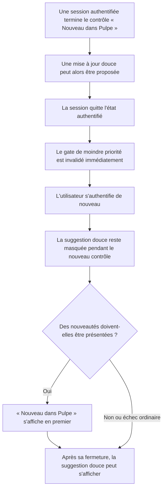
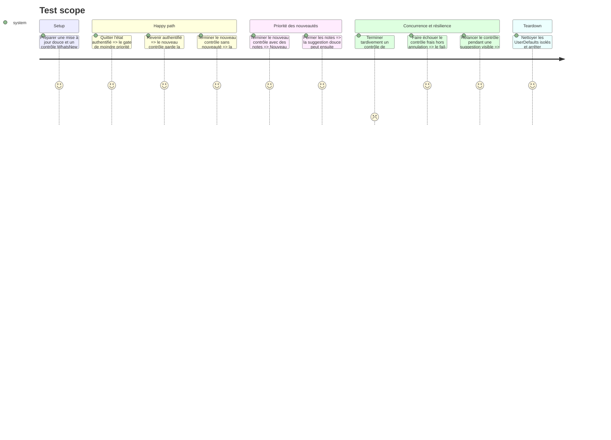

# Instruction: isoler la priorité de présentation par session et verrouiller la régression

## Architecture projection

> Tree of the final files. ✅ create · ✏️ modify · ❌ delete

```txt
ios
├── Pulpe
│   ├── App
│   │   ├── PulpeApp.swift ✏️ relier la fin d'authentification à l'invalidation du contrôle « Nouveau dans Pulpe »
│   │   └── RootViewModifiers.swift ✏️ invalider le gate au point central des transitions d'authentification
│   └── Domain/Store
│       ├── AppVersionStore.swift ✏️ expliquer la garde qui conserve une suggestion déjà présentée
│       └── WhatsNewStore.swift ✏️ borner l'achèvement du contrôle à la session authentifiée courante
└── PulpeTests
    ├── App/WhatsNewLifecycleTests.swift ✏️ couvrir les transitions qui invalident le gate
    └── Domain/Store/WhatsNewStoreTests.swift ✏️ couvrir reset, achèvement tardif et nouveau contrôle
```

## User Journey



## Test Scope



## Tasks to do

### `1)` Borner le gate à la session authentifiée courante

> Une autorisation acquise lors d'une session ne doit jamais être réutilisée au prochain login.

1. Ajouter à `WhatsNewStore` une invalidation synchrone de l'état transitoire qui autorise les présentations de moindre priorité. Ne modifier ni le marqueur persistant `lastSeenVersion`, ni le high-water mark du prompt de mise à jour.
2. Faire en sorte qu'un `check()` démarré avant cette invalidation ne puisse pas réactiver le gate en terminant tardivement ; seule la fin d'un contrôle appartenant à la session courante peut publier son résultat de priorité.
3. Appeler cette invalidation depuis le point central existant de `RootViewLifecycle` à chaque transition de `.authenticated` vers un état non authentifié, avant les autres effets déclenchés par le changement d'état.
4. Relier ce callback dans `PulpeApp` au `WhatsNewStore` déjà possédé au niveau application. Conserver la `.task(id: appState.authState)` existante comme unique déclencheur du nouveau contrôle après authentification.

### `2)` Fixer le comportement par des tests de non-régression

> Les tests doivent échouer si le gate survit à une session ou si un ancien contrôle gagne la course.

1. Dans `WhatsNewStoreTests`, partir d'un contrôle achevé qui autorise la moindre priorité, invalider la session et vérifier que `allowsLowerPriorityPresentation` repasse immédiatement à `false`.
2. Suspendre un contrôle, invalider la session, puis laisser l'ancien contrôle terminer : il ne doit ni rendre le gate vrai, ni prendre la priorité de la nouvelle session. Un contrôle frais doit ensuite pouvoir produire le comportement normal.
3. Préserver les deux sémantiques existantes : une annulation garde le gate fermé ; un échec réseau ordinaire du contrôle frais reste fail-open et l'ouvre après la tentative.
4. Dans `WhatsNewLifecycleTests`, couvrir en table la sortie de `.authenticated` vers chacun des états non authentifiés, ainsi que les transitions qui ne doivent pas invalider une nouvelle session.

### `3)` Solder les remarques de maintenabilité et de documentation

> Une seule clarification couvre les deux suggestions dupliquées sans changer le comportement déjà testé.

1. Ajouter près de `isPresentingUpdate(version:)` un commentaire concis expliquant que `markUpdatePresented()` écrit immédiatement le high-water mark et qu'un re-check de premier plan ferait sinon passer le statut à `.ok` et fermerait la sheet visible.
2. Conserver le scénario déjà présent dans `AppVersionStoreTests` qui marque la version, relance `check()` et exige que `.updateAvailable` reste actif ; ne créer un second test que si ce scénario n'exerce plus directement la branche commentée.
3. Ne pas réintroduire de checklist de travaux futurs dans `aidd_docs/tasks/2026_08/2026_08_16_ios-soft-update-prompt/review.md`. Vérifier que son verdict reste final, que ses six critères sont cochés et qu'aucune table de correctifs en attente n'est présente.

### `4)` Vérifier sans toucher aux environnements partagés

> Prouver le correctif iOS sur le simulateur réservé, sans backend, Supabase ou appareil déjà occupé.

1. Régénérer le projet depuis `ios/project.yml`, puis exécuter `WhatsNewStoreTests`, `WhatsNewLifecycleTests` et `AppVersionStoreTests` avec le scheme `PulpeTests` sur le simulateur nommé exactement `Pulpe Tests`. Confirmer `** TEST SUCCEEDED **` et le nombre de tests dans le résultat Xcode.
2. Exécuter SwiftLint sur les fichiers Swift touchés, `git diff --check`, puis le gate racine `pnpm quality` sans démarrer de backend ni lancer de commande Supabase.
3. Relire le diff contre la projection d'architecture : `App/` compose le cycle de vie, `Domain/Store/` reste sans dépendance UI et aucun nouvel adaptateur ou coordinateur n'est créé.
4. Vérifier que le simulateur `iPhone 17 Pro Max` n'a pas été utilisé et remettre uniquement `Pulpe Tests` dans son état initial après les tests.

## Test acceptance criteria

| Task | Acceptance criteria                                                                                                                                                                                                                      |
| ---- | ---------------------------------------------------------------------------------------------------------------------------------------------------------------------------------------------------------------------------------------- |
| 1    | Après toute sortie de `.authenticated`, `allowsLowerPriorityPresentation` vaut immédiatement `false`; le marqueur persistant des nouveautés et celui de la version App Store déjà proposée restent inchangés.                            |
| 1    | Un contrôle lancé dans l'ancienne session et terminé après l'invalidation ne peut pas rouvrir le gate ; seul un contrôle démarré dans la nouvelle session le peut.                                                                       |
| 2    | Les tests échouent si le reset est retiré, si un achèvement tardif réactive le gate ou si le callback n'est pas appliqué à l'un des états non authentifiés.                                                                              |
| 2    | Après réauthentification, des notes disponibles gardent « Nouveau dans Pulpe » prioritaire ; une absence de notes ou un échec réseau ordinaire rend ensuite la suggestion douce éligible, tandis qu'une annulation la maintient bloquée. |
| 3    | Le re-check d'une cible déjà visible conserve `.updateAvailable`, le commentaire explique pourquoi, et le document de revue initial reste final sans case non cochée ni liste de travaux ultérieurs.                                     |
| 4    | Les trois suites ciblées réussissent sur `Pulpe Tests`, SwiftLint, `git diff --check` et `pnpm quality` sont verts, aucune frontière iOS n'est violée et aucun processus backend, état Supabase ou simulateur non dédié n'est modifié.   |
