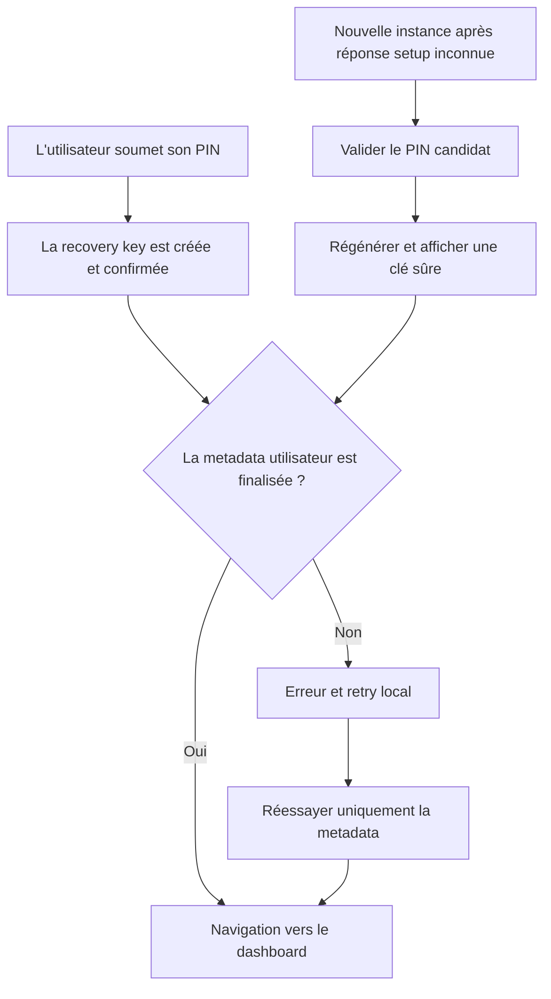
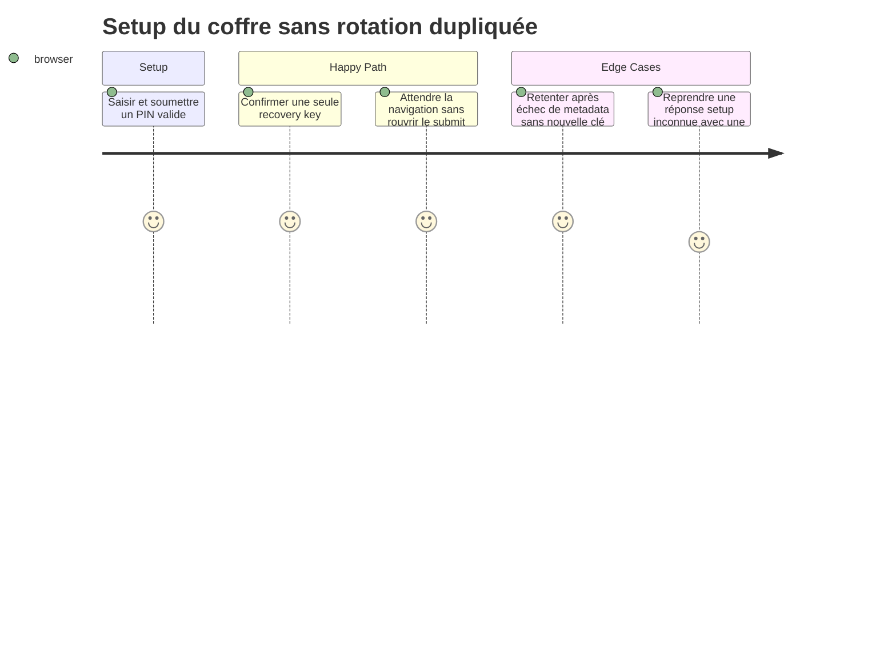

# Instruction: Reproduire et corriger la double soumission en TDD

## Architecture projection

> Tree of the final files. ✅ create · ✏️ modify · ❌ delete

```txt
frontend/projects/webapp/src/app/feature/auth/setup-vault-code/
├── setup-vault-code.ts ✏️
└── setup-vault-code.spec.ts ✏️
```

## User Journey



## Test Scope



## Tasks to do

### `1)` Écrire les tests unitaires rouges

> Le test doit échouer sur le comportement actuel en observant les appels de protocole, pas un détail interne.

1. Remplacer le test qui attend aujourd'hui une régénération après échec de `updateUser` par `should retry user metadata without rotating a confirmed recovery key`.
2. Prouver deux soumissions successives dans la même instance : une seule création, une seule modal, aucune validation/régénération, deux tentatives de metadata et une seule navigation.
3. Ajouter `should keep setup single-flight until navigation completes` avec une promesse de navigation différée; le deuxième appel ne doit relancer ni salt ni setup.
4. Ajouter le cas positif fresh-instance `RECOVERY_KEY_ALREADY_EXISTS` : validation du candidat, une régénération, affichage de la nouvelle clé et finalisation de la metadata.

### `2)` Appliquer le correctif minimal au cycle de soumission

> Une clé déjà confirmée dans cette instance ne doit plus repasser par le protocole recovery.

1. Reprendre le garde explicite `if (isSubmitting()) return` déjà utilisé par `EnterVaultCode`.
2. Mémoriser localement que `#showRecoveryKey` s'est terminé par une confirmation; lors d'un retry local, sauter dérivation, setup, validation, régénération et dialogue pour reprendre à `updateUser`.
3. Attendre `router.navigate` avant le `finally`, afin que le formulaire reste verrouillé jusqu'à la fin réelle de la transition.
4. Ne pas persister l'indicateur : un reload doit volontairement revenir au chemin sûr de validation/régénération lorsque l'affichage de la clé ne peut plus être prouvé.

## Test acceptance criteria

| Task | Acceptance criteria                                                                                                                                    |
| ---- | ------------------------------------------------------------------------------------------------------------------------------------------------------ |
| 1    | Le test de retry metadata échoue avant correction parce que le deuxième submit appelle `setup-recovery` puis `regenerate-recovery`.                    |
| 1    | Le test de navigation différée échoue avant correction parce que `isSubmitting` retombe avant la résolution du routeur.                                |
| 2    | Après confirmation d'une clé, tout retry dans la même instance effectue au plus une nouvelle tentative de metadata et ne touche plus au `wrapped_dek`. |
| 2    | Deux appels concurrents à `onSubmit` ne produisent qu'une requête salt, une requête setup et une modal.                                                |
| 2    | Une instance fraîche qui reçoit `RECOVERY_KEY_ALREADY_EXISTS` conserve la reprise sûre existante : valider, régénérer, afficher, confirmer.            |
