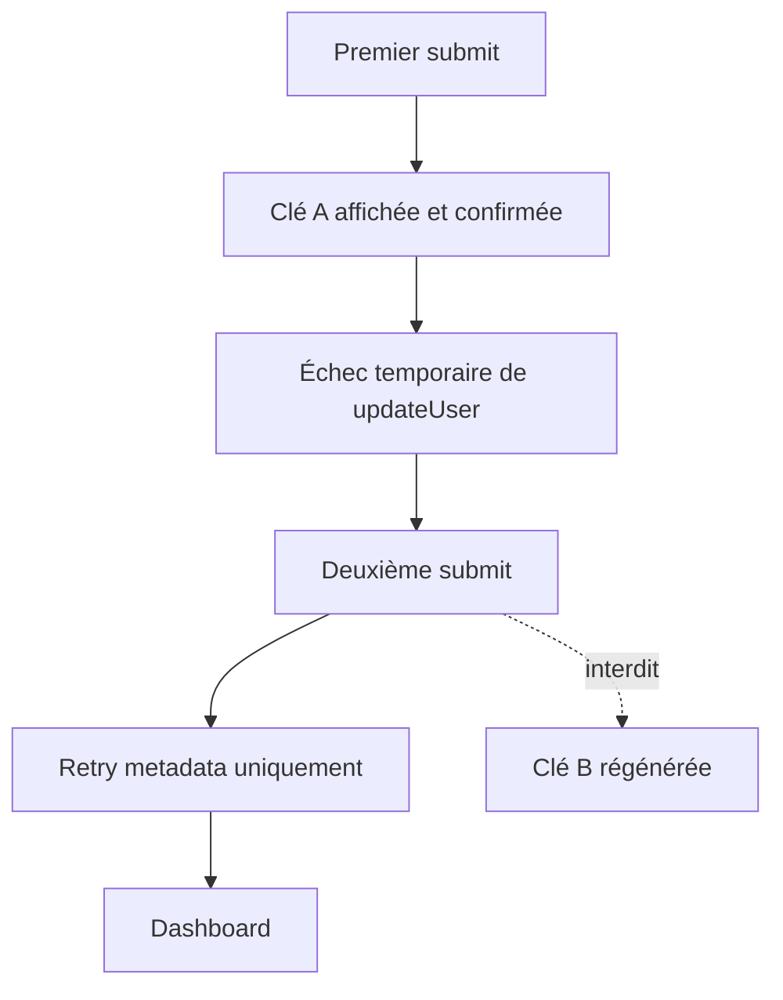
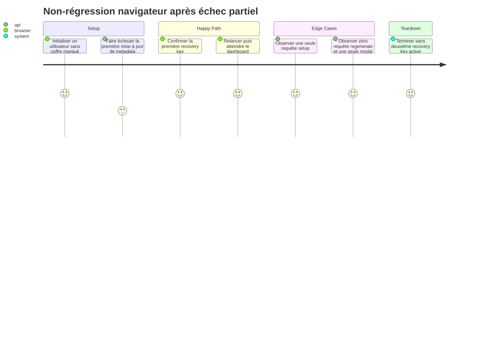

# Instruction: Verrouiller le parcours navigateur et documenter l'invariant

## Architecture projection

> Tree of the final files. ✅ create · ✏️ modify · ❌ delete

```txt
docs/
└── ENCRYPTION.md ✏️
frontend/e2e/tests/features/
└── vault-code.spec.ts ✏️
```

## User Journey



## Test Scope



## Tasks to do

### `1)` Ajouter la régression Playwright déterministe

> Rejouer l'échec partiel qui active actuellement la branche de rotation, sans dépendre d'un double clic flaky.

1. Étendre le describe `Setup vault code` existant, en réutilisant `setupAuthBypass` et `VaultCodePage`; ne créer ni fixture ni page object.
2. Compter les appels `setup-recovery`, `regenerate-recovery` et `auth/v1/user`; faire échouer le premier update metadata puis réussir le second.
3. Soumettre le PIN, confirmer la clé A, constater l'erreur, retenter et vérifier : un setup, zéro regenerate, une seule modal, deux updates metadata et arrivée au dashboard.
4. Faire retourner une clé B par la route regenerate afin que toute régression soit visible et fasse échouer explicitement le test.

### `2)` Écrire l'invariant de reprise dans la documentation sécurité

> Les deux types de retry doivent rester impossibles à confondre lors d'une future correction.

1. Dans `docs/ENCRYPTION.md`, préciser qu'après confirmation locale de la recovery key, un échec de metadata se reprend sans rotation.
2. Préciser qu'après reload ou réponse setup perdue, le client ne peut pas prouver que la clé brute a été vue; il doit valider le PIN puis régénérer avant de finaliser.
3. Relier cet invariant au fait que le serveur ne stocke jamais la recovery key brute et que chaque régénération invalide immédiatement la précédente.

### `3)` Exécuter les gates proportionnés au risque

> Le correctif touche un parcours crypto : unit, navigateur et gates du monorepo doivent tous être verts.

1. Exécuter le spec Angular ciblé `setup-vault-code.spec.ts`.
2. Exécuter le scénario Playwright ciblé dans le projet mocked, puis le fichier `vault-code.spec.ts` complet.
3. Exécuter `pnpm quality` et le build frontend pour inclure `strictTemplates`.

## Test acceptance criteria

| Task | Acceptance criteria                                                                                                                            |
| ---- | ---------------------------------------------------------------------------------------------------------------------------------------------- |
| 1    | Un échec de metadata après confirmation ne peut afficher qu'une seule clé et ne peut appeler aucune régénération avant l'arrivée au dashboard. |
| 1    | Les compteurs réseau prouvent le contrat même si le contenu ou le timing visuel du dialogue change.                                            |
| 2    | La documentation distingue explicitement retry local confirmé et reprise fraîche inconnue, avec leur conséquence sur la validité de la clé.    |
| 3    | Les tests unitaires ciblés, la suite Playwright du coffre, `pnpm quality` et le build frontend terminent sans erreur.                          |
