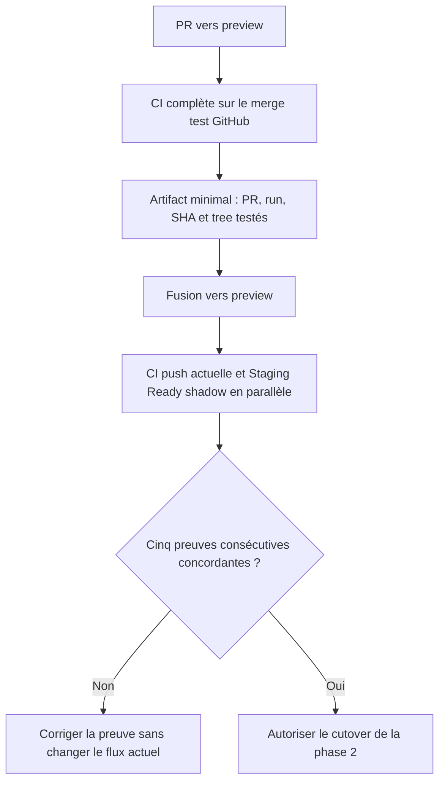
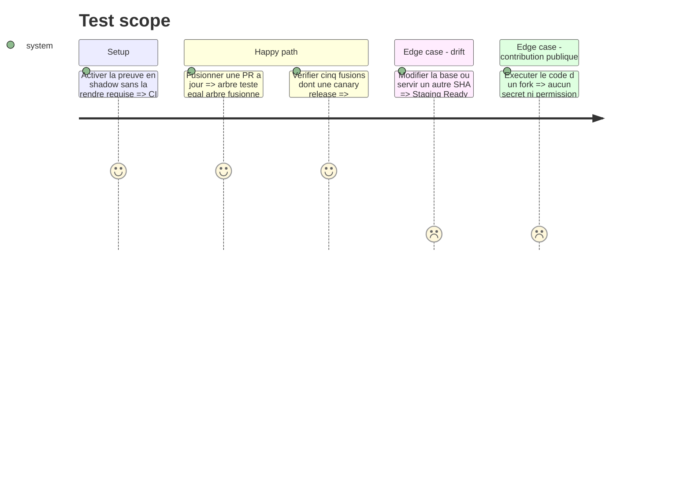

# Instruction: Prouver le staging en observation

## Architecture projection

> Tree of the final files. ✅ create · ✏️ modify · ❌ delete

```txt
.github/
├── scripts/
│   └── ci-security.test.mjs ✏️
└── workflows/
    ├── ci.yml ✏️
    └── staging-proof.yml ✅
```

## User Journey



## Test Scope



## Tasks to do

### `1)` Émettre la preuve du contenu réellement testé

> Ajouter une identité machine-readable au job final existant sans changer sa matrice.

1. Sur les PR vers `preview`, conserver tous les jobs actuels : Angular, backend, SQL, unitaires, E2E, quality, actionlint et iOS.
2. Faire produire à `✅ CI Success` un artifact JSON minimal contenant le dépôt, le numéro de PR, le run, le SHA head, le SHA de merge GitHub, la base et le tree Git de `GITHUB_SHA`.
3. Émettre l'artifact seulement après le succès de toute la matrice et lier sa durée de rétention au délai maximal de promotion.
4. Garder `pull_request`, jamais `pull_request_target`, avec permissions en lecture et actions épinglées.
5. Ne modifier encore aucun déclencheur `push` ni check requis.

### `2)` Vérifier le staging exact en mode shadow

> Observer d'abord la nouvelle preuve à côté de la CI post-merge actuelle.

1. Créer `staging-proof.yml` sur push `preview` et limiter la première version aux commits provenant d'une PR fusionnée.
2. Retrouver le dernier run PR canonique, télécharger sa preuve et comparer le tree du commit fusionné au tree testé ; le SHA peut différer, le contenu non.
3. Attendre les déploiements Vercel frontend/landing et Railway preview rattachés au commit fusionné, exiger leur état prêt/succès et contrôler les endpoints utiles.
4. Pour Railway, exiger que le déploiement de ce SHA soit actif au moment du health check afin de ne pas valider silencieusement une feature arrivée après lui.
5. Publier `✅ Staging Ready (shadow)` sans le rendre requis et conserver la CI `push preview` comme autorité pendant l'observation.
6. Échouer fermé sur preuve absente, run annulé, tree divergent, fournisseur sur un autre SHA ou déplacement du déploiement pendant les contrôles.

### `3)` Décider le cutover sur des résultats observés

> Ne retirer la duplication que si la preuve légère reproduit correctement le verdict utile.

1. Observer cinq fusions consécutives comprenant frontend/backend, iOS si possible et une PR canary structurée comme une release.
2. Exiger zéro faux positif, zéro preuve ambiguë et une concordance entre le SHA/tree annoncé, les déploiements actifs et la CI post-merge actuelle.
3. Mesurer le temps de `Staging Ready` et confirmer que son coût est nettement inférieur à une matrice complète médiane de 36 runner-min.
4. Si les critères passent, renommer le check `✅ Staging Ready` et autoriser les changements de triggers/rulesets de la phase 2 ; sinon conserver la CI actuelle et corriger ou abandonner la preuve.
5. Étendre `ci-security.test.mjs` pour verrouiller les permissions, l'absence de secrets PR et la validation d'identité, sans encore interdire la CI `push`.

## Test acceptance criteria

| Task | Acceptance criteria                                                                                                                    |
| ---- | -------------------------------------------------------------------------------------------------------------------------------------- |
| 1    | Une PR verte produit une seule preuve liant sans ambiguïté le run et le tree Git réellement testé ; une PR non verte n'en produit pas. |
| 1    | Une contribution de fork ne peut lire aucun secret ni obtenir de permission d'écriture.                                                |
| 2    | `Staging Ready (shadow)` devient vert uniquement quand tree testé, commit fusionné, déploiements exacts et smoke checks concordent.    |
| 2    | Un SHA fournisseur obsolète, un Railway preview déjà remplacé ou une preuve issue d'un autre run donne un verdict rouge.               |
| 3    | Cinq fusions, dont une canary release, concordent avec le flux actuel avant toute suppression de CI.                                   |
| 3    | Un échec de la phase d'observation laisse les triggers et protections actuels inchangés.                                               |
