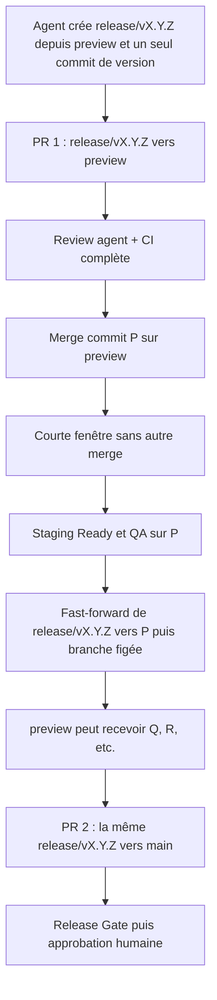
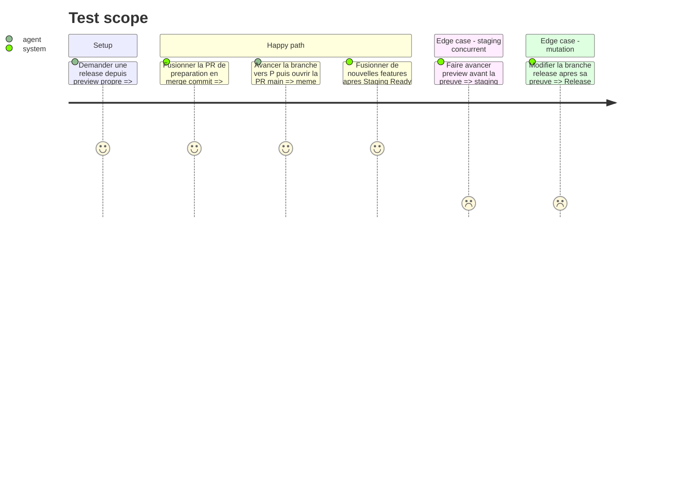

# Instruction: Promouvoir un candidat unique avec deux PR

## Architecture projection

> Tree of the final files. ✅ create · ✏️ modify · ❌ delete

```txt
.
├── .claude/skills/release/
│   ├── references/
│   │   ├── ios-release.md ✏️
│   │   └── jsts-release.md ✏️
│   └── SKILL.md ✏️
└── .github/
    ├── scripts/
    │   └── ci-security.test.mjs ✏️
    └── workflows/
        ├── ci.yml ✏️
        ├── release-gate.yml ✅
        └── release-promotion.yml ✅
```

## User Journey



## Test Scope



## Tasks to do

### `1)` Faire de `/release` un préparateur, pas un administrateur

> L'agent crée le candidat et rend la main à GitHub dès que sa branche est publiée.

1. Conserver l'analyse SemVer, Changesets `fixed`, les cinq versions, la décision iOS, le changelog et les copies FR/EN/DE/IT déjà gérés par la skill.
2. Démarrer d'un `preview` propre et synchronisé, créer `release/vX.Y.Z`, appliquer une seule fois les changements de release et produire un commit `R`.
3. Considérer l'invocation explicite de `/release` comme l'autorisation de préparer ; reporter la décision de mise en production à la PR vers `main`.
4. Pousser uniquement la branche `release/vX.Y.Z` ; ne jamais pousser directement `preview` ou `main`, créer un tag, publier une Release ou modifier Railway depuis la préparation.
5. Mettre version, décision iOS et notes approuvables dans le corps de PR sous des marqueurs stables, sans créer une seconde source de version.

### `2)` Valider puis figer le commit de staging

> La première PR ne crée pas une release distincte : elle rend le commit de version testable dans l'environnement preview.

1. Faire ouvrir par la GitHub App la PR `release/vX.Y.Z -> preview`, avec permissions limitées à Contents et Pull requests, sans bypass de ruleset ni secret de production.
2. Exiger review agentique, conversations résolues, branche à jour et `✅ CI Success`; activer l'auto-merge uniquement sur cette PR de confiance.
3. Imposer le merge commit pour cette PR précise afin que le commit fusionné `P` soit descendant de `R` et que la branche puisse avancer sans force-push.
4. Entre le merge de `P` et `✅ Staging Ready`, ne fusionner aucune autre PR vers `preview`; si `preview` ou Railway dérive, échouer et ne rien promouvoir.
5. Après `✅ Staging Ready` et la QA agentique sur les déploiements exacts, avancer `release/vX.Y.Z` en fast-forward de `R` vers `P`, enregistrer les identifiants de preuve puis interdire toute nouvelle modification.
6. Autoriser immédiatement les autres feature PR à fusionner : elles produisent des commits `Q`, `R2`, etc. sur `preview`, sans déplacer la branche release restée sur `P`.

### `3)` Ouvrir la PR de production depuis la même branche

> La deuxième PR promeut le candidat prouvé ; elle ne recalcule ni version ni contenu.

1. Faire vérifier par `release-promotion.yml` version, branche, SHA/tree `P`, run CI, run staging, QA, absence du tag cible et état attendu de `main`.
2. Avec un jeton court de la GitHub App, ouvrir une seule PR `release/vX.Y.Z -> main`; rendre les rejeux identiques idempotents et refuser tout écart.
3. Faire exécuter `release-gate.yml` sans secrets de production : auteur App, source et base attendues, PR de préparation fusionnée, tree identique à `P`, preuve staging canonique et branche immobile.
4. Ne jamais exiger que `preview` pointe encore sur `P`; exiger seulement que `P` reste dans son historique et que sa preuve n'ait pas changé.
5. Exiger une approbation humaine sur cette PR, dismiss sur nouveau commit et aucun bypass App/administrateur ; après approbation, fusionner en merge commit `M` dont le tree est identique à `P`.

### `4)` Basculer les protections et retirer la CI post-merge preview

> Le cutover n'arrive qu'après la canary réussie de la phase 1.

1. Limiter la matrice complète de `ci.yml` aux PR vers `preview`; la PR vers `main` n'exécute que `✅ Release Gate`.
2. Supprimer la matrice complète sur push `preview` et rendre `✅ Staging Ready` requis pour les opérations de release, sans le transformer en gate de chaque feature déjà fusionnée.
3. Protéger `preview` par PR + `✅ CI Success` et interdire désormais les 27 push directs observés ; toute modification, docs comprise, passe par une PR.
4. Protéger `main` par PR + `✅ Release Gate` + une approbation humaine ; empêcher force-push et suppression sur `main`, `preview`, `release/v*` et `v*`.
5. Conserver temporairement la CI complète sur push `main` jusqu'à ce que `production.yml` soit validé en phase 3.
6. Étendre `ci-security.test.mjs` pour empêcher le retour du push direct preview, d'une CI complète sur PR main ou d'une App autorisée à contourner la production.

## Test acceptance criteria

| Task | Acceptance criteria                                                                                                                                                  |
| ---- | -------------------------------------------------------------------------------------------------------------------------------------------------------------------- |
| 1    | Une demande `/release` crée une branche et un seul commit de version, sans écrire sur `preview`, `main`, les tags ou les fournisseurs.                               |
| 2    | La PR de préparation est fusionnée par merge commit ; la branche avance ensuite en fast-forward sur le commit preview prouvé, sans nouvelle modification de release. |
| 2    | Un merge concurrent avant `Staging Ready` bloque la promotion ; après `Staging Ready`, de nouvelles features peuvent rejoindre `preview` sans changer le candidat.   |
| 3    | La PR vers `main` provient de la même branche figée, contient exactement le tree prouvé et ne peut fusionner sans une approbation humaine distincte de l'App.        |
| 3    | Une branche modifiée, une preuve obsolète, un tag existant ou un `main` inattendu produit un gate rouge sans mutation partielle.                                     |
| 4    | Une feature ou une release ne relance plus la matrice complète après merge `preview`; les push directs sont refusés et les PR conservent toute la validation.        |
| 4    | Le run complet `main` actuel reste en place tant que la phase 3 n'a pas prouvé son remplacement.                                                                     |
