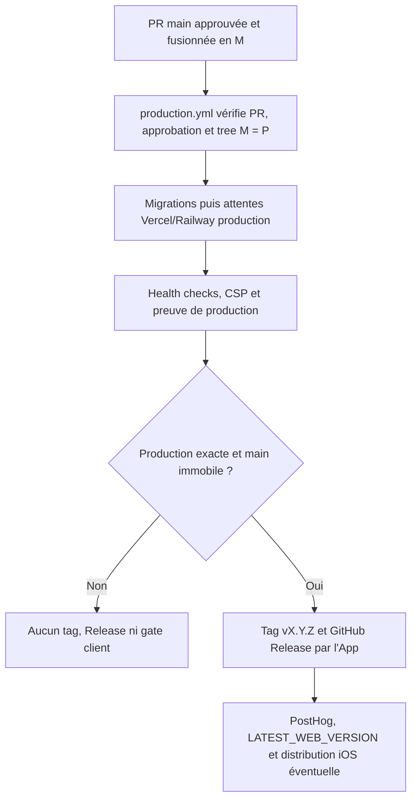
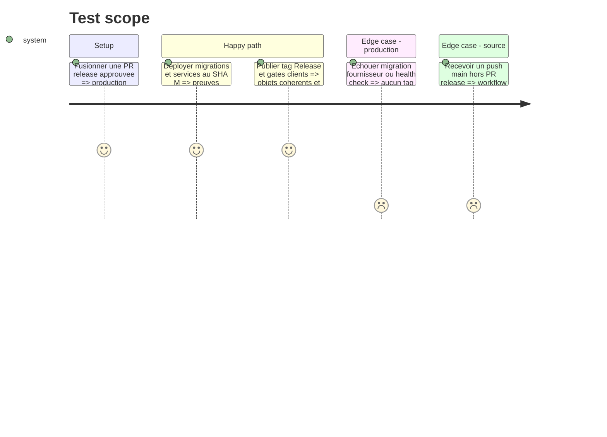

# Instruction: Publier depuis GitHub et retirer l'ancien bypass

The canary slice adds `production.yml` beside the current main CI. It does not move migrations, PostHog, CSP, or iOS distribution yet: those removals happen only after one real release proves the complete happy path.

## Architecture projection

> Tree of the final files. ✅ create · ✏️ modify · ❌ delete

```txt
.
├── .claude/skills/release/
│   └── SKILL.md ✏️
├── .github/
│   ├── scripts/
│   │   ├── ci-security.test.mjs ✏️
│   │   └── public-surface.test.mjs ✏️
│   └── workflows/
│       ├── ci.yml ✏️
│       ├── ios-distribute.yml ✏️
│       └── production.yml ✅
├── aidd_docs/memory/
│   ├── deployment.md ✏️
│   └── vcs.md ✏️
├── docs/
│   ├── CI.md ✏️
│   ├── DEPLOYMENT.md ✏️
│   └── VERSIONING.md ✏️
└── CONTRIBUTING.md ✏️
```

## User Journey



## Test Scope



## Tasks to do

### `1)` Séparer l'orchestration production de la CI de code

> `ci.yml` valide le candidat ; `production.yml` déploie uniquement ce candidat autorisé.

1. Déplacer de `ci.yml` vers `production.yml` la détection/application des migrations, l'annotation PostHog et la vérification CSP actuellement réservées à `main`.
2. Déclencher `production.yml` sur push `main`, avec concurrence non annulable et environnement `production` pour les jobs qui consomment des secrets.
3. Avant tout secret, retrouver la PR de release fusionnée, son approbation humaine, `✅ Release Gate`, le candidat `P`, le commit de production `M` et vérifier `tree(M) = tree(P)`.
4. Refuser un push direct, une PR ordinaire, une App inattendue, un `main` déjà déplacé ou des métadonnées de version divergentes.
5. Garder séparément `candidate_sha`, `production_sha`, version et identifiants de runs dans une preuve de production rejouable.

### `2)` Publier seulement après les preuves production

> Le merge autorise le déploiement ; le tag déclare ce qui est réellement disponible.

1. Appliquer uniquement les migrations détectées et backward-compatible, puis attendre les deux projets Vercel et Railway production rattachés à `M`.
2. Exécuter les health checks publics, CSP et contrôles de version existants ; revalider `main`, la version et l'absence du tag juste avant publication.
3. En cas de succès, créer avec le jeton court de l'App le tag annoté `vX.Y.Z` sur `M` et la GitHub Release depuis les notes de la PR ; les rejeux identiques sont idempotents.
4. Publier ensuite l'annotation PostHog et `LATEST_WEB_VERSION`; ne jamais modifier `LATEST_IOS_VERSION`, déjà résolu depuis l'App Store.
5. En cas d'échec, ne créer ni tag, ni Release, ni gate client ; corriger par une nouvelle PR/release ou une PR de revert, jamais par force-push.

### `3)` Adapter iOS et rendre le processus autonome

> Une session agent lance et surveille ; GitHub peut terminer sans elle.

1. Pour `ios-distribute.yml` interne, remplacer l'exigence d'un run CI push `preview` par la preuve exacte `✅ Staging Ready` du candidat sélectionné.
2. Pour le canal release, exiger la preuve `production.yml` de `M`, la version iOS approuvée et l'identité du candidat `P`; conserver signature, build number, notarisation et upload.
3. Garder TestFlight automatisable et la soumission App Store humaine, séparée de la release web et de son approbation GitHub.
4. Transformer `/release` en orchestrateur/moniteur des workflows : après publication de sa branche, aucune étape ne dépend d'un fichier Git local ou d'une session encore ouverte.
5. Retirer seulement après une canary réussie le fast-forward administrateur, le stockage `pulpe-release-sha` local et la publication locale du tag/Release.

### `4)` Finaliser le cutover et mesurer le gain

> Le dépôt ne doit décrire qu'un chemin normal, avec une procédure d'urgence clairement hors flux.

1. Après une release canary complète, retirer la matrice `ci.yml` sur push `main`; `production.yml` devient l'unique workflow de ce push.
2. Mettre à jour CI, déploiement, versioning, contribution et mémoires avec PR feature → preview, PR release → preview, preuve P, PR P → main, production M.
3. Étendre `ci-security.test.mjs` et `public-surface.test.mjs` pour interdire le retour du bypass, d'une seconde version de release ou d'une publication avant preuve.
4. Documenter un break-glass manuel, audité et sans force-push ; il ne doit pas être utilisable automatiquement par l'App.
5. Comparer les 30 jours suivant le cutover au baseline : nombre de matrices, temps médian de release, échecs de preuve et incidents. Conserver le système si le gain attendu d'environ 77 matrices réussies/mois se matérialise sans faux positif.

## Test acceptance criteria

| Task | Acceptance criteria                                                                                                                                                        |
| ---- | -------------------------------------------------------------------------------------------------------------------------------------------------------------------------- |
| 1    | `production.yml` refuse avant secret tout push `main` qui ne provient pas de la PR App approuvée et du tree candidat prouvé.                                               |
| 1    | `ci.yml` ne contient plus de migration, annotation ou contrôle de production après le cutover.                                                                             |
| 2    | Tag, GitHub Release et gate web apparaissent seulement après migration, déploiements exacts et health checks réussis sur `M`.                                              |
| 2    | Tout échec laisse la version non publiée et permet un rejeu idempotent sans force-push ni mutation partielle.                                                              |
| 3    | iOS internal consomme une preuve staging exacte ; iOS release consomme une preuve production exacte et conserve la soumission App Store humaine.                           |
| 3    | Une fois la branche de release publiée, GitHub peut terminer la promotion et la publication après fermeture de la session agent.                                           |
| 4    | Le chemin normal n'utilise plus de push administrateur vers `preview` ou `main`, ni de CI complète sur leurs push.                                                         |
| 4    | Les métriques après 30 jours confirment ou invalident explicitement le gain attendu ; une preuve peu fiable entraîne le maintien ou le rétablissement du dernier flux sûr. |
