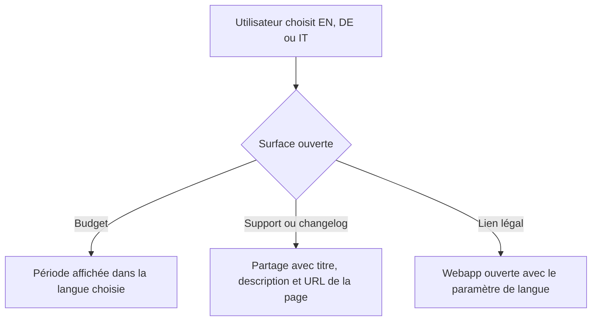
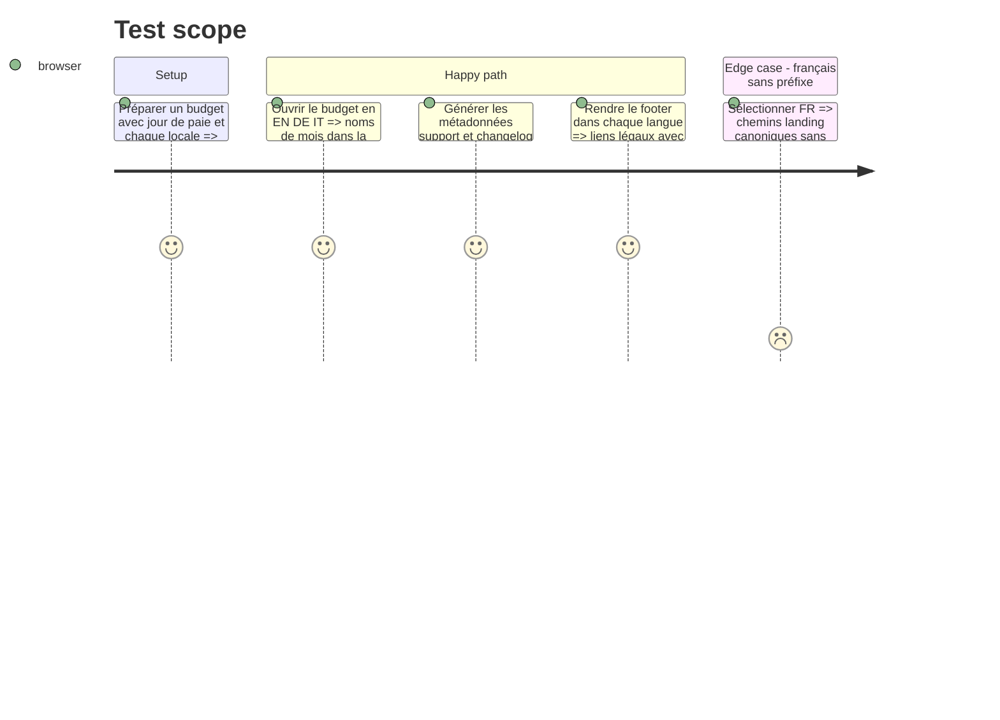

# Instruction: Localisation web et landing

## Architecture projection

> Tree of the final files. ✅ create · ✏️ modify · ❌ delete

```txt
.
├── frontend/projects/webapp/src/app/feature/budget/budget-details/
│   ├── budget-details-page.ts                       ✏️ transmet la langue d’interface au formateur de période
│   └── budget-details-page.spec.ts                  ✏️ couvre EN, DE et IT au niveau du caller
└── landing/
    ├── lib/metadata.ts                              ✏️ centralise les métadonnées sociales avec le bon type de page
    ├── components/pages/metadata.ts                 ✏️ donne à support et changelog leurs propres cartes sociales
    ├── components/sections/Footer.tsx               ✏️ propage la langue vers les documents légaux Angular
    └── app/accessibility.test.tsx                   ✏️ verrouille cartes sociales et URLs légales localisées
```

Aucun fichier de production ou de test à créer ou supprimer : les harnais existants couvrent ces contrats.

## User Journey



## Test Scope



## Tasks to do

### `1)` Localiser la période du détail de budget

> Le formateur partagé reçoit la langue d’interface comme ses autres appelants.

1. Passer `userSettingsStore.locale()` en quatrième argument de `formatBudgetPeriod` dans `periodDisplay`.
2. Ne pas utiliser la locale de devise : `docs/I18N.md` impose que les mois suivent la langue, tandis que les montants suivent la devise.
3. Étendre `budget-details-page.spec.ts` avec un test du caller pour `en`, `de` et `it`, en gardant un jour de paie différent de 1 afin que la période soit visible.

### `2)` Donner des métadonnées sociales propres à support et changelog

> Les pages cessent d’hériter du titre, de la description et de l’URL OpenGraph/Twitter de la homepage.

1. Généraliser le helper social existant pour distinguer explicitement une page `website` d’un guide `article`, sans dupliquer la construction des images, locales et alternatives.
2. Faire charger aussi `site.socialImageAlt` par `supportMetadata` et `changelogMetadata`.
3. Définir pour chacune des deux pages `openGraph` et `twitter` avec son titre complet, sa description, son URL canonique localisée, sa locale, ses alternatives et l’image sociale de la langue.
4. Ajouter des assertions directes sur les deux générateurs, dont au moins une locale préfixée, pour prouver qu’aucun champ social de la homepage n’est repris.

### `3)` Propager la langue dans les liens légaux

> Les liens vers CGU et confidentialité réutilisent le constructeur d’URL Angular déjà employé par les CTA.

1. Représenter les deux destinations légales comme chemins Angular, puis construire leur `href` via `angularUrl` avec la locale du footer et un identifiant UTM stable par lien.
2. Conserver les libellés traduits et le comportement d’ancre existants.
3. Tester les quatre locales et les deux chemins : chaque URL garde sa destination et contient exactement le `lang` sélectionné.

### `4)` Vérifier la phase

> Les tests ciblés et les vérifications de type prouvent les trois contrats sans lancer d’E2E réseau.

1. Construire `pulpe-shared`, puis exécuter les specs Angular du détail de budget.
2. Exécuter le test landing contenant les nouveaux contrats, puis `pnpm type-check` dans `landing`.
3. Exécuter le build landing afin de laisser Next.js résoudre les métadonnées des routes françaises et préfixées.

## Test acceptance criteria

| Task | Acceptance criteria |
| ---- | ------------------- |
| 1 | Pour un budget de mars avec jour de paie personnalisé, la période contient des mois anglais, allemands ou italiens selon `UserSettingsStore.locale`, jamais les mois français par défaut. |
| 2 | Les cartes support et changelog portent le titre, la description, l’URL canonique, la locale et l’image de leur page dans chaque langue ; le guide reste de type `article`. |
| 3 | Depuis chaque version FR/EN/DE/IT de la landing, CGU et confidentialité ouvrent le bon chemin Angular avec `lang` égal à la langue choisie. |
| 4 | Les suites ciblées, le type-check landing et le build Next terminent sans échec. |
