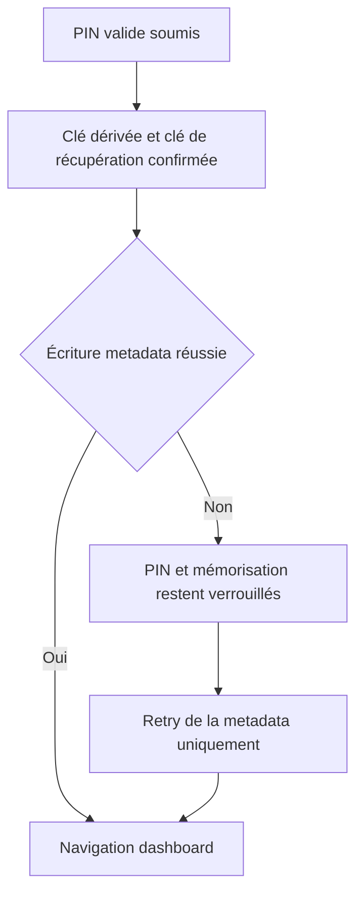
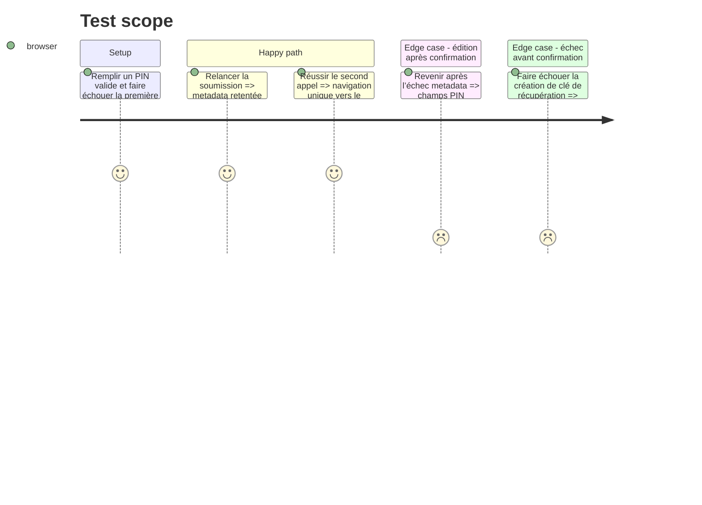

# Instruction: Retry sûr après confirmation de la clé de récupération

## Architecture projection

> Tree of the final files. ✅ create · ✏️ modify · ❌ delete

```txt
.
└── frontend/projects/webapp/src/app/feature/auth/setup-vault-code/
    ├── setup-vault-code.ts                          ✏️ verrouille les valeurs confirmées pendant le retry metadata
    └── setup-vault-code.spec.ts                     ✏️ couvre l’échec metadata puis le retry
```

Aucun fichier à créer ou supprimer.

## User Journey



## Test Scope



## Tasks to do

### `1)` Modéliser la phase confirmée de manière réactive

> La confirmation de la clé de récupération devient un état que `canSubmit` et le formulaire peuvent observer.

1. Remplacer le booléen privé non réactif par un état réactif minimal.
2. Autoriser le bouton de soumission quand la clé est déjà confirmée, même si les contrôles sont désactivés, tant qu’aucune soumission n’est en cours.
3. Continuer à valider le formulaire uniquement avant la première confirmation.

### `2)` Verrouiller les valeurs qui ont produit la clé

> Après confirmation, le retry ne peut plus présenter un PIN ou un choix de mémorisation différent de ceux réellement utilisés.

1. Après fermeture de la boîte de clé de récupération, marquer la phase confirmée avant l’écriture metadata.
2. Dans le `finally`, ne réactiver le formulaire que si la clé n’a pas été confirmée.
3. Garder le chemin de retry actuel : aucune nouvelle lecture du sel, dérivation, création, validation ou régénération de clé ; seul `updateUser` est rejoué.

### `3)` Étendre le test de chaîne partiellement échouée

> Le test existant devient une preuve de cohérence visuelle et cryptographique.

1. Faire échouer `updateUser` une fois puis réussir au second appel.
2. Après le premier échec, vérifier que les trois contrôles sont désactivés et que le retry reste possible.
3. Après le retry, vérifier une seule dérivation, une seule installation de clé cliente, une seule boîte de récupération, deux écritures metadata et une seule navigation.
4. Conserver le test d’échec avant confirmation qui exige la réactivation du formulaire et le nettoyage de la clé candidate.

### `4)` Vérifier la phase

> La spec du composant couvre le flux complet sans backend réel.

1. Construire `pulpe-shared`.
2. Exécuter uniquement `setup-vault-code.spec.ts`, puis le type-check des specs frontend.

## Test acceptance criteria

| Task | Acceptance criteria |
| ---- | ------------------- |
| 1 | Après confirmation de la clé et échec metadata, le bouton permet une nouvelle tentative sans rendre le formulaire éditable. |
| 2 | Le PIN, sa confirmation et `rememberDevice` visibles restent ceux ayant servi à dériver et stocker la clé. |
| 3 | Le retry réussi effectue exactement deux appels metadata et une seule opération pour chaque étape cryptographique et dialogue de récupération. |
| 4 | La spec ciblée et son type-check terminent sans échec. |
